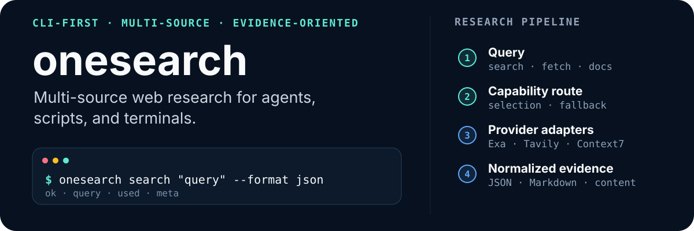

<p align="center">
  <a href="README.md">English</a> · <a href="README.zh-CN.md">简体中文</a>
</p>

<p align="center">
  
</p>

<p align="center">
  <a href="https://github.com/deqiying/onesearch/actions/workflows/npm-publish.yml"></a>
  <a href="https://www.npmjs.com/package/onesearch"></a>
  
  <a href="LICENSE"></a>
  <a href="https://linux.do/"></a>
</p>

`onesearch` 是一个面向 AI agent、脚本和终端用户的 CLI-first 研究与证据工具。它把答案搜索、来源发现、文档检索、网页抓取、站点 map/crawl、仓库 Wiki、离线研究规划、配置诊断和内置 Skill 分发放在同一个可复现的命令层里。

> `onesearch` 不是 MCP Server。AI 工具可以先用 `skills show` 读取内置工作流，再执行明确的 CLI 命令完成搜索、抓取和验证。

<p align="center">
  <a href="#快速开始">快速开始</a> ·
  <a href="#能力地图">能力地图</a> ·
  <a href="#配置">配置</a> ·
  <a href="#将-onesearch-接入-agent">Agent 接入</a> ·
  <a href="#开发">开发</a>
</p>

## 快速开始

### 1. 安装 CLI

安装 npm launcher 及当前平台对应的预构建二进制：

```powershell
npm install -g onesearch
onesearch --version
```

npm 包目前提供 Windows x64、Linux x64 和 macOS arm64 二进制；其他 Windows、Linux 和 macOS 构建可以从 [GitHub Releases](https://github.com/deqiying/onesearch/releases) 下载。

### 2. 查看命令并初始化配置

先读取静态搜索合同。该命令离线执行，不会创建配置文件：

```powershell
onesearch schema search --format json
```

随后初始化 runtime 配置并检查本机 readiness：

```powershell
onesearch status --format json --pretty
```

首次安装时，`status` 预期会显示 `ready: false` 和 `minimum_profile.ok: false`，这不表示安装失败。Readiness 报告还会列出可以脱离完整 `search` workflow 独立运行的重要能力：

| 能力 | Onboarding 角色 | Provider 选择 / 默认状态 |
| --- | --- | --- |
| `answer_search` | `standard` profile 必需 | 配置 `xai`、`openai-compatible` 或 `openai-responses` |
| `docs_search` | `standard` profile 必需 | 配置 `exa` 或 `context7` |
| `page_fetch` | `standard` profile 必需 | 配置 `exa`、`tavily` 或 `firecrawl`；`anysearch` 初始已启用 |
| `repo_wiki` | 重要的独立能力，默认可用 | `deepwiki`；公开仓库通常可以匿名使用 |
| `vertical_search` | 可选的实验性能力，默认可用 | `anysearch` |

初始配置只启用支持匿名访问的 `deepwiki` 和 `anysearch`；答案搜索、文档检索、通用来源搜索和 crawl provider 都需要配置后才会启用。DeepWiki 没有被列为 `standard` 必需项，是因为 `repo-wiki` 有独立 readiness gate，可以在完整搜索 profile 就绪前单独运行。

### 3. 使用 DeepWiki 研究公开仓库

当 `capabilities.repo_wiki.ok == true` 或 `direct_endpoints.deepwiki.available == true` 时，无需先完成整个 `standard` profile，就可以直接研究公开 GitHub 仓库：

```powershell
onesearch repo-wiki "microsoft/playwright" `
  "MCP Browser Server 的架构是什么？" `
  --provider deepwiki `
  --format json
```

DeepWiki 可以提供生成式仓库上下文、架构摘要、wiki structure 和 wiki contents。它属于辅助上下文；精确实现结论仍应回到仓库源码验证。访问私有仓库时可能需要配置 DeepWiki 凭据。

### 4. 为完整搜索配置 provider

最短的完整配置是一个答案 provider 加 Exa。下面这组配置可以覆盖 `answer_search`、`docs_search`、`page_fetch`，以及可选的 `source_search`：

```powershell
onesearch config setup openai-compatible
onesearch config setup exa
```

交互式提示会隐藏 API key。如果端点使用 xAI 或 OpenAI Responses 协议，可以把 `openai-compatible` 替换为 `xai` 或 `openai-responses`。兼容网关应显式提供 API 根路径：

```powershell
onesearch config setup openai-compatible `
  --base-url "https://gateway.example.com/v1"
```

配置后再次检查 readiness：

```powershell
onesearch status --format json --pretty
```

执行搜索前必须确认 `minimum_profile.ok == true`。能力命令和 provider-direct 命令还应分别确认 `capabilities.<capability>.ok == true` 或 `direct_endpoints.<provider>.available == true`。这些字段只代表本机 preflight 通过，不证明远端端点当前可达。

### 5. 执行第一次搜索

Readiness gate 通过后再运行：

```powershell
onesearch search "解释 Go context cancellation 的常用模式" `
  --validation balanced `
  --format json
```

只有 `capabilities.source_search.ok == true` 时才添加 `--extra-sources 2`。

整个命令层保持显式：

```text
任务 → 能力路由 → provider 选择 / fallback → 统一结果
```

## 为什么使用 onesearch

- **一套合同覆盖多种研究操作。** 常见任务使用 workflow 命令，需要精确控制时使用 provider-direct 命令。
- **面向 agent 与脚本设计。** 版本化 command schema、严格参数解析、紧凑 JSON、稳定退出语义和内置 Skill 让命令可被可靠发现。
- **发现与证据分离。** 候选 URL 不等于已验证正文；形成结论前应先抓取关键来源。
- **凭据不会进入常规输出。** JSON、Markdown、content、stderr 和输出文件中的动态内容都会脱敏。
- **本地规划保持本地。** `deep` 只生成离线研究计划，不调用 provider，也不抓取网页。

## 能力地图

| 任务 | 命令 | 路由 / provider |
| --- | --- | --- |
| 答案搜索 | `search` | `answer_search`：xAI、OpenAI-compatible、OpenAI Responses |
| 来源发现 | `search --extra-sources`、`exa web-search`、`zhipu search`、`ddg search`、`freecrawl search` | `source_search`：Exa、Zhipu、Tavily、Firecrawl；DDG、Freecrawl 默认 direct-only |
| 文档检索 | `context7 resolve-library-id`、`context7 query-docs`、`exa web-search` | `docs_search`：Context7、Exa |
| 网页抓取 | `fetch --provider`、`exa web-fetch`、`tavily extract`、`firecrawl scrape`、`ddg fetch-content`、`freecrawl scrape` | `page_fetch`：Tavily、Firecrawl、Exa；DDG、Freecrawl 默认 direct-only |
| 站点结构 | `map --provider`、`tavily map`、`firecrawl map` | `site_map`：Tavily、Firecrawl |
| 站点爬取 | `crawl --provider`、`tavily crawl`、`firecrawl crawl`、`freecrawl crawl` | `site_crawl`：Tavily、Firecrawl；Freecrawl 默认 direct-only |
| 仓库 Wiki | `repo-wiki`、`search --repo-wiki` | `repo_wiki`：DeepWiki |
| 垂直搜索 | `anysearch domains/search/extract/batch` | `vertical_search`：AnySearch |
| 研究规划 | `deep`、`dr` | 本地离线 planner |
| Skill 发现 | `skills list`、`skills show` | 内置 router、workflow 和 provider Skill |
| 配置诊断 | `doctor`、`status`、`config list`、`smoke`、`regression` | 配置健康、实时 preflight 和公共回归检查 |
| CLI 发现 | `schema`、命令级 `--help` | 版本化 CLI manifest 与人类可读帮助 |

实际可用性取决于本机配置。选择 provider 或能力前，请运行 `onesearch status --format json`。

## 配置

Windows、macOS 和 Linux 的默认配置路径均为：

```text
~/.config/onesearch/config.json
```

可以通过 `ONESEARCH_CONFIG_DIR` 指定其他目录。首次执行普通命令时，如果配置目录和 `config.json` 不存在，`onesearch` 会创建初始配置并继续执行。初始 schema 只启用 `deepwiki` 和 `anysearch`；`xai`、两个 OpenAI adapter、Exa、Context7、Zhipu、Tavily、Firecrawl、DDG 和 Freecrawl 默认禁用。因此，普通 `search` 在首次使用前必须先完成 provider 配置。

Runtime 配置由五个顶层区域组成：

```json
{
  "schema_version": 1,
  "defaults": {},
  "pipelines": {},
  "routes": {},
  "profiles": {},
  "providers": {}
}
```

- `defaults`：默认 pipeline、fallback、validation、minimum profile、超时、日志、重试和输出清理策略。
- `pipelines`：`default`、`research`、`docs`、`crawl` 等能力链。
- `routes`：各能力的 provider 顺序。声明对应 capability 的 provider 会自动追加，除非设置了 `settings.direct_only=true`。
- `profiles`：最低能力集合；例如 `standard` 要求 `answer_search`、`docs_search` 和 `page_fetch`。
- `providers`：adapter、capabilities、base URL、凭据来源、启用状态及 provider 特有配置。

完整可移植示例见 [config.example.json](config.example.json)。

### 安全配置 provider

```powershell
onesearch config path --format json
onesearch config list --format json
onesearch config setup exa
onesearch doctor --format json
onesearch status --format json
```

交互式配置会隐藏 API key。脚本和 pipeline 必须通过 stdin 传递密钥；CLI 刻意不提供会把密钥留在 shell history 中的 `--api-key` 参数：

```powershell
$env:EXA_API_KEY |
  onesearch config setup exa --api-key-stdin --format json

$env:OPENAI_COMPATIBLE_API_KEY |
  onesearch config setup openai-compatible `
    --api-key-stdin `
    --base-url "https://gateway.example.com/v1" `
    --format json
```

`config setup` 会更新 key，并把目标 provider 设为 `enabled: "auto"`。model、capabilities、routes、provider settings 和禁用操作仍需直接编辑 `config.json`。`api_key` 与 `api_key_env` 同时存在时，前者优先。

### OpenAI-compatible adapter

- `openai_responses` 使用 JSON-only standalone SearchRequest 调用 `/v1/alpha/search`。
- `openai_chat_completions` 调用 `/v1/chat/completions`，支持 JSON/SSE，并可透传 `tools` 和 `tool_choice`。
- 两者不会互相降级；Alpha 失败会进入普通的跨 provider fallback。
- `openai_responses` 的 base URL 必须是 API 根路径；以 `/alpha/search` 或 `/responses` 结尾的完整 endpoint 会被拒绝为参数错误。

## 常用场景

```powershell
# 答案搜索并发现额外来源
onesearch search "今天值得关注的 AI 新闻" --validation balanced --extra-sources 2 --format json

# 按能力限制 provider，并抓取一条关键来源
onesearch search "当前官方榜单" `
  --providers "answer_search=openai_responses;source_search=tavily;page_fetch=firecrawl" `
  --fetch-sources 1 `
  --validation strict `
  --format json

# 以 Markdown 抓取网页
onesearch fetch "https://example.com/article" --provider tavily --format markdown --output evidence.md

# 查询当前版本的库文档
onesearch context7 resolve-library-id "react" "useEffect cleanup" --format json
onesearch context7 query-docs "/facebook/react" "useEffect cleanup" --format json

# 通过 DeepWiki 查询公开仓库
onesearch repo-wiki "microsoft/playwright" "MCP Browser Server 是怎么实现的？" --provider deepwiki --format json

# 生成离线研究计划
onesearch deep "对比 OpenAI Responses 与 Chat Completions 的联网搜索" --budget deep --format json
```

指定 `--fetch-sources N` 后，`search` 会抓取 `source_search` 发现的前 `N` 个 URL；结果出现在 `used.page_fetch`，角色为 `source_evidence`。

## 将 onesearch 接入 agent

安装 CLI 并完成[首次 readiness 配置](#快速开始)后，在 agent host 支持的自定义 Skills 目录中创建名为 `onesearch` 的 Skill 文件夹，将下面的内容保存为 `SKILL.md`。如果 host 需要重新发现 Skill，再按其方式刷新或重启。

这个 host Skill 刻意保持为薄入口：它会定位实际安装的可执行文件，并从同一个 `onesearch` binary 动态加载版本匹配的工作流；它不会在 agent 中复制 provider 合同、配置端点，也不会扩大网络访问或环境变更权限。

````markdown
---
name: onesearch
description: Use when an agent needs to search the web, look up current or latest public information such as news, prices, rankings, hot searches, or trending topics, verify claims with online sources, read a URL, map or crawl a website, find official API/SDK/package/framework docs, or inspect public GitHub repo docs and architecture.
---

# Onesearch CLI Entry

Use this Skill only as the host-level entry for the installed `onesearch` CLI. Treat the main Skill embedded in the resolved CLI binary as the sole versioned Onesearch workflow. Do not duplicate or infer provider inventories, command flags, defaults, output contracts, or recovery behavior here.

## Load the version-matched workflow

1. Resolve the actual executable and record its version. On Windows, use `Get-Command onesearch -All`; on macOS or Linux, use `type -a onesearch` when available or `command -v onesearch`. Then run `onesearch --version`.
2. Read the canonical main Skill from that same executable:

```text
onesearch skills show onesearch --format content
```

3. Read the complete stdout and follow it as the authoritative workflow for the current executable. Do not merge it with remembered or repository-copied Onesearch instructions.
4. Reuse the loaded main Skill for the rest of the task while the executable path and version stay unchanged. Do not reload it recursively.
5. When the loaded router selects a child workflow or provider, load only that child with its advertised canonical `onesearch skills show <skill-id> --format content` command. Treat the returned Markdown as workflow guidance; it is not a newly registered host Skill.

## Preserve host boundaries

- Call `skills show` without `--output`; loading embedded guidance must not create files or initialize provider configuration.
- Loading a Skill does not authorize network calls, credential reads, configuration writes, package installation, or other side effects. Follow the user's existing authorization boundary and the loaded Skill's narrower preflight rules.
- Never silently install or update `onesearch`, provider runtimes, browser dependencies, or global packages. Request authorization before changing the environment.
- If the CLI is missing and the user wants it installed, verify Node/npm first and request authorization before running `npm install -g onesearch`.
- Never expose credential values in commands, logs, generated files, or responses.

## Recover without stale guidance

If the CLI is missing or the canonical `skills show` command fails, report the resolved path, version when available, exit status, and concise error. Do not guess aliases or flags, silently upgrade the CLI, or fall back to a copied CLI contract. Use an available purpose-built host search capability when it is allowed and preserves the task semantics; otherwise report the missing prerequisite.
````

## 面向 agent 的命令合同

`onesearch schema` 返回 V2 CLI command manifest。每个 command 先公开便于 Agent 理解的 `name`、`description` 和 `input_schema`，随后描述 canonical CLI `path`、argv 绑定、约束、side effects、output contract 和 status preflight。它既不是 native tool 注册，也不是 runtime 配置 schema；上层适配器仍需把 `input_schema` 映射为目标平台的 tool parameters，并执行 canonical `path`。

V2 明确将 V1 的 `commands[].id` 替换为 `commands[].name`，将 `commands[].summary` 替换为 `commands[].description`；`commands[].input_schema` 保持不变。

```powershell
onesearch schema --format json
onesearch schema search --format json
onesearch schema exa web-search --format json
onesearch schema --pretty
onesearch search --help
```

`schema`、命令级 `--help` 和 `skills list/show` 会在 runtime 配置与 provider 加载前返回，不创建 `config.json`、不读取凭据、也不访问网络。未知 flag、多余位置参数、冲突选项和未知 canonical path 会返回 `parameter_error`，退出码为 `2`。

### 输出合同

- `json`：默认单行 compact JSON，并保留结尾换行；使用 `--pretty` 获得两空格缩进。
- `markdown`：适合人类阅读的诊断、结果和抓取正文。
- `content`：核心答案、网页正文或短诊断摘要。
- 默认 / `--quiet` 错误：精简且面向恢复的字段。
- `--verbose`：provider attempts、routing decision、capability 状态等完整诊断。

`search --format json` 返回 `ok`、`query`、`used` 和 `meta`；`used` 树记录本次真实执行的能力和 provider。需要完整答案正文时使用 `--format content`，需要详细路由和 provider 诊断时使用 `--verbose`。

所有动态输出都会经过凭据脱敏，包括 JSON、Markdown、content、stderr、`--quiet`、`--verbose`、`--pretty` 和 `--output` 文件。敏感值会替换为 `********`，没有关闭脱敏的 debug 开关。

## Provider-direct 命令

需要指定 adapter 而不是使用 workflow 路由时，使用：

```text
onesearch <provider> <command> [args] [--format json|markdown|content] [--pretty]
```

<details>
<summary><strong>查看 provider 命令清单</strong></summary>

```powershell
onesearch exa web-search "query"
onesearch exa web-fetch "https://example.com"
onesearch exa similar "https://example.com"
onesearch tavily search "query"
onesearch tavily extract "https://example.com"
onesearch tavily map "https://example.com"
onesearch tavily crawl "https://example.com"
onesearch firecrawl search "query"
onesearch firecrawl scrape "https://example.com"
onesearch firecrawl map "https://example.com"
onesearch firecrawl crawl "https://example.com"
onesearch context7 resolve-library-id "react"
onesearch context7 query-docs "/facebook/react" "useEffect cleanup"
onesearch deepwiki ask-question "microsoft/playwright" "架构是什么？"
onesearch deepwiki read-wiki-structure "microsoft/playwright"
onesearch deepwiki read-wiki-contents "microsoft/playwright"
onesearch anysearch search "query"
onesearch zhipu search "query"
onesearch ddg search "query"
onesearch ddg fetch-content "https://example.com"
onesearch freecrawl search "query"
onesearch freecrawl scrape "https://example.com"
onesearch freecrawl crawl "https://example.com"
onesearch freecrawl deep-research "topic"
```

</details>

执行前先运行 `status`，确认 `direct_endpoints.<provider>.available` 为 `true`。DDG 和 Freecrawl 使用本地 `mcp_stdio` bridge，默认禁用且为 direct-only；只有显式启用并加入 routes 后，它们才会参与普通 workflow。

## 内置 Skill

内置 `onesearch` Skill 是一个薄 router；workflow Skill 覆盖 `search`、`docs`、`fetch` 和 Deep Research，provider Skill 则描述 Exa、Tavily、Firecrawl、Context7、DeepWiki、AnySearch、Zhipu、DDG 与 Freecrawl 的具体命令。

```powershell
onesearch skills list --format json
onesearch skills list --capability page_fetch --format json
onesearch skills show onesearch --format content
onesearch skills show onesearch --file references/agent-execution-contract.md --format content
onesearch skills show exa --format content
```

`skills show` 默认读取 `SKILL.md`；`--file <relative-path>` 可以读取目标 Skill 内的一个内置文件。除显式使用 `--output` 外，Skill 发现过程只读且离线。

## 证据策略

`search` 返回的 provider sources 是待核验候选，不代表已经检查其网页正文。新闻、政策、财经、医疗、严肃评测和工具选型等场景应先发现 URL，再通过 `fetch` 或 `search --fetch-sources N` 抓取关键页面，最终仅基于已抓取正文下结论。

`onesearch deep` 遵守同一边界。它只生成包含 `intent_signals`、`decomposition`、`capability_plan`、`preflight`、`steps` 和 `gap_check` 的计划，不调用 provider、不联网、不抓网页。Agent 应执行其中的 `command_argv` token 数组，并满足默认 `fetch_before_claim` 要求后再把候选视为已验证证据。

## 开发

仓库通过 `go.mod` 和 `mise.toml` 共同固定 Go 工具链。

```powershell
mise install
mise exec -- go test ./...
mise exec -- go build -o .\bin\onesearch.exe .\cmd\onesearch
.\bin\onesearch.exe --version
```

`mise.toml` 会把 Go module 和 build cache 放在仓库内。如果不通过 mise 运行，且系统 Go cache 没有写权限，可以改用项目级缓存：

```powershell
$env:GOCACHE = Join-Path (Get-Location) '.gocache'
go test ./...
```

### 项目结构

```text
cmd/onesearch/          CLI 入口
internal/cli/           命令解析、flags、命令路由与退出码
internal/config/        Runtime schema、provider、默认值与脱敏
internal/service/       能力路由、fallback、诊断与研究规划
internal/providers/     Provider adapter 与结果归一化
internal/sources/       来源解析、去重与结果角色
internal/output/        JSON、Markdown 与 content 渲染
internal/skills/        内置 Skill 及其附属资产
npm/                    npm launcher 与平台包
```

### 发布

推送 `v*.*.*` tag 后，GitHub Actions 会执行共享测试、构建 GitHub Release 压缩包、生成 checksums，并发布 npm 入口包与平台包。Release workflow 中声明的 Windows、Linux 和 macOS 架构都会生成独立二进制。

## License

本项目采用 [Apache License 2.0](LICENSE)。
