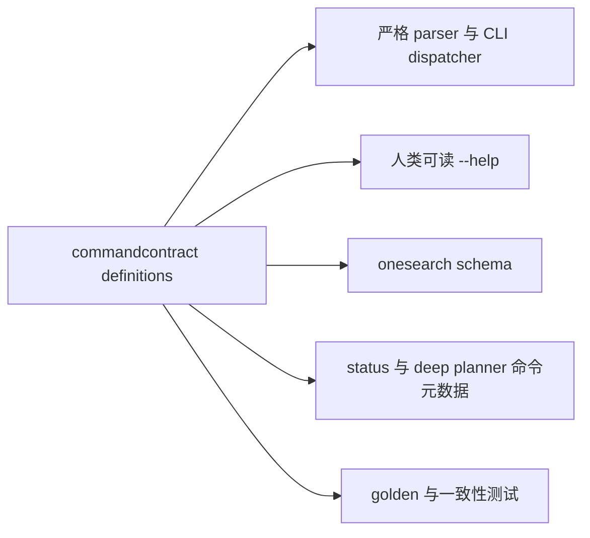

# Onesearch CLI Command Schema 技术方案

## 实施状态

状态：已实施（2026-08-04）。

本文档先基于实施前代码和本机 CLI 行为制定方案，现已按本文合同完成实现。`onesearch schema`、targeted canonical path 查询、registry-backed help、严格 parser、status command 收敛和 Deep `command_argv` 均已可用。

实施结果：

- `internal/commandcontract` 按 workflow、provider、utility 维护 44 个 public executable definitions（43 个既有叶子加 `schema`）和 12 个 namespace definitions，对外组装单一 manifest。
- CLI active path 使用 command definition 驱动的 typed parser 和 binding，不再保留旧 `flag.FlagSet`/`reorderFlags` handler；未知 flag、多余位置参数和互斥组合在配置或 service 初始化前返回退出码 2。
- 数组 flag 保留未转义逗号/空白的兼容输入，并通过 manifest 中的 `list_encoding` 与 `BuildArgv()` 的反斜杠编码保证结构化数组 token 可逆。
- schema 成功与错误使用独立静态 JSON encoder，不进入动态结果的字段精简/redaction；JSON 默认单行 compact，显式 `--pretty` 使用两空格缩进，除显式 `--output` 外不写文件。
- `status.capabilities.vertical_search.command` 已由 `PreferredFor` 生成 `onesearch anysearch search`；provider-direct command 清单也由 registry/binding 生成。
- Deep planner 的 allowlist、preflight 和 steps 已由 contract ID 与 `BuildArgv()` 生成；`command_argv` 是机器合同，`command` 保留为 PowerShell 展示字符串。
- 完整 manifest golden 位于 `internal/cli/testdata/cli-command-manifest-v1.golden.json`，通过显式 `schema --pretty` 和环境变量更新流程生成；其中随发布变化的 `cli.version` 归一化为 `<runtime-version>`，真实输出另行断言等于当前 `app.Version`。
- 44 个 public commands 均暴露 `--pretty`；schema 默认输出单行 compact JSON，显式 `--pretty` 使用两空格缩进，二者保留结尾 LF 且数据语义一致。

实施阶段采用了一个不改变合同目标的细化：`internal/cli/command_parser.go` 直接解释 typed definitions，而不是再构造 `flag.FlagSet`，从而保证 active path 只有一次 argv 解析。

实施验证：

- `mise exec -- go test -count=1 ./...` 通过；一次初始运行中的 fake MCP server 超时已通过定向复跑和随后全量复跑确认属于瞬时抖动。
- `mise exec -- go vet ./...` 通过。
- `mise exec -- go run ./cmd/onesearch smoke --mock --format json` 返回 `ok: true`，13 个 mock cases 全部通过。
- 隔离配置 smoke 验证 full/targeted schema 默认均为 1 行、`--pretty` 均为多行，且两种排版语义相等、静态查询不创建配置。
- 隔离 `ONESEARCH_CONFIG_DIR` 下的 targeted schema、provider leaf help 和非法 argv smoke 均未创建 `config.json`；schema `--output` 仅写入显式目标文件。
- 文档绝对文件系统路径扫描和 `git diff --check` 通过。

真实 provider、网络、凭据和远端 MCP tool live 调用仍不属于本功能验收范围，未执行。

实施前基线已确认：

- 项目使用 `mise.toml` 声明的 Go 1.26.5。
- 当前 CLI 可以正常构建，`internal/cli` 测试通过。
- 当前共有 43 个 canonical 可执行终端路由：6 个 workflow、27 个 provider-direct 叶子命令和 10 个 utility 终端路由。
- 当前另有 13 个顶层 alias 和 10 个嵌套 alias。
- 现有源码、测试和文档中没有 CLI command JSON Schema、OpenAPI 或统一 command registry。

## 背景

`onesearch` 是面向 AI agent、脚本和终端用户的 CLI-first 工具。当前 `--help` 采用人类可读文本，适合终端浏览，但 agent 若要稳定构造命令，还需要从自然语言中自行推断：

- 哪些位置参数必填、可选或可重复。
- flag 的数据类型、默认值和 canonical 名称。
- flag 之间是否互斥、依赖或存在兼容 alias。
- 命令是否访问网络、写入配置或写入文件。
- provider-direct 命令执行前应在 `status` 的哪个字段检查可用性。
- 哪些字段是稳定合同，哪些 provider payload 只是透传数据。

机器可读 schema 对这些精确约束更有优势，但它不能替代人类帮助、Skill 中的路由策略、示例和证据规则。合理的目标不是把 `--help` 改成 JSON，而是同时提供三层入口：

| 入口 | 主要读者 | 负责内容 |
| --- | --- | --- |
| `--help` | 人类、临时终端使用者 | 简洁说明、命令分组、常用调用方式 |
| `onesearch schema` | agent、脚本、适配器 | canonical 路径、输入类型、默认值、约束、argv 绑定、可用性检查位置 |
| 内置 Skill 与 CLI contract | agent 路由与维护者 | 何时调用、provider 取舍、preflight、输出解释、证据与安全边界 |

因此，新增 schema 的价值成立，但前提是 schema 与真实解析行为来自同一份定义；单独手写 JSON 只会增加第四份容易漂移的合同。

同时需要明确：CLI 返回 schema 不等于模型运行时已经注册了 native tool schema。只有 agent 主动调用 `onesearch schema`，或上层适配器读取 manifest 并把 command 映射为 tool，机器合同才会参与生成和校验。因此内置 Skill 仍需负责让 agent 发现 schema，manifest 也必须控制全量输出体积。

## 术语与边界

仓库已经使用“runtime schema”描述 `config.json` 中的 `defaults`、`pipelines`、`routes`、`profiles` 和 `providers`。本文新增的是另一类合同：

- **Runtime schema**：本机配置和 provider 编排，由 `config list --format json` 输出。
- **CLI command manifest**：公共命令、参数和调用约束，由 `onesearch schema` 输出。
- **Command input schema**：manifest 中每个命令的 `input_schema`，采用 JSON Schema Draft 2020-12 的受限子集。

`onesearch schema` 的命令名可以保留，但输出必须使用 `kind: "onesearch_cli_command_manifest"` 和独立的 `manifest_version`，文档中不得把它称为 runtime schema，也不得返回当前用户的 runtime 配置。

## 当前代码边界

### 命令注册与帮助

- `cmd/onesearch/main.go` 只把 argv 传给 `cli.Execute()`，并使用返回值作为进程退出码。
- `internal/cli/cli.go` 的 `Execute()` 通过顶层 alias map、provider 预分流和 `switch` 分派 workflow、utility 命令。
- `internal/cli/provider_commands.go` 通过 `providerToolAliases` 维护 provider 子命令和上游 tool 名映射，并使用第二组 `switch` 执行具体 handler。
- `internal/service/service.go` 的 `capabilityCommand()` 另行硬编码 capability 到 CLI path；其中 `vertical_search` 当前指向不可直接完成调用的 provider group `onesearch anysearch`。
- `internal/service/deep.go` 另行维护 `deepAllowedTools`、preflight 字符串和带完整 flag 的 planner step 命令模板。
- 顶层 help、workflow help、provider help 和 config help 都由独立的 `fmt.Println()` 文本维护。
- 每个 handler 直接创建 `flag.FlagSet`，flag 的 usage 当前基本为空；必填参数、位置参数数量和条件约束散落在 handler 的手写判断中。

这意味着命令路径、alias、参数、help、status 命令清单和 Markdown contract 没有统一来源。

### 当前可观察到的合同漂移

当前实现已经出现适合由 registry 消除的漂移：

- 顶层 help 会展示 `regression`，但 `onesearch` Skill 的公共 CLI contract utility 列表没有列出该命令。
- `fetch`、`map`、`crawl`、`repo-wiki` 的叶子级 `--help` 返回 0；`search`、`deep`、`status`、`skills` 和多数 provider 叶子命令会把 `--help` 当作参数错误。
- `doctor --help` 会实际执行 doctor；`regression --help` 会实际运行 mock regression。
- provider group help 只列子命令名，不包含具体位置参数、flag 类型和默认值。
- 现有 CLI 测试覆盖部分 provider 映射和参数错误，但没有对全部公共路由、全部 help 路径和 schema 一致性做闭环检查。

### 当前参数解析不够严格

`reorderFlags()` 会把无法识别的 `-` 开头 token 放入位置参数；多个 handler 只检查 `NArg() >= 1` 并只读取 `Arg(0)`。因此，下列错误存在被静默接受的风险：

```powershell
onesearch search "query" --max-result 5
onesearch fetch "https://example.com" unexpected-extra-argument
```

如果 command schema 声明 `additionalProperties: false` 或精确的位置参数数量，而真实 CLI 仍忽略拼错的 flag 和多余参数，这份 schema 会制造虚假的可靠性。严格解析必须是发布 schema 的前置条件。

### 配置副作用

除顶层 `--help` 和 `--version` 外，`Execute()` 会先调用 `config.Load()`。`Load()` 在配置不存在时通过 `EnsureInitialized()` 写入初始 `config.json`。

能力发现属于静态只读操作。`onesearch schema` 如果放在现有 `config.Load()` 之后，会仅因读取命令合同就在用户目录创建配置，因此必须像 `--help` 和 `--version` 一样在配置加载前完成分派。

### 结构化输出现状

- `printCommand()` 会统一调用 renderer、脱敏、`--output` 写入和 `output.ExitCode()`。
- workflow、provider 和 service 结果主要使用 `map[string]any`，并会因 JSON/content/markdown、quiet/verbose 和具体 provider 而变化。
- 默认 search JSON 会被压缩成 `ok`、`query`、`used`、`meta`；verbose 输出保留更多动态诊断。
- provider 的 `result`、`raw_result` 和 MCP 结果可能包含上游扩展字段，不适合在 V1 中伪装成稳定的完整 output schema。
- `internal/mcpstdio.Tool` 当前只保留 `name`、`description`，并没有反序列化 MCP `inputSchema`。

因此，V1 应优先解决 CLI 输入合同；输出只声明已有稳定 envelope、格式和 opaque 边界，不承诺完整 provider payload schema。

## 目标

1. 新增静态、可版本化、可由 agent 解析的 `onesearch schema` 命令。
2. 输出全部公共 canonical 命令，并支持按 canonical command path 获取单条定义。
3. 用一份无 CLI/service 运行依赖的声明式 command contract 驱动命令路径、参数解析、help、schema、status 和 deep planner 命令模板，减少重复维护。
4. schema 中准确描述位置参数、flag 类型、默认值、数组语义、互斥/依赖关系、alias、side effect 和 availability preflight。
5. schema 查询不读取或创建 runtime 配置，不读取凭据，不访问网络，也不探测 provider 可用性。
6. 保留 `--help` 的人类可读输出，并修复所有公共命令的叶子级 help 一致性。
7. 在 schema 对外发布前，拒绝未知 flag 和不符合定义的位置参数数量。
8. 保持输出顺序和 JSON 字节结构稳定，便于 agent cache、golden diff 和下游适配器使用。
9. 不增加新的第三方依赖，不提升 runtime `schema_version`。

## 非目标

- 不用 schema 替代内置 Skill、README、CLI contract 或 provider 使用建议。
- 不把 `onesearch` 改造成 MCP Server，也不恢复已移除的全局 `mcp` router、flat provider 命令或 snake_case CLI alias。
- 不在 V1 中为所有 workflow/provider 返回值建立完整、严格的 JSON Schema。
- 不启动 `mcp_stdio` 子进程读取远端 `tools/list`，也不把远端动态 tool schema 合并进静态 manifest。
- 不输出当前配置、API key、环境变量值、配置路径、provider availability 或用户机器状态。
- 不维护一组手写的 `*.schema.json` 作为源码真相。
- 不在 V1 增加按 capability、provider 或 category 的复杂查询语言；真实需要出现后再做 additive extension。
- 不改变 provider HTTP/MCP 协议、runtime routes、fallback 或结果归一化逻辑。

## 方案选择

### 单一大 JSON 与多个 JSON 文件

| 方案 | 优点 | 问题 | 结论 |
| --- | --- | --- | --- |
| 一个手写大 JSON | agent 一次读取；版本表面统一 | 文件大、冲突集中；与 handler/help 重复；很容易漏改 | 不采用 |
| 每个命令或 provider 一个手写 JSON | 局部修改较小 | 文件数量多；公共 flag、版本和 `$ref` 重复；agent 必须先知道要读哪个文件 | 不采用 |
| 声明式 Go registry，运行时组装一个 manifest | 源码按域拆分；消费端一次读取；可按命令过滤；能驱动 parser/help | 需要一次性收敛现有命令元数据 | 推荐 |

推荐采用“**对内按域拆分，对外单一文档，按需过滤**”的模式：

- 源码按 workflow、provider、utility 三个稳定 ownership 拆分，不按 43 个叶子命令创建 43 个 JSON 文件。
- `onesearch schema` 默认输出一个完整 manifest，便于首次发现和缓存。
- `onesearch schema <command-path...>` 输出同一 manifest envelope，但只包含匹配的一个 canonical command，减少后续 agent 上下文。
- 如需落盘，调用方使用 `--output` 生成 JSON；仓库不维护手写发布副本。
- 测试可保留一个由 registry 生成的完整 golden snapshot，它是回归产物，不是第二份源码。

### 为什么不从现有 `flag.FlagSet` 或 help 反射生成

当前 flag usage 为空，required、枚举、互斥、位置参数数量、敏感输入和 side effect 都不在 `flag.FlagSet` 中。扫描 help 只能恢复字符串，无法得到可靠合同。

应新增带类型的 `CommandDefinition`，再由 CLI parser 和 argv builder 消费同一份 option/positional 定义。JSON 必须从 command contract 生成，而不是从输出文本反向解析。

## 总体设计



### Registry 结构

推荐新增不依赖 `internal/cli`、`internal/service` 或 `internal/providers` 的 `internal/commandcontract` 包，使 CLI 和 service 都能单向依赖它，避免 import cycle。该包只拥有静态公共合同，不执行 handler、读取配置或调用 provider。`CommandDefinition` 只表示可执行叶子；provider/config/model/skills 等仅用于分组和 help 的前缀使用独立 `NamespaceDefinition`，不计入 43 个终端路由：

```go
type CommandDefinition struct {
    ID           string
    Path         []string
    Aliases      [][]string
    Category     CommandCategory
    Visibility   CommandVisibility
    Summary      string
    Capabilities []string
    PreferredFor []string
    Provider     string
    Positionals  []PositionalDefinition
    Options      []OptionDefinition
    Constraints  []ConstraintDefinition
    InputChannels []InputChannelDefinition
    Availability AvailabilityDefinition
    SideEffects  []SideEffect
    Output       OutputDefinition
}

type NamespaceDefinition struct {
    Path       []string
    Category   CommandCategory
    Visibility CommandVisibility
    Summary    string
}
```

具体字段语义：

- `ID`：稳定机器标识，例如 `exa.similar`。
- `Path`：唯一 canonical argv 路径，例如 `[]string{"exa", "similar"}`。
- `Aliases`：兼容入口；schema 展示但不推荐 agent 生成 alias。
- `Category`：`workflow`、`provider` 或 `utility`。
- `Visibility`：`public` 或 `hidden`，决定 help/schema 是否输出。
- `Capabilities`：与 runtime capability 名称对齐，但不表示当前可用。
- `PreferredFor`：该叶子是否是一个或多个 capability 在 `status` 中展示的首选可执行入口；每个公开 capability 必须恰好有一个。
- `Positionals`：名称、顺序、类型、required、min/max count、variadic。
- `Options`：canonical flag、兼容 alias、类型、默认值、repeatable、描述和 argv binding。
- `Constraints`：互斥、依赖、覆盖和条件必填。
- `InputChannels`：stdin/TTY 等 argv 之外的输入通道、敏感性、激活 flag 和动态必填条件。
- `Availability`：静态指向 `status` JSON Pointer 的 preflight 元数据。
- `SideEffects`：`network`、`config_write`、`filesystem_write`、`local_process` 等静态标签。
- `Output`：支持格式、默认格式、quiet/verbose 变体和 coarse output contract。

`internal/cli` 另维护一个很薄的 `CommandBinding{ID, Run}` 表，把 contract ID 绑定到现有 handler。CLI binding validation test 必须证明每个 public executable definition 恰好有一个 CLI binding；namespace 不绑定 handler。Handler 本身仍留在 CLI/service/provider 原有 ownership 中。

`internal/commandcontract` 同时提供 `BuildArgv(id, values) ([]string, error)` 或等价 token builder，返回以 `onesearch` 为首 token 的完整 argv。它不负责 shell quoting，也不得用 `strings.Join()` 生成可执行命令。`internal/service/deep.go` 使用 token 生成 planner step/preflight 的 `command_argv`；为兼容现有读者而保留的 `command` 明确是 PowerShell 展示字段，由专用 renderer 从 token 安全转义生成。`internal/service/service.go` 根据 `PreferredFor` 取得 canonical path 并生成 capability command，避免 service 继续复制 flag token 和路径字符串。

公共 `--format`、`--pretty`、`--output`、`--quiet`、`--verbose` 通过共享 option fragment 注册，并由适用的 command 选择后展开到各自 `input_schema`，保证单命令结果可以独立使用。`schema` 自身只选择 JSON `--format`、`--pretty` 和 `--output`，不注册 quiet/verbose。

### 源码组织

建议拆分为：

- `internal/commandcontract/definition.go`：纯静态类型、JSON Schema DTO、input channel 和 validation。
- `internal/commandcontract/registry.go`：注册、canonical/alias lookup、排序和 registry 自校验。
- `internal/commandcontract/argv.go`：按 definition 从结构化值生成 canonical argv token。
- `internal/commandcontract/workflows.go`：6 个 workflow 定义。
- `internal/commandcontract/providers.go`：27 个 provider-direct 叶子定义及其 9 个 namespace metadata。
- `internal/commandcontract/utilities.go`：config/model/skills namespace，以及 doctor、status、smoke、regression、schema 等叶子定义。
- `internal/cli/command_bindings.go`：contract ID 到现有 CLI handler 的唯一绑定。
- `internal/cli/command_parser.go`：从 definition 构造 `flag.FlagSet`、执行 constraint 和 positional 校验。
- `internal/cli/schema_commands.go`：manifest 组装、筛选、JSON 输出和参数错误。

文件拆分以 ownership 为单位；不为每个命令创建独立 schema 文件，也不把 provider 上游 tool 名当作公共 command path。

## 命令合同

### 调用形式

```powershell
# 获取全部公共命令
onesearch schema --format json

# 获取一个 workflow
onesearch schema search --format json

# 获取一个 provider-direct 叶子命令
onesearch schema exa web-search --format json

# 人工检查多行 JSON
onesearch schema --pretty

# 保存同一份 JSON
onesearch schema --format json --output cli-command-schema.json

# 人类可读的 schema 命令说明
onesearch schema --help
```

V1 规则：

1. 不提供 command path 时返回全部公共 canonical 叶子命令，并包含 `schema` 自身。
2. 提供 command path 时只接受 canonical path；alias 作为输出元数据展示，但不作为 agent 查询合同。
3. 结果 envelope 始终相同，单命令查询的 `commands` 数组长度为 1。
4. `--format` 省略时默认为 `json`，显式值也只接受 `json`；`markdown` 和 `content` 返回 `parameter_error`。人类说明继续使用 `--help`。
5. JSON 默认单行 compact 并保留结尾 LF；`--pretty` 切换为两空格缩进，不改变 manifest 数据。
6. 支持 `--output <path>`；写入内容与 stdout 完全一致，写入失败返回 5。
7. 不接受 `--quiet`、`--verbose`，因为选择范围已经由 command path 决定，manifest 本身没有运行时诊断变体。
8. 未知 command path、未知 flag、多余位置参数或非 JSON format 返回结构化 `parameter_error`，退出码为 2。
9. 成功返回 0；该命令不产生 config error、network error 或 evidence error。
10. 输出不包含 `generated_at`、随机 ID、绝对路径或本机状态，保证同一二进制重复执行时结果稳定。

### 静态分派

`Execute()` 的顺序调整为：

```text
version
  -> top-level help
  -> registry-backed nested help
  -> schema
  -> config.Load / service.New
  -> normal command dispatch
```

这样 `onesearch schema` 以及任意公共命令的 `--help` 都不会创建配置、读取 runtime、访问环境中的 provider key 或执行网络逻辑。

### 输出 envelope

完整和单命令结果使用同一根结构：

```json
{
  "ok": true,
  "kind": "onesearch_cli_command_manifest",
  "manifest_version": 1,
  "cli": {
    "name": "onesearch",
    "version": "0.2.5"
  },
  "scope": {
    "mode": "all",
    "path": []
  },
  "commands": []
}
```

约束：

- `manifest_version` 是 CLI manifest 的破坏性版本，不复用 runtime `schema_version`。
- `cli.version` 使用当前二进制版本，允许开发构建显示 `dev`。
- `commands` 按 category、canonical path 稳定排序，不依赖 Go map 迭代顺序。
- 失败结果沿用 `ok`、`error_type`、`error` 的公共错误 envelope，可增加稳定排序的 `available_paths` 帮助定位；schema 错误不输出指向 `--verbose` 或 runtime doctor 的 hint。

### 单命令定义

每个 command 至少包含：

```json
{
  "id": "exa.similar",
  "path": ["exa", "similar"],
  "category": "provider",
  "summary": "Find pages similar to a URL with Exa.",
  "provider": "exa",
  "capabilities": ["source_search"],
  "aliases": [],
  "input_schema": {
    "$schema": "https://json-schema.org/draft/2020-12/schema",
    "type": "object",
    "properties": {
      "url": {
        "type": "string",
        "minLength": 1,
        "x-cli-binding": {
          "kind": "positional",
          "index": 0
        }
      },
      "num_results": {
        "type": "integer",
        "default": 5,
        "x-cli-binding": {
          "kind": "flag",
          "token": "--num-results"
        }
      }
    },
    "required": ["url"],
    "additionalProperties": false
  },
  "constraints": [
    {
      "kind": "mutually_exclusive",
      "members": ["verbose", "quiet"]
    }
  ],
  "availability": {
    "dynamic": true,
    "check_command": ["status"],
    "json_pointer": "/direct_endpoints/exa/available",
    "preflight_level": "local_configuration",
    "does_not_prove": ["network_reachability", "remote_tool_presence", "credential_validity"]
  },
  "side_effects": ["network", "filesystem_write_when_output_is_set"],
  "output": {
    "default_format": "json",
    "formats": ["json", "markdown", "content"],
    "variants": ["quiet", "verbose"],
    "contract": "provider_result",
    "provider_payload": "opaque"
  }
}
```

示例只表达合同形状；实际生成结果还会展开公共 output flags。`x-cli-binding` 是 Onesearch 扩展关键字，用来把 JSON property 映射回 argv，不改变标准 JSON Schema validator 对基础类型和 required 的处理。

### 输入 schema 规则

V1 只使用稳定、易生成的 JSON Schema 子集：

- `type`
- `properties`
- `required`
- `default`
- `description`
- `examples`
- `deprecated`
- `enum`
- `minimum`、`maximum`
- `minLength`
- `items`
- `minItems`、`maxItems`
- `additionalProperties: false`
- `x-cli-binding`

只有 CLI 本地 parser 实际执行的约束才能进入强 schema：

- 如果 provider 文档建议某个值，但本地没有校验，先写入 description/examples，不声明为 `enum`。
- 如果声明 `minimum`、`maximum`、互斥或依赖，parser 必须使用同一 `CommandDefinition` 执行校验。
- 兼容 flag 应标注 `deprecated` 或 `alias_for`，并明确覆盖顺序；不能让两个不同定义同时描述同一行为。
- 数组 flag 的 canonical agent 写法必须固定为重复 flag 或逗号分隔；当前兼容的空格吸收行为可以保留，但不能作为唯一可生成形式。
- 敏感输入只描述传输通道，不携带值。`config setup` 应标记 stdin line 为 sensitive，并继续禁止 `--api-key <value>`。

Variadic positional 在 `input_schema` 中表示为 array，并用 `minItems`、`maxItems` 和 `x-cli-binding.variadic` 映射到重复 argv token。例如 `anysearch batch` 必须声明 `minItems: 1`；无上限时省略 `maxItems`。Parser 和 `BuildArgv()` 必须对空数组、单值和多值执行同一约束。

### 非 argv 输入通道

`config setup` 不能只靠 input schema 中的 boolean flag 表达安全输入。Command definition 需要独立输出 `input_channels`：

```json
{
  "input_channels": [
    {
      "name": "api_key",
      "sensitive": true,
      "bindings": [
        {
          "kind": "tty_hidden",
          "when": "interactive_and_api_key_stdin_is_false"
        },
        {
          "kind": "stdin_line",
          "activated_by": "api_key_stdin"
        }
      ],
      "required_when_runtime": "provider_requires_key_and_has_no_effective_key",
      "runtime_check_command": ["config", "list"],
      "runtime_check_scope": "/providers/{provider}",
      "forbidden_binding": "argv"
    }
  ]
}
```

`required_when_runtime` 表示是否必填取决于目标 provider 的当前配置，静态 manifest 只声明条件，不读取本机 key 状态。`runtime_check_command` 和 scope 让 agent 能读取脱敏后的 provider 状态；自动化 agent 应在满足条件时通过 stdin 管道传入一行，不得尝试构造被禁止的 `--api-key <value>`。交互式人类仍可使用现有 hidden TTY prompt。

### Output schema 边界

V1 不为动态 provider payload 生成虚假的完整 schema。每个命令只声明：

- 支持的 format 和默认 format。
- quiet/verbose 是否存在。
- coarse contract 名称，例如 `search_result`、`provider_result`、`status_result`、`config_result`、`skill_result`。
- 公共错误 envelope 和退出码。
- `result`、`raw_result`、MCP `structuredContent` 等路径是否为 opaque extension。

后续只有在 service/provider DTO 稳定并有实际下游需求时，才为特定 coarse contract 增加 `output_schema`。该扩展必须是独立阶段，不能为了本次输入 schema 强行把所有 `map[string]any` 改成 DTO。

## Parser 与 Help 收敛

### 严格参数解析

schema 发布前必须完成以下行为收敛：

1. `reorderFlags()` 或替代 parser 对未知 `-flag` 直接返回 `parameter_error`；用户确实需要以 `-` 开头的位置参数时使用 `--` 终止 flag 解析。
2. 每个 command 根据 registry 校验位置参数的 min/max/variadic，不再只检查 `NArg() >= 1` 后忽略剩余参数。
3. `--stream`/`--no-stream`、`--mock`/`--live`、`--quiet`/`--verbose` 等成对 flag 使用 registry constraint 拒绝冲突，不再依赖固定代码顺序静默覆盖。
4. flag 类型、默认值、alias 和数组语义由 builder 同时提供给 runtime parser 与 schema generator。
5. 错误发生在 service/provider 调用前，统一返回退出码 2，且不访问网络。

严格化可能拒绝过去被静默忽略的无效 argv。这些行为没有被公共 contract 承诺，属于输入正确性修复；仍应在 release note 中明确提示，不应把它伪装成完全无行为变化的文档功能。

### Help 生成

顶层、provider group 和叶子 help 都从 registry 生成：

- 顶层保持现有 workflow/provider/utility 分组风格。
- group help 列出 canonical 叶子命令和 summary。
- leaf help 列出 usage、位置参数、flag、类型、默认值和约束。
- 任意层级 `--help` 都返回 0，且不执行 doctor、regression、provider 或配置逻辑。
- `regression` 是否属于 public contract 由 registry 的 visibility 明确；本方案按当前顶层 help 的公开事实将其纳入 public，CLI contract 必须同步。

Skill 继续维护路由语义、provider 选择、preflight 和例子，不从 schema 自动生成大段 Markdown。

## Availability 与 Agent 调用流程

schema 只表达静态能力关系，不混入本机动态状态：

1. agent 执行 `onesearch schema` 或目标 command schema，确定 canonical argv。
2. 对需要 runtime/provider 的命令，读取 `availability.check_command` 和 `json_pointer`。
3. agent 执行 `onesearch status --format json`，检查 capability/provider 的本地配置、路由和安装前置条件。
4. agent 按 schema 构造并执行真实命令。

例如 provider-direct 命令指向 `/direct_endpoints/<provider>/available`，workflow 指向对应 capability 的可用状态。`deep`、`schema` 等静态本地命令可以标记 `dynamic: false`。

`availability` 必须同时声明 `preflight_level` 和 `does_not_prove`：

- 普通 HTTP provider 的 `status` 主要证明本地配置和 route 能解析，不证明凭据真实有效、endpoint 可达或请求会成功。
- `mcp_stdio` 的 `status.direct_endpoints.<provider>.available` 只证明 enabled、可执行文件和静态 tool mapping 满足本地检查，不会启动子进程执行 initialize/`tools/list`。
- 远端 tool 是否真实存在、网络是否可用和凭据是否有效，只能由真实调用结果证明。

该设计避免把安装状态、API key 或 MCP 子进程结果等易变信息缓存进 manifest，也避免 schema 查询启动本地 MCP 子进程。agent 不得把 `status ... available == true` 表述为远端调用已经验证成功。

## 安全与确定性

### 无配置、无网络副作用

- 成功路径在 `config.Load()` 之前完成。
- 不构造 `service.Service`，不调用 `status`、`doctor`、provider 或 runtime merge。
- 不读取或输出配置路径、`api_key_env` 的值、`settings.env` 或当前 availability。
- 除用户显式传入 `--output` 外，不写任何文件。

### Schema 数据不得携带 secret

- Registry 只允许描述 sensitive channel，不允许为 sensitive option 设置 default、example 或固定值。
- `config setup` 只描述 `--api-key-stdin` 和敏感 stdin，不增加 `--api-key`。
- contract validation 发现 sensitive definition 带默认值时，schema 生成返回 local error，CI 单元测试必须失败。
- Schema 成功输出使用 typed static JSON encoder；不能因为 property 名为 `token`、`secret` 等而被动态结果的字段名脱敏逻辑破坏结构。
- 参数错误由同一个 typed static encoder 生成公共错误 envelope；其中不包含 runtime 数据，也不添加当前 dynamic error renderer 的 runtime hint。

### 确定性

- command、alias、property、enum、constraint 均显式排序。
- 不输出时间戳、本机路径、当前配置、随机值或 map 原始遍历顺序。
- 完整输出和目标 command 输出共享同一 assembler，不维护两种结构。
- 相同 `manifest_version`、CLI build 和 pretty 参数下，重复执行应得到 byte-for-byte 一致的 JSON；默认 compact 与显式 pretty 解码后深度相等。

## 版本与兼容性

### Manifest 版本

- 首版使用 `manifest_version: 1`。
- 新增 command、可选字段、description 或非破坏性 metadata 属于 additive change，不提升 major。
- 删除/重命名 canonical path、改变 property 类型、required、argv binding 或既有字段语义时提升 manifest major。
- command 定义应预留 `since`、`deprecated`、`replacement`，但 V1 不为假设性需求增加复杂迁移机制。
- `cli.version` 只表示产生 manifest 的二进制版本，不能代替 `manifest_version`。

### Runtime 兼容

- runtime `schema_version` 保持 v1。
- `config.json`、`config.example.json`、routes、profiles、providers 不因本功能改变。
- `schema` 和任意层级 help 不触发首次配置初始化。
- `status` 的已有动态字段不改义，只把 command path 元数据改为从 registry 生成。
- `status.capabilities.vertical_search.command` 从 provider group `onesearch anysearch` 收敛为可执行叶子命令 `onesearch anysearch search`；这是 command metadata 正确性修复，需要同步测试和 release note。
- Deep planner 的 `steps[]` 和 `preflight[]` additive 增加 `command_argv`；既有 `command` 保留并明确为 PowerShell 展示字符串，agent 执行应优先使用 argv 数组。

### 命令兼容

- 现有 canonical command path 保持不变。
- 现有 alias 可继续解析，并在 manifest 中作为非推荐入口展示。
- 不恢复已删除的全局 MCP、flat provider 或 provider snake_case 命令。
- 未知 flag、多余位置参数和互斥 flag 同时出现将从“可能被忽略/覆盖”收敛为退出码 2；需要在 changelog 中列为无效输入严格化。
- `--help` 统一返回 0 且不执行命令，是对现有不一致行为的修复。

## 文件改动规划

| 文件 | 计划改动 |
| --- | --- |
| `internal/commandcontract/definition.go` | 新增无运行依赖的 command、positionals、options、constraints、input channels、availability 和 output 定义。 |
| `internal/commandcontract/registry.go` | 新增 lookup、排序、visibility 和 registry validation。 |
| `internal/commandcontract/argv.go` | 从结构化输入生成 canonical argv token，供 service planner 和测试复用。 |
| `internal/commandcontract/workflows.go` | 注册 6 个 workflow 及其参数、availability、side effect、output contract。 |
| `internal/commandcontract/providers.go` | 注册 27 个 provider-direct 叶子 definition 和 9 个 namespace metadata。 |
| `internal/commandcontract/utilities.go` | 注册 utility namespace、嵌套叶子、alias、`schema` 自身及 JSON presentation option。 |
| `internal/cli/command_bindings.go` | 将 contract ID 唯一绑定到现有 CLI handler。 |
| `internal/cli/command_parser.go` | 从 definition 构造 flag parser，并执行 positional、类型和 constraint 校验。 |
| `internal/cli/schema_commands.go` | 实现完整/单命令 manifest、JSON-only flags、compact/pretty 稳定输出和错误 envelope。 |
| `internal/cli/cli.go` | 在 config load 前处理 nested help/schema；用 registry 收敛顶层 dispatch、严格 parser 和 help。 |
| `internal/cli/provider_commands.go` | 用 registry 替代重复的 provider command map/help/status command 枚举；保留 provider 调用 handler。 |
| `internal/cli/config_commands.go` | 接入 utility definitions，保留 setup 的 TTY/stdin 安全实现。 |
| `internal/cli/skills_commands.go` | 接入 utility definitions，不改变 Skill 内容读取行为。 |
| `internal/service/service.go` | 使用 command contract 生成 capability command，移除独立 `capabilityCommand()` 字符串映射。 |
| `internal/service/deep.go` | 用 contract ID 和 argv builder 生成 `allowed_tools`、preflight/step 的 `command_argv`；保留经专用 PowerShell renderer 生成的兼容展示字段 `command`。 |
| `internal/output/output.go` | 动态 JSON 默认 compact，显式 `Pretty` 条件缩进；不改变动态结果脱敏合同。 |
| `internal/commandcontract/registry_test.go` | 覆盖定义唯一性、schema 生成、input channel、排序和敏感默认值禁令。 |
| `internal/commandcontract/argv_test.go` | 覆盖 required、variadic、array、alias、constraint 与 canonical argv 生成。 |
| `internal/cli/schema_commands_test.go` | 覆盖 full/target/error/side-effect-free/compact/pretty/deterministic/golden 行为。 |
| `internal/cli/cli_test.go` | 覆盖 registry 与 dispatch、alias、严格未知 flag、多余参数、全部 help 路径。 |
| `internal/service/service_test.go` | 覆盖 status capability command 和 deep planner 全部 argv 都能在 command contract 中解析并通过 parse-only。 |
| `internal/cli/testdata/cli-command-manifest-v1.golden.json` | 保存由 registry 生成的完整回归快照；只通过显式更新流程生成。 |
| `README.md` | 增加 `schema` 定位、agent 使用流程和与 runtime schema 的区别。 |
| `npm/onesearch/README.md` | 增加 npm 安装后的 schema 发现示例。 |
| `npm/deqiying-onesearch/README.md` | 同步 scoped entry 的 schema 发现示例。 |
| `internal/skills/assets/onesearch/SKILL.md` | 将 schema 纳入 agent 首次发现流程，但保留 status/skill 路由职责。 |
| `internal/skills/assets/onesearch/references/agent-execution-contract.md` | 更新 public command surface、schema envelope、输入约束、退出码和回归命令。 |

第一阶段不需要修改：

- `internal/providers/`：provider 网络参数和返回值不因 command manifest 改变。
- `internal/mcpstdio/` 生产代码：不读取或代理远端 input schema；可复用现有 fake MCP 测试设施验证 preflight 不等于真实 tool 可用。
- `internal/config/runtime.go` 和 `config.example.json`：runtime schema 不变。
- provider-specific Skill：provider command path 和业务参数没有改变；只有实际修正某个 provider 参数合同时才同步对应 Skill。
- npm launcher 和 package metadata：二进制转发和版本查找逻辑不变。
- `go.mod`、`go.sum`：V1 使用标准库和现有 CLI 组件，不新增依赖。

## 实现步骤

### 阶段一：冻结公共命令集合

1. 从当前 dispatch、顶层 help、provider map、config/model/skills 子命令和 CLI contract 汇总 canonical 叶子路由。
2. 将当前 43 个终端路由逐项分类为 public 或 hidden；按当前 help 事实将 `regression` 设为 public。
3. 记录现有顶层和嵌套 alias，只把当前真实可解析的 alias 放入 registry。
4. 为每个 public route 建立稳定 ID、path、summary、capability/provider、output contract 和 side effect。
5. 增加 contract 自校验：ID/path/alias 唯一、无 alias 环、排序稳定、public command 必须有 summary；CLI binding 测试另行保证每个 public ID 恰好绑定一个 handler。

### 阶段二：收敛 parser 与 help

1. 新增共享 command definitions、canonical argv builder 和 CLI parser，使 runtime flag 注册和 schema metadata 来自同一份 option definition。
2. 逐类迁移 workflow、provider、utility，保持 service/provider 调用参数不变。
3. 让 command contract 驱动 canonical/alias lookup、顶层 dispatch、provider group dispatch、`status` capability/direct command 以及 deep planner command template。
4. 将每个 capability 的 preferred command 绑定到可执行叶子 definition；把 `vertical_search` 修正为 `anysearch search`。
5. 用 `BuildArgv()` 重建 deep planner 的 preflight/step `command_argv`，再用专用 PowerShell renderer 生成兼容 `command` 展示字段，并验证 argv 能被同一 parser 接受。
6. 严格拒绝未知 flag、多余位置参数和互斥组合；为 variadic command 显式定义 min/max。
7. 统一从 contract 生成 top/group/leaf help，并把所有 help 分派移动到 config load 前。
8. 对行为差异补回归测试，确认 invalid argv 在进入 service 前返回 2。

### 阶段三：实现 command manifest

1. 定义 typed manifest DTO 和 `manifest_version: 1`。
2. 从 command contract 生成完整命令数组和每个命令的 Draft 2020-12 input schema。
3. 实现无 path 的 full query 和 canonical path 的 targeted query。
4. 实现 JSON-only `--format`、`--pretty`、`--output`、结构化错误和稳定排序。
5. 在 `Execute()` 中于 `config.Load()` 前分派 schema。
6. 生成完整 golden，并验证 targeted entry 与 full manifest 中对应 entry 完全相同。

### 阶段四：同步公共文档

1. 更新 README、两个 npm README、`onesearch` Skill 和 CLI contract。
2. 明确 help、schema、Skill、status、runtime schema 各自职责。
3. 把 `regression` 与其他 public utility 的合同统一到 registry 和 Markdown。
4. 增加 schema/full/target/help 回归命令，不复制整份 generated JSON 到文档。

### 阶段五：验证与发布检查

1. 运行 command contract、parser、schema、service planner、output、skills 相关单元测试。
2. 运行全量 Go 测试和 vet。
3. 在隔离配置目录下执行静态 smoke，验证 schema/help 不创建配置。
4. 检查生成输出稳定性、golden diff、文档绝对路径规则和 `git diff --check`。
5. 人工复核 manifest diff，确认只包含预期 command/contract 变化。

## 测试方案

### Command Contract 单元测试

至少覆盖：

1. 所有 public executable canonical path 和 ID 唯一；namespace path 也唯一且不得遮蔽叶子 lookup。
2. alias 只解析到一个 canonical path，不出现循环或冲突。
3. 当前全部 public 终端路由都进入 contract；CLI binding 中不存在无 definition 或无法 dispatch 的路径，namespace 不要求 binding。
4. provider group、顶层 help、CLI contract 期望、`status` capability/direct commands 和 deep planner allowed tools 使用同一 contract 集合。
5. 每个公开 capability 恰好有一个 `PreferredFor` 叶子，且该叶子的 capabilities 包含目标 capability。
6. public definition 必须包含 summary、输入定义、output contract 和 side effect。
7. sensitive input 必须有 `input_channels`，且不得带 default/example 或 argv binding。
8. command/property/enum/constraint/input channel 顺序稳定。

### Parser 单元测试

至少覆盖：

- 每个 command 的最小合法 argv 可以完成 parse-only，不触发 service/provider。
- 缺少 required positional、超出 max positional、未知 flag、错误类型返回 2。
- variadic command，如多 URL 和 batch query，保留既有合法输入。
- Variadic array 的 `minItems`/`maxItems` 与 parser 的 min/max 一致，空数组、单值和无上限多值均按定义处理。
- `--` 后以 `-` 开头的位置参数可以合法传入。
- `--stream`/`--no-stream`、`--mock`/`--live`、`--quiet`/`--verbose` 冲突返回 2。
- array/repeatable flag 的 canonical 写法和兼容写法得到相同结果。
- schema 声明的 enum/range/required 与 parser 实际约束逐项一致。

### Service 与 Planner 一致性测试

至少覆盖：

- `status.capabilities.*.command` 和 `status.direct_endpoints.*.commands` 中的每个 path 都存在于 command contract。
- Capability 的 preferred command 必须解析到可执行叶子，不能只指向缺少 subcommand 的 provider group。
- `deep.allowed_tools`、`deep.preflight[].command_argv` 和 `deep.steps[].command_argv` 使用的 path/flag 都来自 contract。
- Deep planner 生成的具体 argv 在替换 `<library_id>`、`<key-url>` 等运行时占位符后可以 parse-only 通过。
- 用包含空格、双引号、`$`、反引号和 `;` 的 query/output path 验证 `command_argv` token 边界保持不变；兼容 `command` 由 PowerShell renderer 生成，不能通过简单拼接改变 token 边界。
- Canonical path 或 flag token 变更时，service/planner 不存在仍能编译但输出旧字符串的独立映射。
- 对 fake `mcp_stdio` provider 构造“本地 preflight 为 true、远端 `tools/list` 缺少目标 tool”的场景：`status` 可以报告本地检查通过，但真实调用必须返回明确失败，验证 manifest 的 `does_not_prove` 语义。

### Help 单元测试

表驱动覆盖 top、9 个 provider group 和全部 public leaf：

- `--help` 返回 0。
- 输出包含 canonical usage、summary、位置参数和 flag。
- 不创建 config、不执行 doctor/regression/provider、不访问网络。
- 顶层和 group 列表与 command contract public set 完全一致。

### Schema 单元测试

至少覆盖：

1. full query 返回 `ok: true`、正确 `kind`、`manifest_version: 1` 和全部 public command。
2. `schema search`、`schema exa web-search` 只返回目标 canonical entry。
3. targeted entry 与 full manifest 中的同 ID entry 深度相等。
4. 未知 path、alias query、多余 path、非 JSON format、未知 flag 返回 2。
5. 所有 `input_schema` 是 JSON object，包含 Draft URI、`additionalProperties: false` 和可解析的 `x-cli-binding`；variadic property 正确包含 `minItems`/`maxItems`。
6. `config setup` 包含 hidden TTY/stdin `input_channels`、stdin 激活 flag、runtime check、动态必填条件和禁止 argv binding。
7. manifest 不包含 runtime config、API key 值、环境变量值、本机路径、时间戳或实时 availability 值。
8. 默认 compact 与显式 pretty 解码后深度相等，各自连续生成两次都 byte-for-byte 相同。
9. compact/pretty 的 `--output` 文件分别与 stdout 相同，写入失败返回 5。
10. schema 成功、unknown canonical path 和可识别 pretty 的参数错误均遵循所选排版。
11. 不存在配置文件时执行 full/target query，执行后目录仍不存在。
12. golden 由显式 pretty 输出生成，只在显式 update 模式下变化，普通测试发现差异即失败。

### Input channel 安全测试

针对 `config setup` 至少覆盖：

- 非交互、目标 provider 需要 key 且没有 effective key 时，不提供 stdin 激活 flag 会返回 2。
- `--api-key-stdin` 只读取一行；空值、有值、LF/CRLF 与读取失败均符合现有 setup 合同。
- 已存在 effective key 或 provider 允许匿名时，动态条件不把 stdin 错误标成静态必填。
- `--api-key <value>` 和等号写法继续被拒绝，manifest 不提供任何 argv secret binding。
- 敏感 stdin 原文不出现在 stdout、stderr、`--output`、quiet/verbose 或失败 envelope。

### Output 合同测试

- schema 成功输出不经过 search/provider compact 分支。
- typed static encoder 不会把 schema 中的 `token`、`secret` 等 property name 替换成 mask。
- schema 参数错误仍符合公共 error envelope，并且没有 runtime hint 或配置路径泄漏。
- schema compact/pretty 只改变空白，均保留结尾 LF；stdout 与 `--output` 在成功和错误路径逐字节一致。
- 现有动态结果 redaction 测试保持通过，不能因 static manifest 增加绕过真实运行时凭据脱敏的入口。

### 端到端 smoke

使用隔离目录执行：

```powershell
$schemaSmokeDir = Join-Path (Get-Location) ".cache/schema-smoke/config"
$env:ONESEARCH_CONFIG_DIR = $schemaSmokeDir

mise exec -- go run ./cmd/onesearch schema --format json
mise exec -- go run ./cmd/onesearch schema search --format json
mise exec -- go run ./cmd/onesearch schema exa web-search --format json
mise exec -- go run ./cmd/onesearch schema --help
mise exec -- go run ./cmd/onesearch search --help
mise exec -- go run ./cmd/onesearch exa web-search --help
```

检查项：

- 所有 schema/help 命令返回 0。
- 隔离目录中没有生成 `config.json`。
- full manifest 包含目标 command，targeted manifest 只包含对应 entry。
- manifest 中的 canonical usage 可以被 parse-only 测试接受。
- schema 不发起 provider/MCP 子进程或网络请求。

完整验证命令：

```powershell
mise exec -- go test ./...
mise exec -- go vet ./...
mise exec -- go run ./cmd/onesearch smoke --mock --format json
git diff --check
```

真实 provider live 调用不是本功能的验收条件；本次修改只改变命令合同、解析、help 和静态发现。若实现阶段同时修改了 provider 参数语义，再为受影响 provider 增加独立 live 验证。

## 验收标准

1. `onesearch schema` 返回完整、稳定、可解析的单行 compact CLI command manifest；`--pretty` 返回语义相同的两空格缩进结果。
2. `onesearch schema <canonical-path...>` 返回与 full manifest 完全一致的单条 command definition。
3. manifest 清楚区分自身版本、CLI 版本和 runtime schema，不返回 runtime 配置。
4. 43 个现有 public 终端路由和新增的 `schema` 路由都有唯一 canonical definition；最终数量由 command contract 测试固定。
5. schema、dispatch、help、status capability/direct command 和 deep planner `command_argv` 来自同一 `internal/commandcontract`，没有独立手写 JSON 或 service argv 字符串映射；特殊字符输入保持 token 边界，兼容 `command` 只作为安全转义后的 PowerShell 展示字段。
6. schema 查询和任意层级 help 不创建配置、不访问网络、不执行 provider/doctor/regression。
7. 未知 flag、多余位置参数、互斥组合和 schema 中声明的其他非法输入在执行前返回 2。
8. 所有 schema 强约束都由 runtime parser 实际执行，不存在“schema 拒绝但 CLI 静默接受”的分叉。
9. `--help` 保持人类可读，top/group/leaf 全部返回 0 且内容与 command contract 一致。
10. `config setup` 的敏感 stdin、激活 flag、动态必填条件和禁止 argv secret binding 可被 agent 机器读取，真实值在所有输出通道中保持脱敏。
11. provider payload 继续按 opaque extension 处理，不因本功能承诺虚假的完整 output schema。
12. availability 明确是本地 preflight，不把 `status available == true` 表述为网络、凭据或远端 MCP tool 已验证。
13. runtime `schema_version`、provider routes、网络协议、现有 canonical 命令和有效 argv 行为保持不变；文中明确列出的 status metadata/无效输入/help 修复除外。
14. README、npm README、内置 Skill 和 CLI contract 已同步，文档不包含开发机绝对路径。
15. `go test ./...`、`go vet ./...`、mock smoke、golden、文档检查和 `git diff --check` 通过。

## 风险与取舍

- **Registry 迁移范围**：要让 schema 可信，不能只加一个输出函数；需要收敛 43 个叶子路由的参数和 help。工作量高于手写 JSON，但它消除了长期多源漂移，是本功能的核心收益。
- **严格输入带来的兼容变化**：过去被静默忽略的未知 flag、多余参数和冲突 flag 将失败。它们不是有效公共合同，但 release note 必须明确，避免脚本升级后只看到退出码变化。
- **完整 manifest 体积**：全量结果会比 `--help` 大。targeted query 可减少后续上下文；V1 不提前增加复杂 filter。如果真实测量显示 full manifest 过大，再增加 category/capability filter。
- **JSON Schema 与 argv 的差异**：标准 JSON Schema 描述对象，不原生描述 CLI token。`x-cli-binding` 负责位置参数/flag 映射，下游必须同时读取标准 schema 和扩展字段。
- **Shell 字符串边界**：`BuildArgv()` 只能产生 token 数组；Deep 的 `command_argv` 是机器合同，`command` 只是兼容展示。禁止用简单空格拼接 token，避免空格、引号、`$`、反引号或 `;` 改变命令边界。
- **动态可用性**：静态 manifest 只能说明“如何检查”，`status` 也只证明相应层级的本地 preflight。agent 不能把 skill/schema 存在或 `available == true` 误认为网络、凭据、远端 MCP tool 已验证。
- **并非 native tool 注册**：模型不会因为 CLI 新增 schema 就自动获得 tool calling。Skill 或上层适配器仍需主动读取 manifest；这也是保留 targeted query 和人类 help 的原因。
- **输出 schema 精度**：provider payload 和 verbose 诊断仍是动态 map。V1 明确 opaque 比维护一份不真实的完整 schema 更安全。
- **Schema 名称歧义**：裸 `schema` 容易与 runtime schema 混淆。通过 `kind`、`manifest_version`、README 术语和命令说明固定其 CLI manifest 语义，不再增加 `manifest`/`cli-schema` 同义顶层入口。
- **静态输出与脱敏**：schema 定义可能出现 `token`、`secret` 等字段名，不能被动态结果的字段名脱敏器改写；同时 registry 必须禁止携带任何真实敏感默认值。
- **Golden 体积与评审噪音**：完整 golden 可能较大，但它是由显式 `schema --pretty` 生成的 contract snapshot，不是手写源。更新必须显式进行，并由人工复核 diff；运行时默认 compact 由独立测试锁定。

## 推荐结论

建议新增 `onesearch schema`，但将其明确定义为“CLI command manifest”，用于 agent 精确获取 canonical 命令、输入 JSON Schema、argv binding、side effect 和 availability preflight；它补充而不替代 `--help`、Skill 和 `status`。

维护策略采用“共享 `internal/commandcontract` 按 workflow/provider/utility 拆分，CLI 与 service 共同消费，运行时输出一个完整且可按 command path 筛选的 JSON manifest”。不维护一个手写大 JSON，也不维护多份手写 schema 文件；如需文件，由 `onesearch schema --output` 生成。

实现顺序必须是“冻结公共命令集合 → 建立共享 command contract → 收敛 parser/help/status/deep planner → 增加静态 schema 命令 → 同步文档与 golden → 全量验证”。尤其要先修复未知 flag、多余参数和 help 会执行真实命令的问题，否则 schema 只会增加一份看似精确、实际无法兑现的合同。
