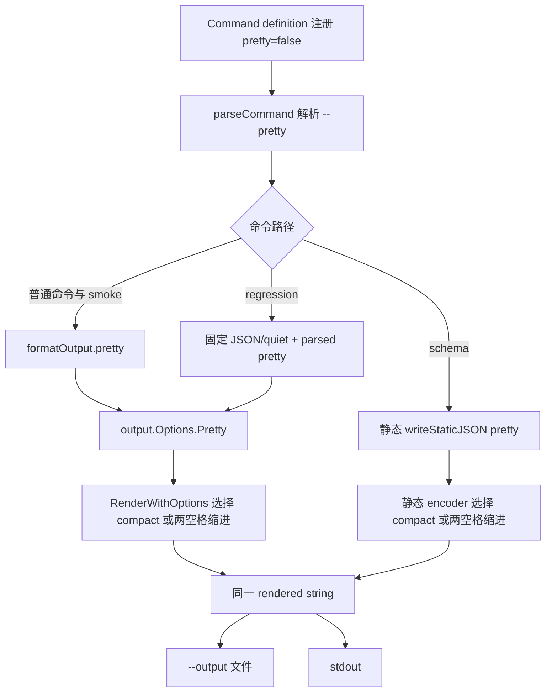

# Onesearch CLI JSON Compact 输出与 `--pretty` 技术方案

## 实施状态

状态：已实施并完成验证（2026-08-04）。

本文档先基于 `main` 分支实施前源码制定方案，现已按本文合同完成代码、测试、golden 和公共文档同步。

实施前基线已确认：

- 项目使用 `mise.toml` 声明的 Go 1.26.5。
- `internal/output`、`internal/cli`、`internal/commandcontract`、`internal/skills` 定向测试通过。
- 当前 44 个 public executable commands 都支持 JSON 输出，但普通命令、`schema` 和 `regression` 并不完全共用同一条输出参数链路。
- 普通动态 JSON 与静态 schema JSON 都固定调用 `Encoder.SetIndent("", "  ")`，因此默认输出为两空格缩进的多行 JSON。
- 一次性分析快照中，当前 manifest golden 为 177,319 个字符、包含 6,683 个 LF；在不改变 JSON 数据的前提下压缩空白并保留结尾 LF 后约为 97,037 个字符，字符数减少约 45.28%。该数据只说明优化量级，不作为后续 golden 或验收的固定阈值。

实施结果：

- 44 个 public commands 均通过 command contract 暴露 `pretty: false` 和 `--pretty` binding；`output.variants` 继续只表达 quiet/verbose 等 payload 变体。
- 普通命令已贯通 `parsed -> formatOutput -> output.Options -> RenderWithOptions`，JSON 默认 compact，仅在 `Pretty == true` 时调用 `SetIndent("", "  ")`。
- 静态 schema encoder 的成功、unknown canonical path 和可识别的 parse error 均支持 compact/pretty，且继续在配置加载前执行。
- `regression` 支持 `--pretty`，但仍固定 JSON、quiet、无 `--output`；`schema` 与 `regression` 的非 JSON format 继续返回退出码 2。
- 顶层 synopsis、command help、manifest golden、README、两份 npm README、主 Skill、CLI contract 和直接受影响的技术设计已同步。
- manifest golden 继续通过显式 `schema --pretty` 生成，保持多行可审阅；默认 compact 由独立测试锁定。

实施验证：

- `mise exec -- go test -count=1 ./internal/output ./internal/commandcontract ./internal/cli ./internal/skills` 通过。
- `mise exec -- go test -count=1 ./...` 通过。
- `mise exec -- go vet ./...` 通过。
- 隔离配置 smoke 中，full/targeted schema、regression 和 mock smoke 的默认 JSON 均为 1 行；对应 `--pretty` 均为多行。
- full schema compact/pretty 解码后语义相等；schema 静态查询未创建 `config.json`。
- 自动化测试已覆盖 `--pretty=false`、quiet/verbose payload 语义等价、schema 成功与错误的 stdout/`--output` byte equality，以及 compact/pretty 脱敏一致性。
- 文档绝对文件系统路径审计、目标 diff 检查和 `git diff --check` 均通过。

真实 provider、网络、凭据、远端 MCP tool 和发布后二进制安装验证仍不属于本功能验收范围，未执行。

## 背景

`onesearch` 的 JSON 主要面向 agent、脚本和适配器。当前默认 pretty JSON 对人类直接阅读友好，但完整 `onesearch schema` 等大对象会因缩进、换行和结构层级产生大量无语义字符，增加：

- agent 工具输出的字符和 token 开销；
- shell、日志和上层工具达到总输出限制的概率；
- 完整 manifest 在会话中的视觉行数；
- 高频 CLI 调用累计占用的上下文预算。

JSON parser 对 compact 与 pretty 两种序列化结果具有相同的结构语义。对 agent-first CLI，更合理的默认是输出 compact JSON；当维护者确实需要直接阅读完整 JSON 时，再通过显式 `--pretty` 请求两空格缩进。

本方案确定以下产品选择：

1. `compact` 是 JSON 的规范默认物理格式。
2. `--pretty` 是显式的人类查看选项，默认值为 `false`。
3. 不根据 TTY 自动切换 JSON 排版，保证相同参数得到确定的物理格式。
4. compact 与 pretty 只改变 JSON 空白，不改变结果字段、脱敏、退出码或 quiet/verbose 语义。

## 术语与边界

仓库现有文档中的“compact”存在两种不同含义，本功能必须明确区分：

| 术语 | 控制对象 | 当前入口 | 本方案是否改变 |
| --- | --- | --- | --- |
| 语义精简 | 输出哪些字段、正文预览长度和诊断详略 | 默认 quiet、`--quiet`、`--verbose` | 不改变 |
| JSON compact 排版 | JSON token 之间是否写入缩进和换行 | 当前没有独立入口 | 改为默认 |
| JSON pretty 排版 | 使用两空格缩进和多行展示 | 当前是无条件默认 | 改为显式 `--pretty` |

例如，`search --format json --quiet --pretty` 仍是字段精简的 quiet payload，只是使用多行排版；`search --format json --verbose` 仍包含完整诊断，只是默认以单行 compact JSON 输出。

本文中的“CLI JSON 输出”仅指 CLI 最终写入 stdout 和显式 `--output` 文件的 JSON 文本，不包括：

- `internal/config/config.go` 写入用户配置文件时使用的 pretty JSON；
- `internal/mcpstdio` 的 JSON-RPC 帧；
- provider HTTP request/response 的 JSON wire format；
- 测试内部临时使用的 `json.Marshal`；
- help、version、content、markdown 和普通 stderr 文本。

这些路径具有独立的持久化或协议合同，不得为满足 CLI 排版需求而改动。

## 当前代码边界

### 普通动态命令

普通 workflow、provider-direct、utility 和 `smoke` 的数据流为：

1. `internal/cli/command_parser.go` 按 command definition 解析 argv。
2. `internal/cli/command_bindings.go` 的 `formatOutputFromParsed()` 读取 `format`、`output`、`quiet` 和 `verbose`。
3. `internal/cli/cli.go` 的 `printCommand()` 调用 `output.RenderWithOptions()`。
4. `internal/output/output.go` 先完成结构化脱敏和 quiet/verbose payload 选择，再在 JSON 分支创建 `json.Encoder`。
5. 当前 JSON 分支无条件执行 `SetIndent("", "  ")`。
6. 同一份 rendered string 先传给 `output.Write()`，随后写入 stdout。

`output.Write()` 已经保证 `--output` 接收的不是另一份重新编码数据，因此新增排版选项后仍应保持“一次渲染、两处写入”。

### 静态 `schema` 命令

`schema` 在 `config.Load()` 前完成静态分派，并使用 `internal/cli/schema_commands.go` 的 `writeStaticJSON()` 独立编码 typed manifest。该路径同样无条件执行 `SetIndent("", "  ")`，但不会进入动态结果的 compact、redaction 或 service 流程。

这个静态边界是安全和确定性合同的一部分。实现 compact/pretty 时应只为静态 encoder 增加排版开关，不应把 schema 接入动态 renderer。

### `regression` 特殊命令

`regression` 没有使用共享 `withOutput()` options：

- command definition 只注册 JSON-only `--format`；
- binding 固定使用 `format=json` 和 `verbosity=quiet`；
- 当前不支持 `--output`。

因此，仅修改共享 output options 不会让 `regression --pretty` 生效。该命令必须单独补充 `pretty` option，并继续保留固定 quiet、JSON-only、无文件写入的现有合同。

### Command manifest 与 help

`internal/commandcontract` 是 public command path、options、input schema、help 和 `BuildArgv()` 的共同来源：

- 42 个普通命令通过 `withOutput()` 取得共享 output options；
- `schema` 与 `regression` 各自声明特殊 JSON-only options；
- `CommandDefinition.inputSchema()` 自动把 boolean option 转成 JSON Schema property 和 `--flag` binding；
- help 自动列出 definition 中的 options；
- `BuildArgv()` 对显式 `true` boolean 生成 flag，对 `false` 或未提供的值不生成 token。

因此，`--pretty` 必须先进入 command contract，而不能只在 renderer 中作为未公开的内部参数实现。

## 目标

1. 所有 public command 的 JSON stdout 默认使用 compact 排版。
2. 所有 public command 都公开 boolean `--pretty`，显式启用后使用现有两空格缩进。
3. compact 和 pretty 都保留恰好一个结尾 LF。
4. 普通命令、`schema`、`regression`、成功和结构化错误都遵循同一物理格式合同。
5. `--pretty` 与 `--quiet`、`--verbose` 正交，不改变 payload 结构。
6. stdout 与 `--output` 继续写入完全相同的 rendered bytes。
7. 不增加 TTY 自动探测，不因交互环境改变输出。
8. 保持 schema 的静态、无配置初始化、无网络、无凭据读取边界。
9. 保持 manifest golden 为可审阅的 pretty JSON，而不是把 golden 压成单行。
10. 同步 README、npm README、内置 Skill、CLI contract 和直接受影响的技术设计文档。

## 非目标

1. 不改变 quiet/verbose 的字段裁剪、正文预览或诊断结构。
2. 不改变 JSON field 名、field 顺序合同、退出码、脱敏和错误分类。
3. 不新增 `json-pretty` format，也不把 `pretty` 加入 `OutputDefinition.Variants`。
4. 不按 TTY、pipe、重定向或 `--output` 是否存在自动选择排版。
5. 不引入 NDJSON、流式 JSON、分页、cursor、`--fields` 或新的 schema summary 模式。
6. 不修改配置文件持久化 JSON、MCP JSON-RPC 或 provider wire JSON。
7. 不为 `regression` 顺手新增 `--output`。
8. 不在本功能中重构动态 JSON 编码错误的既有处理方式；编码错误传播应另立任务处理。
9. 不机械地给所有 agent 示例追加 `--pretty`；agent 示例应继续使用默认 compact JSON。

## 方案选择

### 默认 compact，显式 pretty

采用以下规范：

```text
--format json
  -> 单行 compact JSON
  -> 结尾保留一个 LF

--format json --pretty
  -> 两空格缩进的多行 JSON
  -> 结尾保留一个 LF
```

省略 `--format` 时默认仍是 JSON，因此 `onesearch schema`、`onesearch status` 等命令也默认 compact。`--pretty=true` 等价于 `--pretty`；省略或使用 `--pretty=false` 时保持 compact。

继续使用 `json.Encoder.Encode()`，只把 `SetIndent()` 改为 `Pretty == true` 时调用。这样可以保留当前：

- 恰好一个结尾 LF；
- `SetEscapeHTML(false)` 行为；
- Go 标准库的 JSON 编码和确定性排序行为；
- compact 与 pretty 之间只存在空白差异。

### 不使用 TTY 自动切换

TTY 自动策略虽然适合传统人类 CLI，但不适合本项目的稳定 agent/script 合同：

- agent shell 是否分配伪终端取决于宿主工具，不能作为可靠意图信号；
- 相同 argv 在终端、pipe 和测试捕获环境中会产生不同 bytes；
- `--output` 与 stdout 的 byte equality 会变得依赖执行环境；
- schema golden、快照和复现命令更难判断预期输出。

因此，排版只由 argv 中的 `--pretty` 决定。

### 非 JSON format 下的行为

`--pretty` 只影响 JSON encoder。对本来支持 `content` 或 `markdown` 的普通命令：

- 参数仍被识别和接受；
- rendered 结果与不传 `--pretty` 完全相同；
- 不新增 parser constraint，不返回参数错误。

这样可以保持 output modifier 的实现简单，并避免仅为一个无副作用组合扩展 command constraint 类型。help 和 CLI contract 必须明确写为“Indent JSON output; ignored for non-JSON formats.”，避免用户误认为它会格式化 Markdown 或 content。

`schema` 和 `regression` 继续保持 JSON-only：两者传入 `--format content` 或 `--format markdown` 仍返回 `parameter_error` 和退出码 2；新增 `--pretty` 不扩大其 formats 集合。

### `pretty` 不是结果 variant

`OutputDefinition.Variants` 当前表达 `quiet`、`verbose` 等 payload 形态。`pretty` 不改变字段集合和数据语义，因此：

- 不把 `pretty` 加入 `output.variants`；
- 通过 `input_schema.properties.pretty`、help 和 CLI contract 公开；
- manifest consumer 可以把它当作普通 boolean presentation option。

### Manifest golden 保持 pretty

默认 schema 改为 compact 后，如果 golden 继续比较默认输出，`internal/cli/testdata/cli-command-manifest-v1.golden.json` 将退化为不可审阅的单行文件。

本方案让 golden 测试显式执行：

```powershell
onesearch schema --pretty
```

然后继续执行现有 `cli.version` 归一化和显式 update gate。另设独立测试验证默认 `schema` 是 compact。这样运行时默认合同与代码审查产物各自使用最合适的排版，而 JSON 数据保持深度相等。

## 总体设计



### Command contract

在 `internal/commandcontract/fragments.go` 增加复用的 `prettyOption()`：

```go
func prettyOption() OptionDefinition {
    return optionDefault(
        "pretty",
        "pretty",
        TypeBoolean,
        false,
        "Indent JSON output; ignored for non-JSON formats.",
    )
}
```

具体接入规则：

1. `outputOptions()` 加入 `prettyOption()`，覆盖所有使用 `withOutput()` 的命令。
2. `schema` 的 JSON-only options 显式加入 `prettyOption()`。
3. `regression` 的 JSON-only options 显式加入 `prettyOption()`。
4. `normalConstraints()` 不变，`quiet` 与 `verbose` 仍互斥；`pretty` 可与二者任意一个组合。
5. `OutputDefinition.Formats`、`DefaultFormat`、`Variants` 和 `manifest_version` 不变。

新增 option 后，registry 生成的 help、input schema 和 `BuildArgv()` 会自动获得：

```json
"pretty": {
  "type": "boolean",
  "default": false,
  "description": "Indent JSON output; ignored for non-JSON formats.",
  "x-cli-binding": {
    "kind": "flag",
    "token": "--pretty",
    "repeatable": false
  }
}
```

`BuildArgv(id, {"pretty": true})` 应生成 `--pretty`，`false` 不生成 token；不需要修改现有 boolean argv builder。

### 普通动态 JSON

在 `internal/output/output.go`：

1. 为 `output.Options` 增加 `Pretty bool`。
2. 保持 redaction、quiet/verbose payload 选择和 format switch 的现有顺序。
3. JSON 分支继续使用 `json.NewEncoder()` 和 `SetEscapeHTML(false)`。
4. 仅当 `options.Pretty` 为 `true` 时调用 `SetIndent("", "  ")`。
5. 继续使用 `Encode()` 保留结尾 LF。

在 `internal/cli`：

1. 为 `formatOutput` 增加 `pretty bool`。
2. `formatOutputFromParsed()` 从 `parsed.Bool("pretty")` 读取值。
3. `printCommand()` 把值传给 `output.Options.Pretty`。
4. 普通成功、service 错误、provider 错误和 parse 后的结构化参数错误继续共用 `printCommand()`。

不新增第二次 JSON 编码，也不让 `output.Write()` 接收结构化数据。

### 静态 schema JSON

`schema` 继续保留独立 typed encoder。修改数据流为：

```text
parsed.Bool("pretty")
  -> runSchema
  -> writeStaticError / writeStaticJSON
  -> conditional SetIndent
  -> output.Write
  -> stdout
```

需要覆盖三条路径：

1. full/targeted schema 成功输出；
2. `runSchema()` 中 unknown canonical path 的结构化错误；
3. `Execute()` 中 schema parse error 的结构化错误。

当 parser 在读到 `--pretty` 前已因更早的 unknown flag 终止时，无法可靠恢复后续 flag，错误使用默认 compact；不为排版 flag 增加二次 argv 扫描。已成功解析到 `pretty` 的错误路径应尊重其值。

静态 schema 仍不得进入动态 redaction/compact 分支，也不得因此加载配置或初始化 service。

### `regression` 特殊路径

`runParsedCommand()` 已在进入 switch 前构造 `formatOutput`。`regression` 分支只复用其中的 `pretty` 值：

```text
format = json       固定
verbosity = quiet   固定
output = empty      固定
pretty = parsed     新增
```

不得直接把完整 `fo` 传入 regression，否则 runtime debug 默认可能改变其固定 quiet 合同，也可能误导后续维护者认为它支持 `--output`。

### stdout 与 `--output`

普通命令和 schema 都必须保持：

```text
structured data
  -> 一次渲染
  -> rendered string
  -> output.Write(path, rendered)
  -> fmt.Print(rendered)
```

两处输出不得分别编码。文件写入失败继续返回退出码 5，并且不打印成功 payload。compact 与 pretty 两种模式都必须做 byte-for-byte equality 测试。

## 命令合同

### 调用示例

```powershell
# agent 与脚本默认：compact JSON
onesearch status --format json
onesearch search "query" --format json
onesearch schema
onesearch schema search
onesearch regression

# 人工检查完整 JSON：显式 pretty
onesearch status --format json --pretty
onesearch search "query" --format json --verbose --pretty
onesearch schema --pretty
onesearch schema search --pretty
onesearch regression --pretty
```

### 行为矩阵

| 命令范围 | format | pretty 值 | 输出行为 |
| --- | --- | --- | --- |
| 全部 public commands | `json` 或默认 format | 未提供 / `false` | compact JSON，一行数据，结尾一个 LF |
| 全部 public commands | `json` 或默认 format | `true` | 两空格缩进的多行 JSON，结尾一个 LF |
| 支持 content 的普通命令 | `content` | 任意值 | content 输出不变，`pretty` 无效果 |
| 支持 markdown 的普通命令 | `markdown` | 任意值 | markdown 输出不变，`pretty` 无效果 |
| `schema`、`regression` | 非 `json` | 任意值 | 保持 JSON-only 参数错误，退出码 2 |

### 与 quiet/verbose 的组合

| 参数 | 结果 |
| --- | --- |
| `--quiet --pretty` | 合法；quiet payload + pretty 排版 |
| `--verbose --pretty` | 合法；verbose payload + pretty 排版 |
| `--quiet --verbose --pretty` | 仍因 quiet/verbose 互斥返回退出码 2 |
| `--pretty=false` | 合法；使用 compact 排版 |

### 结构化错误

- 已解析到 command definition 的 JSON 错误默认 compact。
- 当有效 `--pretty` 已被 parser 读取时，普通命令和 schema 的结构化错误使用 pretty。
- unknown top-level command 继续使用现有 stderr 文本，不因本功能变成 JSON。
- unknown namespace subcommand 在 command definition 解析前产生，继续使用默认 compact JSON；不为支持 `--pretty` 扩展预路由扫描。
- 错误 envelope、错误分类和退出码保持不变。

## 兼容性与版本

### JSON 语义兼容

使用标准 JSON parser 的消费者不受影响：compact 与 pretty 解码后必须深度相等。字段、类型、null/empty 语义、转义和结尾 LF 均不改变。

### 物理 bytes 兼容

默认 bytes 会发生有意变化：

- 依赖逐行读取多行对象的脚本需要改为标准 JSON parser；
- 对默认 pretty bytes 做 golden、snapshot、hash 或文本 diff 的调用方需要显式增加 `--pretty`，或更新预期值；
- 用正则匹配缩进和换行的调用方不属于稳定 JSON 消费方式。

这是用户可见的输出兼容性变化，release note 必须明确说明默认 JSON 改为 compact，并给出 `--pretty` 迁移方式。

### Manifest 版本

`manifest_version` 保持 1：

- manifest envelope 和 input schema 表达方式未变；
- `pretty` 是新增的可选 boolean command option；
- whitespace 不属于 manifest 数据模型版本；
- `output.variants` 不新增值。

CLI/package 版本是否升级由实施后的发布流程统一决定，不在代码中为本方案单独硬编码版本号。

## 文件改动规划

| 文件 | 规划改动 |
| --- | --- |
| `internal/commandcontract/fragments.go` | 新增复用的 `prettyOption()`，并加入共享 output options |
| `internal/commandcontract/utilities.go` | 为 `schema`、`regression` 的特殊 JSON-only options 加入 `pretty` |
| `internal/output/output.go` | 为 `Options` 增加 `Pretty`；JSON encoder 改为条件缩进 |
| `internal/cli/cli.go` | 为 `formatOutput` 增加 `pretty` 并传入 renderer；schema parse error 传递 `parsed.Bool("pretty")` |
| `internal/cli/command_bindings.go` | 读取 parsed `pretty`；让 regression 特殊分支只透传该值 |
| `internal/cli/command_help.go` | 在顶层 schema synopsis 中公开 `--pretty` |
| `internal/cli/schema_commands.go` | 将 `pretty` 贯穿 `writeStaticParameterError()`、`writeStaticError()`、`writeStaticJSON()` 和 schema 成功路径 |
| `internal/output/output_test.go` | 覆盖 compact/pretty 字节、语义相等、结尾 LF、脱敏和 quiet/verbose 正交性 |
| `internal/commandcontract/registry_test.go` | 断言全部 public commands 暴露 `pretty=false` 且 output variants 不变 |
| `internal/commandcontract/argv_test.go` | 覆盖 `pretty=true/false` 的 argv 生成 |
| `internal/cli/command_parser_test.go` | 覆盖 boolean inline 值和 quiet/verbose 组合保持不变 |
| `internal/cli/schema_commands_test.go` | 覆盖默认 compact、显式 pretty、错误、确定性、文件一致性和 pretty golden |
| `internal/cli/config_commands_test.go` | 在现有动态 stdout/`--output` 一致性与脱敏测试中加入 pretty case |
| `internal/cli/cli_test.go` | 覆盖 regression 与普通 public command 的 CLI 级 compact/pretty 行为 |
| `internal/cli/testdata/cli-command-manifest-v1.golden.json` | 通过显式 update gate 更新新增的 `pretty` properties，文件继续保存为 pretty JSON |
| `README.md` | 区分字段精简与空白压缩，说明默认 compact、`--pretty`、非 TTY 策略和迁移方式 |
| `npm/onesearch/README.md` | 补充 npm CLI 的 compact/pretty 公共合同 |
| `npm/deqiying-onesearch/README.md` | 与 unscoped npm README 保持一致 |
| `internal/skills/assets/onesearch/SKILL.md` | 明确 agent 默认不传 `--pretty`，人工检查时才使用 |
| `internal/skills/assets/onesearch/references/agent-execution-contract.md` | 记录运行时排版、错误、schema、regression、stdout/file 合同，并同步现有 regression/golden 维护说明 |
| `docs/cli-command-schema-technical-design.md` | 更新已实施 schema 的默认排版、pretty option、golden 和测试说明 |
| `docs/cli-provider-setup-technical-design.md` | 补充 pretty 不改变脱敏边界和 stdout/文件一致性 |

明确不改：

- `cmd/onesearch/main.go` 和 npm launcher：当前已按原样透传 argv。
- provider/workflow 子 Skill 中的大量 `--format json` 示例：这些示例面向 agent，应继续使用默认 compact。
- `internal/config`、`internal/mcpstdio` 和 provider wire encoder。
- `OutputDefinition`、manifest envelope 和 schema version。

## 实现步骤

### 阶段一：冻结命令合同

1. 在 command contract 中定义唯一的 `prettyOption()`。
2. 接入 42 个共享 output commands，以及 `schema`、`regression` 两个特殊 command。
3. 验证 44 个 public command 的 input schema 都包含 `pretty`，默认值为 `false`。
4. 验证 `output.variants` 仍只表达既有 payload variants。
5. 验证 help 和 `BuildArgv()` 自动获得正确 flag 行为。

### 阶段二：实现动态输出排版

1. 在 `output.Options` 和 CLI `formatOutput` 中增加 `Pretty` 数据通道。
2. 将 `pretty` 从 parser 贯穿到 `RenderWithOptions()`。
3. 删除 JSON 默认路径上的无条件 `SetIndent()`，改为条件调用。
4. 保持 `SetEscapeHTML(false)`、`Encode()`、redaction 和 output write 顺序不变。
5. 单独修改 regression 分支，保留固定 JSON/quiet/no-output 合同。

### 阶段三：实现静态 schema 排版

1. 为 schema option 注册 `--pretty`。
2. 将 parsed pretty 传入 full/targeted success encoder。
3. 将 pretty 传入 unknown canonical path 和 parse error encoder。
4. 保持 schema 在 config/service 之前静态分派。
5. 不复用动态 renderer，不引入 runtime redaction 或 compact payload 分支。

### 阶段四：补齐测试与 golden

1. 先补 renderer 的 compact/pretty 物理格式测试。
2. 补 command contract、help、parser 和 argv 测试。
3. 补普通命令、schema、regression 的 CLI 级成功与错误测试。
4. 将 manifest golden 的生成入口改为 `schema --pretty`。
5. 通过现有显式环境变量更新 golden，并人工复核仅出现预期 `pretty` option 变更。
6. 另行断言默认 schema compact，避免 pretty golden 掩盖运行时默认行为。

### 阶段五：同步文档与发布说明

1. 更新 root README、两份 npm README、主 Skill 和 CLI contract。
2. 更新直接受影响的 schema/provider setup 技术设计状态说明。
3. 不给 agent 命令示例批量追加 `--pretty`。
4. 在 release note 中写明 byte-level 兼容性变化和 `--pretty` 迁移方法。
5. 执行所有文档绝对路径审计并人工排除 URL、API path 等非文件系统标识。

## 测试方案

### Output 单元测试

至少覆盖：

1. 默认 JSON 只有一个实际 LF，且该 LF 是最后一个字节。
2. `Pretty: true` 包含两空格缩进并以一个 LF 结尾。
3. compact 与 pretty 分别 `json.Unmarshal` 后深度相等。
4. `SetEscapeHTML(false)` 的既有行为不变。
5. quiet 与 verbose 在两种排版下的字段集合分别相同。
6. 成功、普通错误和 provider error 都遵守排版选择。
7. 两种排版都继续通过结构化字段脱敏和最终文本脱敏。
8. content/markdown 在 `Pretty: false/true` 下 byte-for-byte 相同。

### Command contract 与 parser 测试

至少覆盖：

1. 44 个 public commands 都公开 `pretty` boolean、默认 `false` 和 `--pretty` binding。
2. `schema`、`regression` 不因特殊 options 漏掉 pretty。
3. `output.variants` 不包含 `pretty`。
4. help 展示 `--pretty` 及“仅影响 JSON”的说明。
5. `BuildArgv(..., {"pretty": true})` 生成 `--pretty`。
6. `pretty=false` 不生成 flag。
7. parser 接受 `--pretty`、`--pretty=true`、`--pretty=false`。
8. `--quiet --pretty` 和 `--verbose --pretty` 合法；quiet/verbose 互斥仍生效。
9. content/markdown 与 pretty 的组合可解析，renderer 输出不变。

### 普通 CLI 输出测试

至少覆盖：

1. 一个本地、无网络的普通 utility 默认输出 compact JSON。
2. 同一 utility 的 `--pretty` 输出多行 JSON，解码结果相同。
3. 默认和 pretty 两种模式下，stdout 与 `--output` 文件逐字节一致。
4. 文件写入失败仍返回 5，且不打印成功 payload。
5. 已读取到 `--pretty` 后发生的结构化参数错误使用 pretty。
6. runtime debug 默认不改变 pretty 的默认值。
7. `smoke --mock` 自动复用普通输出链路。
8. `search "query" --pretty --output <temp> --unknown-flag` 返回 2，且 stdout 与错误文件逐字节相同并保留结尾 LF。

### Schema 测试

至少覆盖：

1. full 和 targeted schema 默认都是一行 compact JSON，并保留结尾 LF。
2. full 和 targeted schema 的 `--pretty` 都使用两空格缩进。
3. 两种排版解码后的 manifest 深度相等。
4. 默认和 pretty 各自连续生成两次都 byte-for-byte 稳定。
5. 两种排版的 stdout 与 `--output` 各自逐字节一致。
6. unknown canonical path 和已解析到 pretty 的参数错误遵守所选排版。
7. schema 查询仍不创建 config、不读取 provider key、不访问网络。
8. golden 测试使用显式 `schema --pretty`，保留 `<runtime-version>` 归一化和显式更新门禁。
9. golden diff 只包含每个 command 新增的 pretty property 和本功能直接引起的合同变化。
10. `schema <unknown-path> --pretty --output <temp>` 返回 2，且 stdout 与错误文件逐字节相同并保留结尾 LF。
11. `schema --quiet`、`schema --verbose` 继续返回 2；`--pretty` 是 schema 唯一新增的 presentation flag。

### Regression 特殊路径测试

至少覆盖：

1. `regression` 默认输出 compact JSON。
2. `regression --pretty` 输出多行 JSON。
3. 两种排版解码结果相同。
4. 两种模式都保持固定 quiet payload，不受 runtime debug 默认影响。
5. `regression --output` 继续是 unknown flag，避免无意扩大文件写入合同。
6. `regression --quiet`、`regression --verbose` 继续是 unknown flag；固定 quiet 是内部输出合同，不代表公开这两个参数。

### 端到端 smoke

使用仓库相对缓存目录和隔离配置执行：

```powershell
$jsonOutputSmokeRoot = Join-Path (Get-Location) ".cache/json-output-smoke"
$env:ONESEARCH_CONFIG_DIR = Join-Path $jsonOutputSmokeRoot "config"

mise exec -- go run ./cmd/onesearch schema --output .cache/json-output-smoke/schema-compact.json
mise exec -- go run ./cmd/onesearch schema --pretty --output .cache/json-output-smoke/schema-pretty.json
mise exec -- go run ./cmd/onesearch schema search
mise exec -- go run ./cmd/onesearch schema search --pretty
mise exec -- go run ./cmd/onesearch regression
mise exec -- go run ./cmd/onesearch regression --pretty
mise exec -- go run ./cmd/onesearch smoke --mock --format json
mise exec -- go run ./cmd/onesearch smoke --mock --format json --pretty
```

人工检查：

- compact 文件只有一行 JSON 数据并以 LF 结尾；
- pretty 文件为两空格缩进；
- compact/pretty 解码后相等；
- 隔离配置目录未因 schema/help 静态命令创建 `config.json`；
- mock regression/smoke 不访问真实 provider；
- 输出中不存在凭据原文。

完整验证命令：

```powershell
mise exec -- go test -count=1 ./internal/output ./internal/commandcontract ./internal/cli ./internal/skills
mise exec -- go test -count=1 ./...
mise exec -- go vet ./...
git diff --check
```

文档变更后还需扫描全部 Markdown 中的 Windows drive path、UNC path 和 Unix user-directory path，并人工排除 URL、HTTP API path 和 Context7 `/org/project` 标识。

真实 provider live 调用不是本功能的验收条件；本功能只改变本地最终 JSON 序列化排版。

## 验收标准

1. 44 个 public commands 全部在 help 和 command manifest 中公开 `--pretty`，默认值为 `false`。
2. 所有 CLI JSON 默认输出 compact 单行数据，并保留恰好一个结尾 LF。
3. `--pretty` 对所有 CLI JSON 使用两空格缩进，并保留恰好一个结尾 LF。
4. compact 与 pretty 解码后的 JSON 深度相等。
5. pretty 不改变 quiet/verbose、字段裁剪、错误分类、退出码和脱敏。
6. `--pretty=false` 与省略 flag 的输出一致。
7. 支持 content/markdown 的普通命令在是否传 pretty 时输出一致。
8. 普通命令、`schema`、`regression`、成功和结构化错误路径均有测试覆盖。
9. `regression` 继续固定 quiet、JSON-only、无 `--output`。
10. `schema`、`regression` 的非 JSON format 以及既有不支持的 quiet/verbose flags 继续返回 2。
11. schema 继续在配置加载前静态执行，不创建配置、不读取凭据、不访问网络。
12. stdout 与 `--output` 在 compact/pretty 两种模式下分别逐字节一致，成功和错误路径均覆盖。
13. manifest golden 继续是可审阅的 pretty JSON，并只通过显式 update gate 更新。
14. `manifest_version`、runtime schema、provider wire format 和配置持久化格式保持不变。
15. README、npm README、主 Skill、CLI contract 和直接受影响的技术设计已同步。
16. 文档中不存在开发机、用户目录或工作区绝对文件系统路径。
17. 定向测试、全量测试、vet、mock smoke、文档检查和 `git diff --check` 全部通过。

## 风险与取舍

### 依赖默认 pretty bytes 的调用方

风险：非标准消费者可能依赖换行、缩进、逐行 grep、snapshot 或 hash。

处理：在 release note 中明确 byte-level 变化；需要旧排版的调用方显式增加 `--pretty`。标准 JSON parser 无需迁移。

### 单行大 JSON 的宿主限制

风险：少数日志或终端宿主存在单行长度限制，完整 compact manifest 仍可能被截断。

处理：agent 优先使用 `schema <canonical-path...>`；需要完整人工审阅时使用 `--pretty`；需要脱离终端处理时使用 `--output`。不因此引入 TTY 自动切换或 NDJSON。

### 三条输出路径发生漂移

风险：普通 renderer、schema 静态 encoder 和 regression 特殊 binding 可能只修改其中一部分。

处理：command contract 覆盖全部 44 个 public commands；分别建立动态、schema、regression 测试，并以行为矩阵作为共同验收合同。

### “compact”语义混淆

风险：维护者可能把 quiet payload 裁剪与 JSON 空白压缩误认为同一功能。

处理：代码字段使用 `Pretty`，文档分别使用“语义精简”和“JSON compact 排版”；不把 pretty 加入 output variants。

### Golden 可审阅性下降

风险：默认 compact 直接驱动 golden 会让大型 manifest 变成一行，难以审查合同变更。

处理：golden 固定通过 `schema --pretty` 生成；独立测试默认 compact，不让测试产物排版反向决定运行时默认值。

### 动态 JSON 编码错误仍未传播

风险：`RenderWithOptions()` 当前忽略 `encoder.Encode()` 错误，这是既有失败语义缺口。

处理：本功能保持最小范围，不借排版修改扩大 renderer API；另立任务将编码失败贯穿到 stderr 和退出码 5，并添加不支持类型/NaN 测试。

## 推荐结论

采用“compact 为 JSON 规范默认、`--pretty` 显式启用、无 TTY 自动分支”的统一合同。实现以现有 command contract 为唯一 public option 来源，分别覆盖普通动态 renderer、schema 静态 encoder 和 regression 特殊 binding；compact 与 pretty 只改变 JSON 空白，quiet/verbose、脱敏、退出码和数据合同全部保持不变。

manifest golden 继续使用显式 pretty 输出以保持可审阅，运行时默认 compact 由独立测试锁定。该方案无需新增依赖、无需修改协议或持久化 JSON，也不引入 NDJSON、分页或新的结果 variant，是满足 agent 输出效率目标的最小充分改动。
