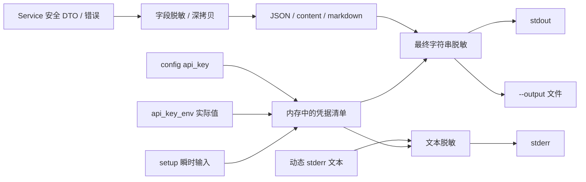

# CLI Provider 凭据快速配置与安全输出技术方案

## 实施状态

状态：已实现并完成验证（初始实现 2026-07-20；JSON compact/pretty 合同同步 2026-08-04）。

本方案已经按“全局脱敏基础设施 → 严格配置写入 → setup 交互 → status/doctor 诊断 → 文档与测试”的顺序落地：

- 新增 `onesearch config setup <provider>`，支持隐藏 TTY 输入、`--api-key-stdin`、可选 `--base-url`、canonical ID/kebab-case/alias 解析和 `enabled: "auto"`。
- 新增严格 JSON/runtime schema 读取和 `providers.<canonical-id>` 定向 patch；损坏或不可识别的配置不会被覆盖。
- 新增共享 redaction package；结构化数据在格式化前深拷贝脱敏，compact/pretty rendered text 在 stdout、动态 stderr 和 `--output` 前再次按实际凭据值替换。
- `status` 和 `doctor` 已输出当前 `config.file`、`dir_source`、必要时的 `dir_env` 以及不含 value 的 `effective_environment`。
- `api_key_set`、`api_key_env_set`、`api_key_src` 和 `has_api_key` 已统一使用 trim 后的凭据状态。
- README、内置 `onesearch` Skill 和 CLI contract 已同步更新。

验证结果：`go test ./...` 通过；单元测试覆盖 setup 的 compact/pretty JSON、stdout/`--output` 一致性和 key 原文泄漏断言，隔离临时配置目录中的实际 CLI smoke 已覆盖 setup、doctor、status、mock smoke 和三级 help。原方案中的 atomic replace、跨进程锁、远端 key 有效性探测仍保持为非目标。

## 背景

`onesearch` 当前会在首次执行普通命令时自动创建 `config.json`。初始配置已经包含完整的 runtime schema、内置 provider、默认 `base_url`、`api_key_env` 和启用状态，但需要 API key 的 provider 仍然要由用户手动编辑配置文件。

```json
{
  "providers": {
    "exa": {
      "enabled": false,
      "base_url": "https://api.exa.ai",
      "api_key": ""
    }
  }
}
```

手动编辑存在以下问题：

- 用户必须先执行 `config path` 找到文件，再定位 `providers.<id>`。
- 用户需要同时理解 `api_key`、`base_url`、`api_key_env` 和 `enabled` 的关系。
- provider 已有内置 `base_url` 时仍要判断是否需要重复填写。
- JSON 语法错误会导致运行时退回内置配置，问题不容易在编辑时发现。
- API key 属于敏感信息，不适合通过普通命令参数传递并留在 shell history 或进程参数中。

本方案新增一个定向的 CLI 配置入口，用于快速完成某个 provider 的 API key 和可选 `base_url` 配置；同时把“任何 CLI 输出都不得泄露配置或环境变量中的凭据”提升为全局安全不变量，并在兼容现有诊断模型的基础上补充有效配置来源信息。

## 目标

1. 新增 `onesearch config setup <provider>`，支持通过 provider ID 或 alias 定位目标 provider。
2. 对需要 API key 的 provider，保证配置完成后的有效结果中存在 key；首次配置时空 key 必须失败。
3. 对支持 `base_url` 的 provider 展示当前值或内置默认值，用户输入空值时保留该值。
4. 配置成功后把目标 provider 的 `enabled` 调整为 `"auto"`，使新凭据立即参与现有 availability 和 route 判断。
5. 只修改 `providers.<canonical-id>` 下与本次操作有关的字段，保留其他顶层配置、provider 自定义字段、routes、profiles、pipelines 和 defaults。
6. API key 不出现在命令参数中；任何命令、输出格式、verbosity、错误路径和 `--output` 文件都不得出现配置、环境变量或本次交互输入中的 key 原文。
7. `status` 和 `doctor` 可以输出当前生效的配置文件路径、配置目录来源、环境变量名和是否生效，但不得输出环境变量值。
8. 保持 `config path`、`config list`、`doctor`、`status` 的既有字段语义；新增诊断字段采用向后兼容的 additive change。

## 非目标

- 不实现通用的 `config set <json-path> <value>` JSON 编辑器。
- 不在本阶段提供 key 删除、`base_url` 清空、provider 禁用或配置回滚命令。
- 不修改 `api_key_env`，也不写入用户的系统环境变量、PowerShell profile 或 shell 配置。
- 不实现任意环境变量枚举或环境快照；只报告 onesearch runtime 实际声明或采用的变量名。
- 不输出 key 长度、前后缀、hash、稳定指纹或其他可用于关联凭据的信息。
- 不新增 `health` 顶层命令；当前 `doctor` 继续承担配置健康检查职责，`status` 承担完整运行时状态展示职责。
- 不通过 CLI 配置 provider 的 model、capabilities、routes、settings 或 MCP stdio `settings.env`。
- 不迁移损坏、旧版或无法识别的配置文件；此类文件只报错，不自动覆盖。
- 不调用远端 API 验证 key 是否真实有效，不把网络健康作为配置写入成功条件。
- 不提升 runtime schema version；现有 `api_key`、`base_url` 和 `enabled` 字段已经满足需求。
- 不引入跨进程配置锁；并发写入仍按最后一次成功写入为准。

## 当前代码边界

### 配置初始化

CLI 在命令分发前执行 `config.Load()`。`Load()` 会调用 `EnsureInitialized()`；配置文件不存在时，使用 `InitialRuntimeSchema()` 创建完整 schema，然后继续执行当前命令。

相关代码：

- `internal/cli/cli.go`：`Execute()` 在分发命令前加载配置并创建 service。
- `internal/config/config.go`：配置路径解析、`LoadFile()`、`SaveFile()`、`EnsureInitialized()`。
- `internal/config/runtime.go`：`InitialRuntimeSchema()`、内置 provider 和 runtime merge。

因此，新命令不需要再实现第二套 `init`。即使用户第一次执行的命令就是 `config setup`，目标配置文件也已经在进入子命令前创建。

### 现有 config 命令

`runConfig()` 当前只支持：

```text
onesearch config path
onesearch config list
```

`config list` 会通过 `ProvidersForOutput()` 输出 provider 状态，并将直接配置的 `api_key` 脱敏为 `********`。这个局部安全输出合同应继续复用，但不能作为全局安全保证的唯一边界。

### 现有输出安全与诊断边界

当前所有结构化命令最终基本都会进入 `printCommand()`，随后由 `output.RenderWithOptions()` 渲染为 JSON、content 或 markdown，再同时交给 `output.Write()` 和 stdout。现有 renderer 在 JSON 分支会直接编码 service 返回的 map，本身没有统一的敏感字段过滤或实际凭据值替换。

当前已经具备的安全信息包括：

- `ProvidersForOutput()` 对直接配置的 `api_key` 使用 `********`，并输出非敏感的 `api_key_env`、`api_key_src`、`api_key_set` 和 `has_api_key`。
- `settingsForOutput()` 会保留 `mcp_stdio settings.env` 的变量名，并把该 map 中的全部值替换为 `********`。
- `providerAPIKey()` 会从 `api_key_env` 指向的环境变量读取有效 key，但 `ProvidersForOutput()` 不直接返回该环境变量值。
- `Status()` 的 JSON 数据已经包含 `config.file` 和安全化的 `providers`；`Doctor()` 已包含 `config.file`。

仍需补齐的边界包括：

- `status` 的 content/markdown 当前没有显示有效配置路径和环境变量来源。
- `doctor` 没有环境变量来源摘要，`status/doctor` 的 `config` 对象也没有明确输出 `ConfigDirSource`。
- provider 的 HTTP 错误可以携带截断后的响应 body；如果远端意外回显请求凭据，错误字符串可能绕过 `ProvidersForOutput()` 的局部脱敏。
- `--verbose` 会保留更多诊断字段，`--output` 会写入完整渲染结果，因此两者必须经过与 stdout 相同的最终脱敏边界。

结论是需要两层防护：service/config 层继续只生成安全 DTO，CLI 最终输出层再对所有动态数据统一脱敏。只修改 `config list` 或 `config setup` formatter 无法满足“无论何时”的要求。

### Provider 配置语义

`ProviderDefinition` 已包含本需求需要的字段：

```go
type ProviderDefinition struct {
    ID           string
    Adapter      string
    Capabilities []string
    BaseURL      string
    APIKey       string
    APIKeyEnv    string
    Enabled      any
    Settings     map[string]any
    Aliases      []string
}
```

当前有效 key 的解析顺序为：

1. `providers.<id>.api_key`
2. `providers.<id>.api_key_env` 指向的环境变量
3. 空值

`api_key` 和环境变量同时存在时，直接配置的 `api_key` 优先。

当前环境变量路径还存在一个状态一致性细节：availability 会用 `TrimSpace()` 判断缺失，但 `providerAPIKeySource()` 和 `has_api_key` 的部分判断只比较空字符串。仅包含空白的环境变量可能出现“来源为 env / has key，但 provider 实际 unavailable”的矛盾状态。新增诊断字段前应把凭据解析收敛为同一个内部 helper，直接 key、环境变量 key、source、set 状态和 availability 都使用 trim 后的同一结果。

当前 availability 判断顺序包含：

1. `enabled == false` 时返回 `disabled`。
2. adapter 或 capability 无效时返回对应配置错误。
3. `settings.requires_base_url == true` 且没有 URL 时返回 `missing_base_url`。
4. `mcp_stdio` 按本地 command/tool mapping 检查，不使用通用 API key 判断。
5. 其他 provider 在不允许匿名且没有有效 key 时返回 `missing_api_key`。

这意味着只写入 key 而继续保留初始 `enabled: false`，provider 仍然不可用。本方案必须同时定义配置后的启用语义。

### 现有写入风险

`Config.LoadFile()` 在文件读取失败或 JSON 解析失败时会返回空 map。该行为适合运行时回退，但不能直接用于“读取、修改、写回”：如果配置文件损坏，使用空 map 写回会覆盖用户原文件。

新增配置写命令必须使用严格读取路径：

- 文件读取失败时返回 `config_error`。
- JSON 解析失败时返回 `config_error`。
- 缺少 `schema_version`、`providers` 或 `routes` 时返回 `config_error`。
- 任一校验失败时不调用保存方法，原文件保持不变。

## 方案概览

推荐新增命令：

```text
onesearch config setup <provider> [flags]
```

选择 `setup` 而不是通用 `set`，原因如下：

- 命令职责明确，只配置 provider 的凭据和 endpoint。
- 可以安全地包含交互提示、默认值和启用策略，不暗示支持任意配置路径。
- 同一命令既可完成首次配置，也可更新现有 key 或 `base_url`。
- 与现有 `config path|list` 保持同一 utility command group，不增加新的顶层命令。

核心流程：

```text
Execute
  -> config.Load / EnsureInitialized
  -> runConfig setup
  -> 解析 provider ID 或 alias
  -> 读取安全的 setup spec
  -> 从 TTY 隐藏读取 key，或显式从 stdin 读取
  -> 读取/解析 base_url；空值保留当前值或内置默认值
  -> 严格读取原始 config.json
  -> 只更新 providers.<canonical-id>
  -> SaveFile
  -> 重新加载 runtime，生成不含敏感信息的结果
  -> 汇总当前 runtime 凭据和本次瞬时输入，构造仅驻留内存的脱敏上下文
  -> 在 JSON/content/markdown 渲染前递归脱敏
  -> 将同一份安全结果写入 --output 和 stdout
```

## 命令合同

### 命令格式

```powershell
onesearch config setup <provider> `
  [--base-url <url>] `
  [--api-key-stdin] `
  [--format json|markdown|content] `
  [--pretty] `
  [--output <path>] `
  [--quiet|--verbose]
```

第一阶段不提供 `--api-key <value>`。API key 作为普通 argv 会进入 shell history，并可能被本机进程检查工具读取，不符合本项目的敏感信息边界。

### 参数语义

| 参数 | 必填性 | 行为 |
| --- | --- | --- |
| `<provider>` | 必填 | 接受 canonical provider ID、`-`/`_` 等价写法和配置中的 alias；最终写入 canonical ID。 |
| `--base-url` | 可选 | 非空时覆盖目标 provider 的 `base_url`；未传时在交互模式提示，在非交互模式保留当前值或内置默认值。 |
| `--api-key-stdin` | 可选 | 明确要求从 stdin 读取一行 key，供脚本或管道使用；读取结果不回显。 |
| 输出 flags | 可选 | 沿用现有 `config` 命令的结构化输出和文件输出行为。 |

位置参数只允许一个 provider。多余位置参数返回 `parameter_error`。

### 交互模式

stdin 是终端且未指定 `--api-key-stdin` 时进入交互模式：

```text
API key:
Base URL [https://api.exa.ai]:
```

交互规则：

- API key 使用隐藏输入，终端不回显字符。
- 所有提示写入 stderr，最终 JSON/content/markdown 写入 stdout，避免提示破坏结构化输出。
- `base_url` 的方括号内容优先显示当前配置值；当前配置没有值时显示内置默认值。
- `base_url` 输入空行表示保留当前值或使用内置默认值，不表示清空。
- 已存在有效 key 时，提示只显示“已配置”，不显示掩码长度、前缀或后缀；输入空行表示保留现有 key。
- 当前不存在有效 key 且 provider 强制需要 key 时，空输入返回 `parameter_error`，不写配置。
- 可匿名 provider 的 key 允许为空；用户可以为 DeepWiki 私有文档等可选鉴权场景输入 key。

为避免自己实现 Windows、macOS、Linux 的终端 echo 控制，建议使用 `golang.org/x/term`：

- TTY：`term.IsTerminal()` + `term.ReadPassword()`。
- 非 TTY：只有显式指定 `--api-key-stdin` 才从 stdin 读取。
- 非 TTY 且缺少 `--api-key-stdin`、同时又需要新 key 时，直接返回参数错误，避免命令在自动化环境中等待输入。

这会给当前无第三方依赖的 Go module 增加一个直接依赖和 `go.sum`，但相比明文回显或维护多平台终端代码，安全性和维护成本更可控。

### 非交互模式

PowerShell 示例：

```powershell
$env:EXA_API_KEY | onesearch config setup exa --api-key-stdin --format json
```

自定义 endpoint：

```powershell
$env:OPENAI_COMPATIBLE_API_KEY |
  onesearch config setup openai-compatible `
    --api-key-stdin `
    --base-url "https://gateway.example.com/v1" `
    --format json
```

管道只传递 key 内容；结构化结果仍写入 stdout。命令不得在 `--verbose` 中输出 stdin 原文。

### Provider 分类

当前内置 provider 的预期行为如下：

| 分类 | Provider | Key 行为 | Base URL 行为 |
| --- | --- | --- | --- |
| 强制 key | `xai`、`openai_compatible`、`openai_responses`、`exa`、`context7`、`zhipu`、`tavily`、`firecrawl` | 没有现有有效 key 时必须输入非空值 | 空输入保留当前值或内置默认值 |
| 可选 key / 匿名可用 | `deepwiki`、`anysearch` | 允许为空；非空时写入 `api_key` | 空输入保留当前值或内置默认值 |
| 不适用 | `ddg`、`freecrawl` | `mcp_stdio` 不使用通用 `api_key` availability | 没有 HTTP `base_url`，返回该命令不适用的参数错误 |

实现时不应硬编码上述 provider ID 列表。分类从当前 runtime provider 定义推导：

- `adapter == "mcp_stdio"`：不适用本命令。
- `settings.anonymous_allowed == true`：key 可选。
- 其他支持的 HTTP provider：key 必填。
- `BaseURL` 非空或 `settings.requires_base_url == true`：支持 `base_url` 配置。

这样自定义 provider 可以复用同一命令。

### 空值与覆盖规则

API key：

1. 输入非空值：写入 `providers.<id>.api_key`，并继续保留 `api_key_env`。
2. 输入空值且已有直接 key：保留原直接 key。
3. 输入空值且环境变量提供有效 key：不新增直接 key，继续使用环境变量。
4. 输入空值、没有任何有效 key、provider 又不允许匿名：返回错误，不写文件。
5. 输入空值且 provider 允许匿名：保留原值或保持为空。

Base URL：

1. `--base-url` 或交互输入非空：trim 空白、校验后写入。
2. 输入空值且原始 provider 配置已有非空值：保留原值。
3. 输入空值且原始配置没有值、内置 provider 有默认值：不必把默认值固定写回，runtime 继续使用内置默认值。
4. 输入空值且 `requires_base_url == true`、同时没有任何有效值：返回错误，不写文件。

建议只做最小 URL 校验：

- scheme 必须是 `http` 或 `https`。
- host 必须非空。
- 禁止 URL userinfo、query 和 fragment，避免把用户名、密码或 API key 混入后续允许展示的 `base_url`；需要鉴权时必须使用独立凭据字段。
- trim 末尾多余 `/`，但保留 `/v1`、`/api`、`/mcp` 等有效路径。
- 不主动请求 endpoint，不根据 HTTP 状态判断配置成功。

### 启用策略

配置成功后写入：

```json
{
  "enabled": "auto"
}
```

选择 `"auto"` 而不是 `true`：

- key 存在时 provider 可用，满足“配置完成即可使用”的预期。
- 后续 key 被移除或环境变量失效时，provider 变为 `missing_api_key`，不会被当成显式启用后的强配置错误。
- 与当前 runtime 对 `auto` 的归一化和 availability 语义一致。

`config setup` 是“配置并激活”命令，因此会覆盖原来的 `enabled: false`。如果用户只想保存凭据但继续禁用 provider，第一阶段仍需手动编辑；不为该低频场景增加额外 flag。

## 输出合同

### 全局安全不变量

API key 的保护范围不局限于 `config setup`。以下来源都视为敏感值：

- runtime schema 中 `api_key` 等敏感字段的非空值。
- 所有 provider 的 `api_key_env` 所指向环境变量的非空值，无论该环境变量当前是否被直接配置的 key 覆盖。
- provider `settings.env` 中变量名具有 `_API_KEY`、`_TOKEN`、`_SECRET`、`_PASSWORD`、authorization 或 private-key 语义的非空值。
- `config setup` 刚从 TTY/stdin 读取、尚未保存或最终保存失败的瞬时 key。

以下输出通道必须使用同一脱敏结果：

- stdout 和动态 stderr。
- JSON、content、markdown。
- quiet、默认和 `--verbose`。
- compact JSON 和 `--pretty` JSON。
- `--output` 文件。
- 正常结果、参数错误、配置错误、网络错误和 provider 响应错误。

安全策略采用防御纵深：

1. service/config 层通过 allowlist 构造安全 DTO，不把原始 key 放入返回 map。
2. renderer 在任何格式化和错误压缩之前，对完整 JSON-shaped 数据做深拷贝和敏感字段脱敏。
3. JSON/content/markdown 生成 rendered string 后，再基于实际凭据值执行一次最终文本替换；`output.Write()` 和 stdout 只能接收这份最终字符串。该门可以兜底未知嵌套类型、自定义 formatter 和远端错误 body。
4. 不经过 renderer 的动态 stderr 文本必须调用同一文本脱敏函数；版本号和静态 help 可以保留直接输出。
5. 基于字段名的脱敏覆盖 `api_key`、authorization、token、secret、password、private key 等敏感字段；遇到 `env` map 时保留变量名并屏蔽全部 value。`api_key_env`、`api_key_src`、`api_key_set`、`api_key_env_set` 和 `has_api_key` 属于安全元数据，不应被误判。
6. 基于实际值的脱敏会在任意字符串中把已知凭据原文替换为 `********`，用于兜底嵌套诊断和未来新增字段。



实际值替换应忽略空字符串、去重并按长度降序执行，避免一个短 key 先破坏长 key 的匹配；使用字面量替换而不是正则。renderer 对输入数据做深拷贝，不修改 service 原始结果，也不把敏感值写入日志、panic 信息或错误详情。最终字符串替换不能由 `--verbose` 或 debug 配置关闭。

环境变量名和配置路径不是凭据，可以按下面的诊断合同输出；环境变量值不得进入 DTO，只有在兜底脱敏上下文中短暂驻留内存。

### Setup 成功输出

`--pretty` JSON 示例（默认 JSON 为同一对象的单行 compact serialization）：

```json
{
  "ok": true,
  "provider": "exa",
  "adapter": "exa",
  "config_file": "<config-dir>/config.json",
  "enabled": "auto",
  "api_key_set": true,
  "api_key_env": "EXA_API_KEY",
  "api_key_env_set": false,
  "api_key_src": "config",
  "has_api_key": true,
  "base_url": "https://api.exa.ai",
  "changed_fields": [
    "api_key",
    "enabled"
  ]
}
```

约束：

- 不输出 `api_key` 原文；除兼容已有 `config list` 的 `api_key: "********"` 外，新结果优先完全省略值字段。
- 不输出 key 长度、前后缀、hash 或可用于关联不同 key 的稳定指纹。
- `api_key_set` 表示直接配置字段 `api_key` 非空，保持现有字段语义。
- `api_key_env_set` 只表示 `api_key_env` 指向的环境变量 trim 后非空，不包含变量值。
- `has_api_key` 表示按优先级解析后存在有效 key。
- `api_key_src` 只允许 `config`、`env` 或空字符串，与现有 `config list` 字段保持一致。
- `changed_fields` 只记录字段名，不记录旧值和新值。
- `base_url` 通过禁止 userinfo/query/fragment 的校验后按非敏感字段处理，可以输出最终生效值。

`--format content` 建议输出：

```text
Config OK; provider=exa; enabled=auto; api_key_src=config; has_api_key=true; base_url=https://api.exa.ai; file=...
```

### Status 与 Doctor 诊断输出

`status` 作为详细运行时状态入口，`doctor` 作为紧凑健康检查入口。两者共享以下安全诊断对象：

```json
{
  "config": {
    "file": "<config-dir>/config.json",
    "dir_source": "environment",
    "dir_env": "ONESEARCH_CONFIG_DIR"
  },
  "effective_environment": [
    {
      "name": "ONESEARCH_CONFIG_DIR",
      "purpose": "config_dir"
    },
    {
      "name": "EXA_API_KEY",
      "purpose": "provider_api_key",
      "provider": "exa"
    }
  ]
}
```

字段约束：

- `config.file` 输出当前进程实际使用的配置文件路径，而不是只输出默认路径。
- `config.dir_source` 只允许 `default` 或 `environment`；当值为 `environment` 时，`config.dir_env` 为 `ONESEARCH_CONFIG_DIR`。该变量名应由 config package 的单一常量提供，不在 service/formatter 重复硬编码。
- `effective_environment` 只包含当前实际参与配置解析的环境变量名、用途和可选 provider，不包含 `value` 字段。provider key 只有在 `api_key_src == "env"` 且 provider 未被显式禁用时进入该列表；已启用 `mcp_stdio` 的 `settings.env` 名称以 `purpose: "mcp_stdio_env"` 进入列表。被禁用 provider 的变量状态仍可在 status 详细字段中查看。
- 直接 `api_key` 覆盖环境变量时，该 provider 的 key 环境变量不属于“当前生效”，不进入 `effective_environment`；详细状态仍可通过 `status.providers.<id>.api_key_env` 查看声明的变量名。
- `status.providers.<id>` 保留 `api_key_env`、`api_key_set`、`api_key_src` 和 `has_api_key`，并新增 `api_key_env_set`。这组字段可以区分“直接配置”“环境变量生效”“环境变量已设置但被覆盖”和“完全缺失”，不需要输出任何 key 值。
- `doctor` 不增加完整 providers/routes 副本，只增加上述 config 和 `effective_environment` 摘要，保持健康检查输出紧凑。
- content/markdown 必须显示 `config.file`；环境变量只显示名称和用途。JSON、content、markdown 三种格式使用同一 service 数据，不各自重新读取环境变量。

### 错误分类

| 场景 | `error_type` | Exit code | 写文件 |
| --- | --- | --- | --- |
| 缺少 provider、未知 provider、多余参数 | `parameter_error` | 2 | 否 |
| 必填 key 为空且没有现有有效 key | `parameter_error` | 2 | 否 |
| `base_url` 格式无效 | `parameter_error` | 2 | 否 |
| provider 为 `mcp_stdio`，命令不适用 | `parameter_error` | 2 | 否 |
| 配置文件读取失败、JSON 损坏、schema 不可识别 | `config_error` | 3 | 否 |
| 配置目录或文件写入失败 | `config_error` | 3 | 否或保存失败 |

错误结果可以包含 provider ID、配置路径、环境变量名和字段名，但不得包含 key 输入值或环境变量值。即使远端错误 body 回显了凭据，最终输出层也必须替换为 `********`。

## 分层设计

### CLI 层

建议新增 `internal/cli/config_commands.go`，把 config 子命令的解析和交互从 `cli.go` 中拆出，避免继续扩大通用命令文件。

职责：

- 分发 `path`、`list`、`setup` 和 config group help。
- 为不同子命令创建独立 `flag.FlagSet`，避免 `setup` 的 flags 被 `path/list` 静默接受。
- 调用 service 获取不含敏感信息的 `ProviderSetupSpec`。
- 负责 TTY 判断、隐藏读取 key、读取普通 `base_url`。
- 所有 prompt 写 stderr。
- 调用 service 完成写入并通过现有 `printCommand("config", ...)` 输出结果。
- 调整 `printCommand()` 为必须接收 service/redaction context；函数内部每次从 service 获取当前 runtime 凭据，`config setup` 再通过额外参数追加本次 TTY/stdin 输入，覆盖“写入前失败”的路径。这样新增调用点无法通过手写 `formatOutput{}` 静默绕过实际值脱敏。
- 动态 stderr 统一经过文本脱敏。版本号、静态 help 等不含运行时数据的输出可以继续直接写入。
- setup 一旦读取到 key，后续校验、保存和输出失败都必须通过携带该瞬时 key 的安全 printer 返回；不得再走只打印字符串的早退分支。

建议收紧公共 helper 形态：

```go
func printCommand(
    svc *service.Service,
    command string,
    data map[string]any,
    options formatOutput,
    transientSecrets ...string,
) int
```

该签名会带来一轮机械式调用点调整，但能让编译器约束所有结构化命令必须经过 runtime secret 汇总；相比依赖调用方记得填充可选字段，更符合全局安全不变量。

需要补充帮助信息：

```text
onesearch config path [--format ...]
onesearch config list [--format ...]
onesearch config setup <provider> [--base-url URL] [--api-key-stdin] [--format ...]
```

顶层 `--help` 的 Utility 区也应显示 `config path|list|setup`。

为便于单元测试，交互读取不应直接散落使用全局 `os.Stdin/os.Stderr`。建议使用可注入的 reader、prompt writer 和 secret reader；生产入口再绑定到真实终端。读取成功后不得记录、格式化或复述 key，原始字节只传给 setup request 和当前命令的 redaction context。

### Service 层

建议在 `internal/service` 增加两个清晰边界：

```go
type ProviderSetupSpec struct {
    Provider           string
    Adapter            string
    RequiresAPIKey     bool
    HasEffectiveAPIKey bool
    APIKeySource       string
    SupportsBaseURL    bool
    EffectiveBaseURL   string
}

type ProviderSetupRequest struct {
    Provider string
    APIKey   *string
    BaseURL  *string
}
```

具体命名可在实现时按现有风格调整，职责保持不变：

- `ProviderSetupSpec`：解析 canonical provider，向 CLI 提供安全的提示信息。
- `SetupProvider`：执行最终校验并调用 config 层定向更新。
- 保存成功后重新调用 runtime loader，返回最终 `enabled`、`api_key_set`、`api_key_env`、`api_key_env_set`、`api_key_src`、`has_api_key`、`base_url` 和 `changed_fields`。
- 增加 `OutputSecretValues()` 一类不进入命令 DTO 的内部方法：递归扫描原始 runtime config 的敏感字段，并汇总所有 provider 的直接 key、`api_key_env` 实际值和 `settings.env` 中敏感命名项，用于 CLI 最终输出兜底脱敏。
- 为 `Status()` 和 `Doctor()` 复用一个安全的 effective-environment helper，只返回变量名、用途和 provider；配置对象同时补充 `dir_source`、必要时的 `dir_env`。
- 不执行 provider 网络请求。

最终校验必须在 service/config 写入边界再次执行，不能只依赖 CLI prompt。这样以后新增其他调用入口时仍不会绕过必填 key 和 URL 校验。

### Config 层

建议新增 `internal/config/provider_setup.go`，集中实现：

1. Provider 解析
   - 精确匹配 ID。
   - 支持 ID 中 `-` 与 `_` 等价。
   - 匹配 `aliases`。
   - alias 冲突时返回明确错误，不静默选择第一个。

2. Provider 分类
   - 是否适用通用 API key/base URL setup。
   - 是否允许匿名。
   - 是否要求有效 `base_url`。

3. Provider 安全状态
   - `ProvidersForOutput()` 保留当前 `api_key: "********"` 行为。
   - `settingsForOutput()` 保留 env 名称、屏蔽全部 env value 的现有行为。
   - 增加内部 credential-status helper，一次计算 trim 后的直接值、环境变量值、effective source 和 set 状态，供 availability、status、doctor 和 redaction inventory 复用。
   - 增加 `api_key_env_set`，只检查变量 trim 后是否非空。
   - `api_key_set` 继续表示直接配置值存在，`api_key_src` 表示最终优先级来源，`has_api_key` 表示最终可用性。
   - 汇总 redaction values 时同时收集直接 key、环境变量 key 和 `settings.env` 中敏感命名项；直接 key 优先不代表被覆盖的环境变量值可以忽略脱敏。

4. 严格读取
   - 新增返回 `(map[string]any, error)` 的严格读取函数。
   - 保留现有 `LoadFile()` 的容错行为，避免扩大运行时行为变更。
   - 使用现有 `isRuntimeSchema()` 检查最小 schema 结构。

5. 定向 patch
   - 修改原始 map，而不是把 `RuntimeConfig` 整体反序列化后重建配置。
   - provider 不在原始 `providers` map、但存在于内置 runtime 时，只创建该 canonical provider 的最小 override。
   - 保留未知顶层字段、未知 provider、目标 provider 中本命令不认识的字段。
   - 只在用户输入新 key 时写 `api_key`。
   - 只在用户输入新 URL 时写 `base_url`。
   - 成功时写 `enabled: "auto"`。

6. 保存
   - 复用现有 `SaveFile()` 的 JSON 缩进、LF 结尾和 `0600` 文件模式。
   - 写入失败返回错误，不输出成功结果。

第一阶段不重构所有配置写入为跨平台 atomic replace，也不自动创建包含 API key 的长期 `.bak` 文件，避免扩大改动和生成额外凭据副本。严格读取和“校验完成后一次保存”先解决本需求最直接的覆盖风险；atomic write 可以作为独立配置可靠性改进。

### Output 层

新增独立的 `internal/redact/redact.go`，集中维护敏感字段分类、原始配置敏感值收集、JSON-shaped value 深拷贝脱敏和文本脱敏；`service` 与 `output` 共同复用，避免两层规则漂移。`RenderWithOptions()` 在格式化前做字段脱敏，在返回前对 rendered string 做实际值替换。建议扩展 `output.Options`：

```go
type Options struct {
    Format       string
    Pretty       bool
    Verbosity    string
    SecretValues []string
}
```

字段脱敏函数接收 JSON-shaped value，返回深拷贝后的安全 value。字段名按大小写不敏感并统一 `-`/`_` 后判断，覆盖 `api_key`、`x_api_key`、authorization、access/refresh token、client secret、password 和 private key；明确排除 `api_key_env` 等状态元数据。最终文本脱敏接收 rendered string 和 `SecretValues`，负责处理错误字符串、响应 body、未知嵌套类型和未来 formatter。不得根据 command 名选择性开启；所有命令默认启用。

`internal/output/output.go` 的 config content/markdown formatter 目前主要识别 `config_file`、`key`、`value`。需要扩展为识别 setup 结果中的安全字段：

- `provider`
- `enabled`
- `api_key_set`
- `api_key_env`
- `api_key_env_set`
- `api_key_src`
- `has_api_key`
- `base_url`
- `changed_fields`

同时扩展 status/doctor 的 content/markdown formatter：显示 `config.file`、`dir_source` 和 `effective_environment` 的变量名/用途，并保持不显示 value。

`doctor` 在配置不完整时通常 `ok == false`，会先进入 `compactError()`；其 doctor allowlist 必须同步加入 `effective_environment`，否则默认 quiet JSON 会丢失新增诊断，而 `--verbose` 才能看到，造成格式/verbosity 不一致。

formatter 不主动读取 API key 原文。service DTO allowlist、格式化前字段脱敏和格式化后实际值替换必须同时存在：前两者减少敏感数据流动，最后一道门确保 future field、`--verbose`、`--pretty`、远端错误回显和 `--output` 不会绕过保护。`output.Write()` 只能接收已经完成最终文本脱敏的 rendered string。

## 数据写入示例

初始配置：

```json
{
  "schema_version": 1,
  "providers": {
    "exa": {
      "enabled": false,
      "base_url": "https://api.exa.ai",
      "api_key": "",
      "api_key_env": "EXA_API_KEY",
      "settings": {
        "timeout_seconds": 30
      }
    }
  },
  "routes": {
    "source_search": ["exa", "zhipu", "tavily", "firecrawl"]
  }
}
```

用户输入新 key，`base_url` 直接回车后，目标 provider 变为：

```json
{
  "enabled": "auto",
  "base_url": "https://api.exa.ai",
  "api_key": "<stored-secret>",
  "api_key_env": "EXA_API_KEY",
  "settings": {
    "timeout_seconds": 30
  }
}
```

`routes` 和其他字段保持不变。后续 `config list` 只能看到：

```json
{
  "api_key": "********",
  "api_key_set": true,
  "api_key_env": "EXA_API_KEY",
  "api_key_env_set": false,
  "api_key_src": "config",
  "has_api_key": true
}
```

## 兼容性

### Schema 兼容

- 不新增配置字段，不升级 `schema_version`。
- 旧版本 CLI 会继续识别命令写入的 `api_key`、`base_url` 和 `enabled: "auto"`。
- `config.example.json` 的 schema 不需要改变。

### 命令兼容

- 不修改现有顶层 alias。
- 不恢复已移除的 flat provider 或全局 MCP 命令。
- `config path`、`config list` 的参数保持不变；`config list` 仅新增 `api_key_env_set` 等安全元数据，不删除或改义现有字段。
- `status`、`doctor` 新增 `config.dir_source`、`config.dir_env` 和 `effective_environment`，属于结构化输出的 additive change；content/markdown 同步补充对应信息。
- `api_key` 的已有脱敏占位符保持 `********`，避免破坏依赖该值的脚本和测试。
- 新增的 `config setup` 使用人类可读的 kebab-case 命令约定。

### Runtime 兼容

- 配置保存后无需重启常驻进程；当前 CLI 每次执行都会重新读取 runtime。
- `api_key` 继续优先于 `api_key_env`。
- 仅包含空白的直接 key 或环境变量 key 统一视为未设置；这是对现有诊断矛盾的收敛，不改变有效凭据的优先级。
- `enabled: "auto"` 使用现有 `normalizeEnabled()` 语义。
- 单个 provider 配置完成不代表整个 `minimum_profile` 已满足；`status.ready` 仍可能是 `false`，验收时应检查目标 provider 和对应 capability，而不是强制要求总体 ready。

## 文件改动规划

| 文件 | 计划改动 |
| --- | --- |
| `internal/cli/cli.go` | 调整 config group 分发和 help；让 `printCommand()` 强制构造 redaction context，并处理动态 stderr 脱敏。 |
| `internal/cli/config_commands.go` | 新增 `config setup` flags、交互输入、TTY/stdin 和瞬时 key 脱敏上下文。 |
| `internal/cli/provider_commands.go` | status direct endpoint allowlist 补充 `api_key_src`、`api_key_env_set` 等安全元数据。 |
| `internal/config/config.go` | 为 `ONESEARCH_CONFIG_DIR` 提供单一变量名常量，供路径解析和诊断输出复用。 |
| `internal/config/runtime.go` | 增加 `api_key_env_set` 输出语义，保留 settings env 的已有屏蔽行为。 |
| `internal/config/provider_setup.go` | 新增 provider 解析、分类、严格读取和定向配置更新。 |
| `internal/service/service.go` 或独立 `config_service.go` | 新增安全的 setup spec、setup service、redaction values 和 effective-environment helper。 |
| `internal/redact/redact.go` | 新增敏感字段分类、配置敏感值收集以及 JSON-shaped data/text 的统一递归脱敏。 |
| `internal/output/output.go` | 渲染前强制脱敏，扩展 config setup 与 status/doctor 的 content/markdown 摘要。 |
| `internal/config/provider_setup_test.go` | 覆盖配置 patch、别名、空值、损坏配置和敏感字段保护。 |
| `internal/cli/config_commands_test.go` | 覆盖交互/非交互参数、prompt、瞬时 key、help 和输出通道。 |
| `internal/config/runtime_test.go` | 覆盖直接 key、环境变量 key、优先级和安全状态字段。 |
| `internal/service/service_test.go` | 覆盖 status/doctor 的配置路径、有效环境变量和安全字段。 |
| `internal/redact/redact_test.go` | 覆盖字段分类、原始配置扫描、递归结构、文本替换和输入不变性。 |
| `internal/output/output_test.go` | 覆盖所有格式、verbosity、嵌套字段和错误字符串的全局脱敏。 |
| `go.mod`、`go.sum` | 增加 `golang.org/x/term` 直接依赖。 |
| `README.md` | 增加配置命令、交互示例和安全说明。 |
| `internal/skills/assets/onesearch/SKILL.md` | 让 agent 能发现并正确使用新配置命令。 |
| `internal/skills/assets/onesearch/references/agent-execution-contract.md` | 更新 utility command 和 config 输出合同。 |

第一阶段不需要修改：

- `config.example.json`：已有全部字段。
- 各 provider skill：命令不改变 provider 调用参数。
- `internal/providers/`：不涉及网络协议。
- npm launcher/package metadata：不改变安装或二进制查找逻辑。

## 实现步骤

1. Redaction security foundation
   - 新增共享的敏感字段分类、原始配置扫描、实际值字面量替换和 JSON-shaped 深拷贝。
   - 在 `RenderWithOptions()` 开头做字段脱敏，compact/format 后再做实际值文本脱敏，最后才允许 write/return。
   - 盘点 `internal/cli` 的直接 stdout/stderr，确保只有静态输出绕过 renderer。

2. Config domain
   - 增加 strict load helper。
   - 增加 provider canonical ID/alias 解析。
   - 增加 setup spec 和定向 patch。
   - 为 provider 安全状态补充 `api_key_env_set`，明确各字段语义。
   - 单测先覆盖文件不被错误输入修改。

3. Service boundary
   - 增加获取 setup spec 的安全方法。
   - 增加 setup request 校验与结果 allowlist。
   - 增加 runtime redaction values 和 effective-environment 安全摘要。
   - 为 status/doctor 补充当前配置路径来源和环境变量名。
   - 保存后重新加载 runtime，确认最终配置语义。

4. CLI interaction
   - 重构 `runConfig()` 为按 subcommand 创建 flag set。
   - 增加 `setup`、group help 和顶层 help。
   - 接入 `x/term` 隐藏输入与 `--api-key-stdin`。
   - 让所有 `printCommand()` 调用点（包括 `regression` 和 provider-direct）强制传入 service；setup 额外传入瞬时 key。
   - 保证 prompt/stderr 与 result/stdout 分离。

5. Output and docs
   - 扩展 config、status、doctor 的 content/markdown formatter。
   - 更新 README、builtin skill 和 CLI contract。
   - 不在示例、fixture 或快照中使用真实 key。

6. Verification
   - 运行单元测试和仓库现有 smoke。
   - 使用临时 `ONESEARCH_CONFIG_DIR` 做端到端配置验证。
   - 检查 JSON/content/markdown、quiet/verbose、compact/pretty、stdout/stderr/`--output`、错误退出码、文件 patch 范围和敏感信息泄漏。

## 测试方案

### Config 单元测试

至少覆盖：

1. 新配置文件可为 `exa` 写入 key，空 `base_url` 保留默认值，并将 `enabled` 写为 `"auto"`。
2. 自定义 `base_url` 校验通过后写入，末尾 `/` 被规范化且 `/v1` 路径保留。
3. 必填 key 为空且不存在现有 key 时返回错误，文件字节保持不变。
4. 已有直接 key 时空输入保留原 key，不在结果中暴露原值。
5. 只有环境变量 key 时空输入允许成功，`api_key_src == "env"`，不把环境变量值复制到文件。
6. 匿名 provider 空 key 可以成功。
7. `openai-compatible` alias 写入 canonical `openai_compatible`。
8. 未知 provider、alias 冲突和 `mcp_stdio` provider 返回参数错误。
9. 非法 URL，以及带 userinfo、query、fragment 的 URL 返回参数错误，文件不变且错误信息不复述敏感部分。
10. 无效 JSON、不可读文件、非 runtime schema 返回配置错误，原文件不被覆盖。
11. 目标 provider 的未知字段、其他 provider 和顶层未知字段全部保留。
12. `api_key_env`、settings、capabilities 和 aliases 不被 setup 意外修改。
13. `api_key_set`、`api_key_env_set`、`api_key_src` 和 `has_api_key` 在“直接 key”“仅环境变量”“两者同时存在”“全部缺失”四种情况下语义一致。
14. 直接 key 或环境变量值仅包含空白时，source/set/has-key/availability 都按缺失处理。

### CLI 单元测试

至少覆盖：

- `config setup` 缺少 provider、多余位置参数、未知 flag。
- provider ID 和 alias 的命令分发。
- TTY secret reader 使用注入替身，不在测试日志中输出 key。
- 非 TTY 未指定 `--api-key-stdin` 时不阻塞并返回明确错误。
- `--api-key-stdin` 只读取一行，正确处理 LF/CRLF。
- prompt 只写入 stderr，stdout 是可直接 `json.Unmarshal` 的单个 JSON 文档。
- setup 在保存前失败时，stdout、stderr 和 `--output` 仍不包含刚从 TTY/stdin 读取的瞬时 key。
- `--verbose`、provider direct command 和 workflow command 都携带 runtime redaction values。
- 未知命令等动态 stderr 文本经过相同的文本脱敏；静态 version/help 不依赖配置读取。
- `config --help`、`config setup --help` 和顶层 help 包含新命令。
- `path/list` 不接受 `setup` 专属 flags。

### Output 单元测试

构造包含 `config-secret-value`、`env-secret-value` 和 `transient-secret-value` 的内部输入，至少覆盖：

- JSON、content、markdown 都不包含任一 key 原文，脱敏占位符统一为 `********`。
- quiet、默认、`--verbose`、compact 和 `--pretty` 使用相同脱敏前置步骤。
- 敏感值出现在顶层字段、嵌套 map、slice、普通 content、provider attempt 和 HTTP 错误 body 时都被替换。
- `api_key`、`authorization`、token、secret、password 等敏感字段即使不在 secret-values 列表中也被屏蔽。
- `settings.env` 的变量名保留、所有 value 屏蔽；其中敏感命名项的实际值即使出现在其他错误字符串中也会被替换。
- `api_key_env`、`api_key_src`、`api_key_set`、`api_key_env_set`、`has_api_key`、配置路径和环境变量名保持可读。
- 空值被忽略；重复值和前缀重叠值按长度降序稳定处理；包含正则特殊字符的 key 按字面量处理。
- 脱敏不修改传入 map，避免影响 `ExitCode()` 或调用方后续逻辑。
- compact/pretty 的 `--output` 文件内容分别与 stdout 的已脱敏 rendered string 一致。

### Status 与 Doctor 单元测试

至少覆盖：

- 默认配置目录时，`config.file` 是当前生效路径，`dir_source == "default"`，不输出 `dir_env`。
- `ONESEARCH_CONFIG_DIR` 生效时，`dir_source == "environment"`、`dir_env == "ONESEARCH_CONFIG_DIR"`，实际路径正常输出。
- `enabled: "auto"` 的 provider 仅使用环境变量 key 时，`api_key_env_set == true`、`api_key_src == "env"`、`has_api_key == true`，变量名进入 `effective_environment`；显式禁用时不进入摘要。
- 直接 key 与环境变量同时存在时，`api_key_src == "config"`，该 provider 的环境变量不进入 `effective_environment`，但其声明名和 `api_key_env_set` 仍可在 status 详细字段中诊断。
- 缺失环境变量时只显示声明名和 `api_key_env_set == false`，不伪装为有效来源。
- 已启用 `mcp_stdio` provider 的 `settings.env` 只把变量名以 `mcp_stdio_env` 用途加入摘要；值在 status providers、doctor 和所有 formatter 中都保持屏蔽或省略。
- doctor 保持紧凑，不重新加入完整 providers/routes；status 保留现有 capability 和 provider 结构。
- JSON、content、markdown 都显示配置路径和有效环境变量名，三种格式均不包含环境变量值。

### 端到端 smoke

使用临时配置目录和测试 key，不接触用户真实配置：

```powershell
$env:ONESEARCH_CONFIG_DIR = Join-Path $env:TEMP "onesearch-config-setup-smoke"
$env:GOCACHE = Join-Path (Get-Location) ".gocache"
$env:CONTEXT7_API_KEY = "test-context7-env-key"

'test-exa-key' |
  go run .\cmd\onesearch config setup exa --api-key-stdin --format json

'' |
  go run .\cmd\onesearch config setup context7 --api-key-stdin --format json

go run .\cmd\onesearch config list --format json
go run .\cmd\onesearch status --format json
go run .\cmd\onesearch doctor --format json
```

检查项：

- setup 输出 `api_key_set: true`，但不包含 `test-exa-key`。
- `config list` 中 `providers.exa.api_key == "********"`、`has_api_key == true`、`api_key_src == "config"`。
- Context7 不把 `test-context7-env-key` 复制到配置文件；status/doctor 只显示 `CONTEXT7_API_KEY`，不显示其值。
- status/doctor 的 `config.file` 等于临时目录中的当前配置文件，`dir_source == "environment"`，并显示变量名 `ONESEARCH_CONFIG_DIR`。
- `providers.exa.enabled == "auto"`。
- `providers.exa.available == true`，并在对应 capability 中可用。
- 不要求 `status.ready == true`，因为只配置 Exa 和 Context7 仍不一定满足 standard minimum profile 的全部能力。
- 原始配置中除 `providers.exa.api_key`、两个目标 provider 的 `enabled` 外没有非预期变更，Context7 不新增直接 `api_key`。
- 将本地测试 provider 的 HTTP 错误 body 设置为包含配置 key 和环境变量 key，验证普通与 `--verbose` 输出都只出现 `********`。

完整验证命令：

```powershell
go mod tidy
go test ./...
go run .\cmd\onesearch smoke --mock --format json
go run .\cmd\onesearch --help
go run .\cmd\onesearch config --help
go run .\cmd\onesearch config setup --help
git diff --check
```

如果当前 Windows 环境的 mise、Go cache 或 sandbox 影响命令执行，应先区分环境失败与功能测试失败，再通过项目声明的工具链和仓库内 cache 重试。

## 验收标准

1. 用户可以执行 `onesearch config setup exa` 完成首次 key 配置，无需手动打开 JSON 文件。
2. 需要 key 的 provider 在没有现有有效 key 时不能以空 key 成功。
3. 有默认或当前 `base_url` 时，用户输入空值可以成功，并保留最终有效 URL。
4. 配置成功后目标 provider 为 `enabled: "auto"`，`config list/status` 能立即读到新状态。
5. provider ID、kebab-case/underscore 写法和 alias 都能解析到唯一 canonical ID。
6. 任一失败路径都不覆盖损坏配置，也不产生部分业务字段更新。
7. setup 只修改目标 provider 的 `api_key`、用户显式输入的 `base_url` 和 `enabled`。
8. 任意 CLI 命令的 stdout、动态 stderr、`--output`、quiet/verbose、compact/pretty、JSON/content/markdown、错误输出和测试快照中均不出现直接配置 key、`api_key_env` 值、`settings.env` 敏感值或 setup 瞬时 key 原文。
9. provider 错误响应即使原样包含当前 key，最终 CLI 输出也只能出现 `********`。
10. `status` 和 `doctor` 在所有格式中输出当前有效 `config.file`；能显示 `ONESEARCH_CONFIG_DIR` 和有效 provider key 环境变量的名称/用途，但不存在环境变量 value 字段。
11. `api_key_set`、`api_key_env_set`、`api_key_src`、`has_api_key` 能准确表达直接配置、环境变量、覆盖和缺失状态。
12. `config path/list`、`doctor`、`status`、provider-direct 和 workflow 命令的既有字段继续可用，现有测试按 additive fields 更新后通过。
13. runtime schema 保持 v1，旧版本能够继续读取新命令写入的配置。

## 风险与取舍

- **自动启用语义**：`setup` 会把显式 `false` 改为 `"auto"`。这是为了让配置完成后立即可用；如果后续出现“只保存、不启用”的真实需求，再增加独立行为，不在第一阶段提前扩展。
- **新增依赖**：`golang.org/x/term` 会改变当前零第三方依赖状态，但能避免明文 key 回显和多平台终端代码，收益高于依赖成本。
- **脱敏误命中**：如果普通业务内容恰好包含完整 key 字符串，会被替换为 `********`。这是满足“绝不直出”的安全优先取舍；不提供关闭脱敏的 debug flag。
- **凭据清单维护**：实际值兜底依赖 runtime provider 的 `api_key`、`api_key_env` 和敏感 `settings.env` 汇总，字段名兜底依赖敏感字段分类。未来新增认证字段时，必须同步更新清单和测试；不能只修改 provider 请求代码。
- **诊断信息可见性**：配置绝对路径和环境变量名会暴露本机配置布局，但不包含凭据值，且是用户明确需要的本地诊断信息。文档和示例仍不得写入开发机绝对路径。
- **无网络校验**：本地写入成功不代表 key 或 endpoint 可访问。`status` 只证明 runtime 配置可用；真实凭据验证仍由首次 provider 调用完成。
- **配置写入可靠性**：第一阶段沿用 `SaveFile()`，严格读取可以避免损坏配置被空 map 覆盖，但进程在写入时异常退出仍有极低概率留下不完整文件。atomic replace 应作为独立可靠性改进设计并单独验证 Windows 行为。
- **并发写入**：两个 setup 进程同时修改配置时可能发生最后写入覆盖前一次写入。当前 CLI 没有常驻配置写服务，第一阶段不引入锁。
- **直接 key 优先级**：写入 `api_key` 后会覆盖同 provider 的环境变量 key，这是现有运行时合同。命令帮助和成功结果必须明确 `api_key_src: config`。

## 推荐结论

采用 `onesearch config setup <provider>` 作为唯一新增公共入口，默认完成“安全读取凭据、保留默认 endpoint、定向写入、自动激活、全局脱敏输出”这一条完整路径。`status` 和 `doctor` 只增加有效配置路径及环境变量名称/来源诊断，不返回环境变量值。

该方案复用现有 runtime schema 和 availability 逻辑，不引入通用配置编辑器，也不改变 provider 网络实现。实现顺序上应先落地 renderer 全局脱敏，再接入 setup 输入与 status/doctor 诊断；最终以严格读取、最小 patch、TTY 隐藏输入、安全 DTO、最终输出门五个边界共同保证凭据安全。
