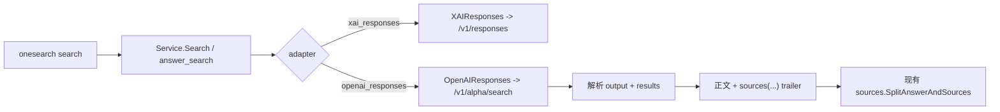

# OpenAI Responses 联网搜索迁移至 Alpha Search 技术方案

## 文档状态

- 状态：已实施（本地验证完成；真实 provider 可用性未验证）。
- 基线日期：2026-08-06。
- 实施日期：2026-08-06。
- 适用范围：`onesearch` 的 `openai_responses` provider 联网搜索链路。
- 外部参考：`sub2api` 当前 checkout 的 `/v1/alpha/search` 实现，以及 OpenAI/Codex 当前可观察协议。
- OpenAI Codex 源码基线：`7a0e974e08c798d1e8d59d407aeb6e24db1313af`。

## 摘要

`onesearch` 当前将 `openai_responses` 联网搜索实现为 `POST /v1/responses`，通过 `tools: [{"type":"web_search"}]` 和 `tool_choice: "required"` 要求模型执行 hosted web search。Codex 当前 standalone 网络搜索已切换到独立的 `POST /v1/alpha/search` SearchRequest 协议；该协议不是 `/v1/responses` 的子资源，请求字段、响应字段和流式语义均不能继续沿用 Responses API。

本方案采用以下结论：

1. 保留 `openai_responses` provider ID、adapter ID、alias、`answer_search` 路由和现有输出 mode，避免把协议跟进扩大为公共配置重命名。
2. 将 OpenAI 与 xAI 的 wire 实现拆开：xAI 继续使用 `/v1/responses`，OpenAI 改为专用 `/v1/alpha/search` client。
3. OpenAI Alpha Search 请求使用当前 Codex 源码可确认的最小 SearchRequest 子集：`id`、`model`、`commands.search_query` 和 direct live web access settings；不再发送 `instructions`、`input`、`stream`、`tools`、`tool_choice` 等 Responses 字段。
4. 只接收 JSON SearchResponse，从 `output` 取得正文，从 `results` 归一化 URL 来源；`encrypted_output` 不进入 onesearch 输出。
5. 不在 adapter 内回退旧 `/v1/responses`。`404`、`405` 或其他失败沿用 onesearch 现有 provider fallback 链处理。
6. 不复制 sub2api 的 OAuth/PAT、账号调度、计费、模型映射和 Responses fallback。这些属于网关职责，不适用于只使用 provider API key 的 onesearch client。

## 背景

### 当前 onesearch 行为

当前调用链为：

```text
onesearch search
  -> cli command binding
  -> Service.Search
  -> answer_search provider routing
  -> buildOpenAIResponsesRunner
  -> providers.OpenAIResponses.Search
  -> POST /v1/responses
```

关键事实如下：

- [`internal/config/runtime.go`](../internal/config/runtime.go) 将 `openai_responses` 注册为 `answer_search` provider，默认 base URL 为 `https://api.openai.com/v1`，默认 settings 包含 `model`、`stream`、`tools` 和 `tool_choice`。
- [`internal/service/service.go`](../internal/service/service.go) 的 `buildOpenAIResponsesRunner()` 读取这些 settings，并把请求交给 `providers.OpenAIResponses`。
- [`internal/providers/xai.go`](../internal/providers/xai.go) 当前让 `OpenAIResponses` 与 `XAIResponses` 共用 `responsesSearch()`：构造 Responses payload、请求 `/v1/responses`，并解析 Responses JSON 或 SSE。
- [`internal/providers/openai.go`](../internal/providers/openai.go) 的 `openAIEndpointURL()` 负责给自定义 base URL 补齐 `/v1`。
- [`internal/sources/sources.go`](../internal/sources/sources.go) 通过 `sources(...)` trailer 将 provider 正文与 URL 来源拆开，供 `Service.Search()` 统一输出。
- [`README.md`](../README.md) 当前明确承诺 `openai_responses` 固定请求 `/v1/responses`，并说明 `stream`、`tools`、`tool_choice` 语义。

### sub2api 参考实现结论

外部参考仓库中的主要证据为：

- `backend/internal/server/routes/gateway.go` 将 `/v1/alpha/search`、`/alpha/search` 和 `/backend-api/codex/alpha/search` 路由到独立 handler。
- `backend/internal/handler/openai_alpha_search.go` 只强校验请求 JSON 和非空 `model`，其余 alpha 字段按 evolving schema 处理。
- `backend/internal/service/openai_alpha_search.go` 将 API key 请求发送到 `https://api.openai.com/v1/alpha/search` 或自定义 base URL 的同名端点，并使用 `Authorization: Bearer`、`Content-Type: application/json`、`Accept: application/json`。
- 同一 service 明确删除 `OpenAI-Beta`、`Session_ID`、`Conversation_ID` 等 Responses 专用 header，并注释说明 alpha search 是独立 SearchRequest，不是 Responses 子请求。
- direct 请求的成功响应按 JSON 原样透传；测试覆盖的 SearchResponse 包含 `output`、`results` 和可选 `encrypted_output`。
- sub2api 的 PAT 账号因 standalone endpoint access enforcement 转回 `/v1/responses + web_search`，属于其账号网关兼容策略，不是 Alpha Search 协议本身。

sub2api 的 handler/service 只强制非空 `model`，不会校验 `commands` 或 `settings`；因此后两者的结构和语义必须以 Codex 源码为依据，不能从 sub2api 的原样透传 fixture 反推为其本地必填合同。

### OpenAI 公开接口边界

截至基线日期，OpenAI 公开开发者文档仍将 hosted web search 描述为 `POST /v1/responses` 加 `tools: [{"type":"web_search"}]`，公开 OpenAPI 列表未包含 `/v1/alpha/search`。因此应将本需求理解为 **Codex standalone 搜索协议跟进**，不能宣称 OpenAI 公共 Responses API 已整体迁移。参考：[Using tools | OpenAI API](https://developers.openai.com/api/docs/guides/tools)。

OpenAI `openai/codex` 当前源码提供了更精确的协议证据：

- [`codex-api/src/search.rs`](https://github.com/openai/codex/blob/7a0e974e08c798d1e8d59d407aeb6e24db1313af/codex-rs/codex-api/src/search.rs) 定义 `SearchRequest`：必填 `id`、`model`，可选 `reasoning`、`input`、`commands`、`settings`、`max_output_tokens`；同时定义 `SearchResponse`：可选 `encrypted_output`、必填字符串 `output`、可选 opaque `results` array。
- 同一文件定义 `SearchQuery` 的 `q`、`recency`、`domains`，以及 `SearchCommands` 的 `search_query`、`image_query`、`open`、`click`、`find`、`screenshot`、finance、weather、sports、time、`response_length`。
- [`codex-api/src/endpoint/search.rs`](https://github.com/openai/codex/blob/7a0e974e08c798d1e8d59d407aeb6e24db1313af/codex-rs/codex-api/src/endpoint/search.rs) 将相对 path 固定为 `alpha/search`，使用 POST JSON 并直接反序列化 JSON SearchResponse。
- [`ext/web-search/src/extension.rs`](https://github.com/openai/codex/blob/7a0e974e08c798d1e8d59d407aeb6e24db1313af/codex-rs/ext/web-search/src/extension.rs) 对 direct live search 设置 `allowed_callers: [direct]` 和 `external_web_access: true`。
- [`ext/web-search/src/tool.rs`](https://github.com/openai/codex/blob/7a0e974e08c798d1e8d59d407aeb6e24db1313af/codex-rs/ext/web-search/src/tool.rs) 使用 thread session ID 构造 `id`，发送当前 model、commands、settings、recent input 和 truncation token budget；onesearch 是无历史的单次 query client，只采用其中与当前接口相符的最小子集。

这些文件位于公开主分支，但 `/v1/alpha/search` 仍是 alpha surface；本文按基线日期冻结当前可观察合同，不把它视为长期稳定 API。

## 问题定义

如果只把当前 URL 从 `responses` 改成 `alpha/search`，请求仍会携带 Responses payload：

```json
{
  "model": "gpt-4.1",
  "instructions": "...",
  "input": [{"role": "user", "content": "..."}],
  "stream": false,
  "tools": [{"type": "web_search"}],
  "tool_choice": "required"
}
```

这不是 SearchRequest。结果会有以下风险：

- 上游返回 `Unknown parameter` 或其他 `400`。
- 成功响应不含 Responses `output[].content[].output_text`，当前 parser 返回空结果。
- Alpha Search 为 JSON 响应，当前 SSE 分支和 `--stream` 语义失真。
- OpenAI 和 xAI 共用 `responsesSearch()`，直接修改共享函数会同时破坏 xAI。
- 将 base URL 直接改成完整 `/v1/alpha/search` 会被当前 endpoint helper 再次拼接 endpoint，形成错误路径。

因此本需求是一次 wire protocol 替换，而不是单行 endpoint 修改。

## 目标

1. `openai_responses` 联网搜索固定请求 `<base>/v1/alpha/search`。
2. 请求体符合当前 Codex 源码可观察的 standalone SearchRequest 最小合同。
3. Alpha Search 的 `output` 和 `results` 能进入 onesearch 现有 `answer_search` 输出与来源归一化链路。
4. 客户端继续支持并正确拼接自定义 OpenAI-compatible relay base URL，且不会重复或错位拼接 `/v1`；relay 是否真实实现该 endpoint 另行验证。
5. xAI Responses、OpenAI Chat Completions、CLI provider filter、fallback 和输出 envelope 保持不变。
6. 配置、README、示例和测试与新 wire 行为一致。

## 非目标

1. 不重命名 `openai_responses` provider、adapter、alias 或环境变量。
2. 不把 `openai_responses` 从 `answer_search` 迁移为 `source_search`，也不重做路由优先级。
3. 不为 `/v1/responses` 保留自动兼容回退、双请求或协议探测。
4. 不实现 OAuth、ChatGPT Account ID、PAT `whoami`、Codex identity header、账号池调度或按次计费。
5. 不实现 Alpha Search 的 `open`、`click`、`find`、`screenshot`、finance、weather 等多命令或有状态后续调用。
6. 不保存、解密或回传 `encrypted_output`。
7. 不新增模型选择策略，不顺带升级默认 model。
8. 不通过本次改动为动态 provider payload 新增 CLI command schema 字段。

## 总体设计



### 设计原则

- 以 provider wire 边界拆分实现，不改变 CLI 和 service 的公共路由合同。
- 仅发送完成单次文本搜索所需的字段，不复制未使用的 Codex web tool 全量命令 schema。
- 保持自定义 base URL 能力；endpoint helper 接收相对 endpoint `alpha/search`，base URL 仍表示 API 根路径。
- 对 alpha response 采用严格正文、宽松来源解析：`output` 必须为非空字符串；`results` 中未知类型的语义忽略，但其中合法 URL 仍可归一化为来源。
- 失败进入现有 provider fallback，不在 provider 内隐藏协议错误。

## 协议合同

### Endpoint

请求固定为：

```text
POST <normalized-base>/v1/alpha/search
```

`openAIEndpointURL(apiURL, "alpha/search")` 的预期示例：

| `apiURL` | 目标 URL |
| --- | --- |
| `https://api.openai.com` | `https://api.openai.com/v1/alpha/search` |
| `https://api.openai.com/v1` | `https://api.openai.com/v1/alpha/search` |
| `https://relay.example.com/openai` | `https://relay.example.com/openai/v1/alpha/search` |
| `https://relay.example.com/openai/v1/` | `https://relay.example.com/openai/v1/alpha/search` |

禁止把 `base_url` 改成完整 endpoint；例如 `https://relay.example.com/v1/alpha/search` 不是合法的 provider base URL 示例。实现会在发起请求前拒绝以 `/alpha/search` 或 `/responses` 结尾的 base URL，避免重复拼接 endpoint。

### Headers

保留 API key client 的最小 headers：

```text
Authorization: Bearer <api-key>
Content-Type: application/json
Accept: application/json
User-Agent: onesearch/<version>
```

不得新增或透传下列 Responses/Codex 账号态 headers：

- `OpenAI-Beta`
- `Session_ID`
- `Conversation_ID`
- `ChatGPT-Account-ID`
- `X-Codex-Beta-Features`
- `X-Codex-Turn-State`

onesearch 当前只使用 provider API key；sub2api 在 OAuth 分支设置的 `Version`、`Originator`、ChatGPT account 和 FedRAMP headers 不应照搬。

### Request

新增内部专用类型，建议命名为：

```go
type openAIAlphaSearchRequest struct {
    ID       string                    `json:"id"`
    Model    string                    `json:"model"`
    Commands openAIAlphaSearchCommands `json:"commands"`
    Settings openAIAlphaSearchSettings `json:"settings"`
}

type openAIAlphaSearchCommands struct {
    SearchQuery []openAIAlphaSearchQuery `json:"search_query"`
}

type openAIAlphaSearchQuery struct {
    Query string `json:"q"`
}

type openAIAlphaSearchSettings struct {
    AllowedCallers     []string `json:"allowed_callers"`
    ExternalWebAccess bool     `json:"external_web_access"`
}
```

目标请求示例：

```json
{
  "id": "onesearch-a1b2c3d4e5f6",
  "model": "gpt-4.1",
  "commands": {
    "search_query": [
      {"q": "OpenAI Codex latest release"}
    ]
  },
  "settings": {
    "allowed_callers": ["direct"],
    "external_web_access": true
  }
}
```

当 `platform` 为 `GitHub` 时，完整 fixture 仅改变 `q`：

```json
{
  "id": "onesearch-a1b2c3d4e5f6",
  "model": "gpt-4.1",
  "commands": {
    "search_query": [
      {"q": "OpenAI Codex latest release\n\nPreferred platform or source: GitHub"}
    ]
  },
  "settings": {
    "allowed_callers": ["direct"],
    "external_web_access": true
  }
}
```

字段规则：

- `id` 每次请求生成一个新的非空 opaque ID，建议格式为 `onesearch-<crypto-random-hex>`。它只用于当前 Alpha Search 请求关联，不复用或冒充用户可见的 onesearch `session_id`。
- `model` 继续来自 provider settings 或现有 `--model` override；默认值本次不变。
- `commands.search_query` 固定包含一个查询，适配 onesearch 当前单 query 调用模型。
- `q` 使用 trim 后的用户 query；trim 后为空时返回 `parameter_error`。`platform` 非空时使用固定格式 `"<query>\n\nPreferred platform or source: <trimmed-platform>"`，避免静默丢失公共 `--platform` 语义。不得把 `SearchPrompt` 或完整本地时间块写入搜索关键词。
- `settings.allowed_callers` 固定为 `direct`，表示 onesearch 直接发起 standalone search。
- `settings.external_web_access` 固定为 `true`，与联网搜索能力目标一致。
- 本阶段不发送 `input`、`reasoning`、`max_output_tokens`、`response_length`、`recency`、`domains` 等可选或未接入字段。Codex 主客户端会从对话历史和 truncation policy 填充其中部分字段，但 onesearch 当前没有等价状态或配置，不猜测默认值。
- 本阶段不把旧 `settings.tools`、`settings.tool_choice` 或 `settings.stream` 透传到 alpha request。

`allowed_callers: ["direct"]` 与 `external_web_access: true` 由当前 Codex live web-search extension 明确构造，sub2api direct fixture 也覆盖相同形态。由于 alpha 协议未进入公开 OpenAPI，后续若真实上游证明字段约束变化，应通过专用 request builder 和 fixture 更新，不在通用 Responses builder 中兼容。

### Response

按当前可观察合同解析：

```json
{
  "encrypted_output": "opaque-state",
  "output": "search result text",
  "results": [
    {
      "type": "text_result",
      "ref_id": "turn0search0",
      "url": "https://example.com/news",
      "title": "Example News"
    }
  ]
}
```

解析规则：

1. 2xx body 必须是 JSON object。
2. `output` 必须是非空字符串；缺失、类型错误或全空白返回 `ProviderError{Type: "upstream_error"}`，让上层执行 provider fallback。
3. `results` 可缺省；字段存在时必须是 array，否则按协议错误返回 `upstream_error`。只抽取 object 中合法的 `http://` 或 `https://` URL，保留非空 `title`，按 URL 去重。
4. `type`、`ref_id` 和其他未知字段不进入稳定来源合同，也不决定是否提取 URL。任意 result object 只要包含合法 URL 即作为来源；没有合法 URL 的 object 忽略。该规则与 Codex 将 `results` 保持 opaque、要求客户端忽略未知 variant 的前向兼容设计一致。
5. 将来源编码为现有 `sources([...])` trailer，复用 `sources.SplitAnswerAndSources()`，避免修改 service 输出层。
6. `encrypted_output` 作为 opaque continuation state 忽略，不记录到日志、诊断或最终输出。
7. `output` 为空但 `results` 非空仍视为协议错误，不把来源列表伪装成完整 answer；上层可以继续尝试下一个 answer provider。
8. 2xx body 若携带标准 `error` envelope，应返回可分类的 `ProviderError`，不能继续按成功响应解析。
9. Alpha Search 不走 SSE；`Content-Type: text/event-stream` 或 SSE body 视为协议不匹配，不再调用 Responses SSE parser。

### Error

- 非 2xx 继续使用现有 `HTTPError` 和 `extractProviderError()`。
- `400/422`、`401/403`、`429` 的上层分类继续分别为 `parameter_error`、`auth_error`、`rate_limited`。
- `404/405` 不触发 `/v1/responses` 兼容请求；当前 answer provider 循环会尝试下一个已配置 provider。
- 2xx 非 JSON、缺失 `output` 或返回 SSE 时使用 `upstream_error`，避免把协议漂移伪装成“空结果”。
- 保留 8 MiB response 上限和现有 HTTP client timeout；CLI 外层 context timeout 继续生效。

## 配置与兼容性

### 保留的公共合同

以下值保持不变：

- provider ID：`openai_responses`
- adapter ID：`openai_responses`
- aliases：`openai-responses`、`responses`
- API key env：`OPENAI_API_KEY`
- capability：`answer_search`
- provider mode：`openai-responses`
- base URL 语义：API 根路径，而不是完整 endpoint
- 默认 model：`gpt-4.1`

`provider mode` 在本阶段作为稳定身份标签保留，不再被解释为实际 HTTP endpoint 名称；真实 wire 以 README 和 provider tests 中的 `/v1/alpha/search` 为准。

因此无需修改：

- CLI provider filter 语法与 command schema。
- `onesearch search --answer-providers openai_responses` 示例。
- provider setup 的 key 必填分类。
- npm README 或 provider-direct command registry。

### 退役的 settings

`openai_responses` 的以下 settings 不再参与请求：

- `stream`
- `tools`
- `tool_choice`

实施时从内置默认 provider definition 和 `config.example.json` 中移除这些字段，只保留 `model`。已有用户 `config.json` 不做迁移或重写；历史字段仍可被 runtime 读取并在 `config list` 中显示，但 Alpha Search builder 明确忽略它们。README 应说明“保留显示不等于仍然生效”，避免配置可观察性造成误解。

`search --stream/--no-stream` 是多个 answer provider 共享的 CLI flag。为避免扩大 CLI 合同，本次不删除 flag；当只选择 `openai_responses` 时该 override 不影响 alpha request。README 必须明确这一点。

### 不采用 provider 内兼容回退

不建议实现以下逻辑：

```text
/v1/alpha/search 失败
  -> 猜测 endpoint 不支持
  -> 自动改发 /v1/responses + web_search
```

原因：

- 两个 endpoint 的请求和响应合同不同，自动转换会隐藏真实配置或 relay 能力问题。
- 第二次请求可能产生额外费用或重复副作用。
- 当前 service 已有跨 provider fallback，职责清晰。
- README 现有设计强调 OpenAI adapter 之间不互相降级。
- sub2api 的 PAT Responses fallback 依赖其账号类型和 access enforcement 事实，onesearch 不具备相同上下文。

## 源码组织

建议将 OpenAI Alpha Search 从 [`internal/providers/xai.go`](../internal/providers/xai.go) 中拆出，形成独立文件：

```text
internal/providers/
  xai.go                       # 继续负责 xAI Responses
  openai.go                    # Chat Completions、通用 endpoint/SSE helpers
  openai_alpha_search.go       # OpenAIResponses 的 alpha request/response
  openai_alpha_search_test.go  # alpha wire contract tests
```

不要求为了文件拆分移动通用 parser 或大范围重构。`responsesSearch()`、`parseResponsesOutput()` 和 `parseResponsesSSE()` 继续服务 xAI；只有 `OpenAIResponses.Search()` 切换到新 client。request builder 接受显式 `requestID`，便于单元测试使用固定 ID；生产调用再由私有 helper 生成随机 ID。

## 文件改动规划

| 文件 | 计划改动 |
| --- | --- |
| `internal/providers/xai.go` | 移除 OpenAI 对共享 `responsesSearch()` 的调用，保留 xAI 行为。 |
| `internal/providers/openai_alpha_search.go` | 新增 Alpha Search request builder、HTTP client 和 JSON response parser。 |
| `internal/providers/openai_alpha_search_test.go` | 新增 endpoint、headers、payload、response、error 和 base URL fixtures。 |
| `internal/providers/openai_test.go` | 保留 Chat Completions 与通用 URL tests；移除或迁移旧 OpenAI Responses 专属 fixtures。 |
| `internal/service/service.go` | `buildOpenAIResponsesRunner()` 不再读取或传递 `stream/tools/tool_choice`，其他路由字段保持不变。 |
| `internal/service/service_test.go` | 更新 runner 默认值、stream no-op 与 `/alpha/search` 错误文案 fixtures。 |
| `internal/config/runtime.go` | `openai_responses` 默认 settings 只保留 `model`。 |
| `internal/config/runtime_test.go` | 更新默认 settings 断言，保留 adapter/key/route 测试。 |
| `config.example.json` | 更新 `openai_responses` 示例 settings。 |
| `README.md` | 更新 endpoint、请求语义、JSON-only、退役 settings 和 stream no-op 说明。 |

以下文件原则上不修改：

- `internal/commandcontract/**` 和 CLI manifest golden：provider wire 不改变公共 argv。
- `internal/skills/assets/onesearch/SKILL.md`：主 Skill 不描述 wire 字段。
- `internal/skills/assets/onesearch-search/SKILL.md`：provider ID 和调用方式保持不变；仅当现有文字声称 Responses hosted tool 时才同步修订。
- `docs/cli-provider-setup-technical-design.md`：key 必填和 base URL 配置语义未改变。

## 实施步骤

### 阶段一：冻结 Alpha Search wire fixture

1. 在 provider tests 中先写目标请求和响应 fixture。
2. 固定 `/v1/alpha/search` path、Bearer/JSON headers、最小 SearchRequest 字段和禁止出现的 Responses 字段。
3. 固定 `output + results -> sources(...)` 归一化结果。
4. 固定 custom base URL 的 `/v1` 补齐规则。

完成条件：新测试在旧实现上因 endpoint/payload/parser 不匹配而失败。

### 阶段二：拆分 OpenAI 与 xAI 实现

1. 新增专用 request/response 类型和 builder。
2. 将 `OpenAIResponses.Search()` 切换到 Alpha Search client。
3. 保留 `XAIResponses.Search()` 的 `/v1/responses` 行为和已有 JSON/SSE parser。
4. 复用现有 HTTP error 提取、body limit、timeout 和 User-Agent。

完成条件：OpenAI alpha fixtures 通过，xAI/Chat Completions 原测试不回归。

### 阶段三：收敛 runtime settings 与文档

1. 从 `openai_responses` 默认 settings 和 config example 移除 `stream/tools/tool_choice`。
2. 更新 service/config tests。
3. 更新 README 对 endpoint、JSON response、stream no-op 和无 adapter fallback 的说明。
4. 检查 embedded Skill 是否存在旧 wire 描述；只修改直接受影响文本。

完成条件：runtime schema、示例和真实 builder 不再宣称或发送旧字段。

### 阶段四：验证与差异审查

1. 运行 provider/config/service/CLI 定向测试。
2. 运行全量 Go 测试和 vet。
3. 运行 mock smoke，确认公共 CLI 输出和 fallback 未变化。
4. 检查 diff、文档路径卫生和 `git diff --check`。

## 测试方案

### Provider wire tests

至少覆盖：

- base URL 无 `/v1` 时请求 `/v1/alpha/search`。
- base URL 已含 `/v1` 时不重复。
- 带 relay 子路径的 base URL 正确拼接。
- method 为 POST。
- `Authorization`、`Content-Type`、`Accept`、`User-Agent` 正确。
- request 使用固定 ID fixture，并对完整 JSON 做 `DeepEqual`：顶层只包含 `id/model/commands/settings`，嵌套也只包含本文定义字段。
- request 不包含 `reasoning/input/max_output_tokens/response_length/recency/domains/instructions/stream/tools/tool_choice/prompt_cache_key/prompt_cache_retention`。
- 空 query 返回 `parameter_error`；`platform` 空和非空时按固定格式归一化 query。
- JSON `output` 正常返回。
- `results` 来源提取、title 可选、URL 去重、非法 scheme 忽略；未知 result type 仍按合法 URL 提取，未知字段不影响解析。
- `encrypted_output` 不出现在返回文本中。
- 2xx 非 JSON、空 `output`、错误类型 `output`、SSE response 返回 `upstream_error`。
- 2xx `error` envelope、`results` 非 array、只有 `encrypted_output` 时返回 `upstream_error`。
- 400、401、403、404、405、429、500 使用现有 HTTP error 分类。
- context cancellation、传输错误和超过 8 MiB 的 response 保持原边界。

### Regression tests

- xAI 仍请求 `/v1/responses`，并继续发送 `instructions/input/tools`，支持现有 JSON/SSE fixtures。
- OpenAI Chat Completions 仍请求 `/v1/chat/completions`。
- `openai_responses` adapter 仍可被 runtime 解析并要求 API key。
- provider ID、aliases、answer route 和 model override 不变。
- generic `--stream` 仍可解析；选择 `openai_responses` 时不会向 alpha body 写入 `stream`。
- 用户配置中遗留的 `stream/tools/tool_choice` 可以被 `config list` 观察，但不会影响 alpha payload。
- `sources.SplitAnswerAndSources()` 能拆出 Alpha Search 归一化来源。
- Alpha 返回 `404/405` 时只请求一次 alpha endpoint，绝不请求 `/responses`；fallback 开启时继续尝试下一个 answer provider，`--fallback off` 时停止。
- quiet/verbose diagnostics 不泄漏 API key、`encrypted_output` 或完整敏感 response。
- CLI manifest full/targeted golden 语义不变；如产生 diff，应视为超范围信号并调查，而不是直接刷新 golden。

### 建议命令

```powershell
mise exec -- go test -count=1 ./internal/providers ./internal/config ./internal/service ./internal/cli ./internal/sources
mise exec -- go test -count=1 ./...
mise exec -- go vet ./...
mise exec -- go run ./cmd/onesearch smoke --mock --format json
git diff --check
```

真实 `/v1/alpha/search` 调用不作为默认自动化验收：它依赖有效凭据、远端 rollout、模型权限、费用和 alpha 稳定性。若实施阶段需要 live smoke，应由用户明确授权具体凭据和请求范围，并将结果与 mock/静态测试分开报告。

### 发布门禁

默认 CI、单元测试和 mock smoke 可以证明本地 wire 合同，但不能证明远端接受默认 `gpt-4.1`。因此必须区分两个完成层级：

1. **代码实现完成**：所有本地测试与静态检查通过，可以确认 endpoint、payload、parser 和回归边界正确。
2. **真实 provider 可用性确认**：使用经用户授权的 API key，对目标 base URL 和拟发布默认 model 完成一次最小 live smoke，或取得等价的上游正式契约证据。

在第二层证据缺失时，可以交付并合并代码，但不得宣称默认 OpenAI provider 已经通过真实网络验收。若 live smoke 证明 `gpt-4.1` 不被 Alpha Search 接受，应单独提交默认 model 决策，不在协议实现中静默替换为未经确认的 Codex model slug。

## 验收标准

1. `openai_responses` 的实际 HTTP path 为 `/v1/alpha/search`，测试能精确证明。
2. Alpha body 不再包含任何旧 Responses-only 字段。
3. `output` 成为 answer 正文，合法 `results` 成为标准 sources。
4. 自定义 base URL 的 `/v1` 拼接正确。
5. xAI Responses 和 OpenAI Chat Completions 行为不变。
6. provider ID、adapter、alias、route、环境变量和公共 CLI argv 不变。
7. `404/405` 不触发旧 endpoint 的隐藏重试，而是进入既有 provider fallback。
8. 默认配置和 README 不再宣称 Alpha Search 支持 `tools/tool_choice/stream`。
9. 定向测试、全量测试、vet、mock smoke、`git diff --check` 全部通过。
10. 文档与代码不包含开发机绝对文件系统路径。
11. 对外说明明确区分“本地 wire 已验证”与“默认 model/真实 endpoint 已 live 验证”；缺少 live 证据时不得报告后者通过。

## 风险与取舍

### Alpha 协议未公开稳定

`/v1/alpha/search` 不在当前公开 OpenAPI 中，字段可能继续变化。方案通过专用文件、最小 request 类型和 fixture 将漂移隔离在 provider 层；不把 alpha DTO 扩散到 service/CLI schema。

### `output` 语义可能弱于模型最终回答

旧实现由模型结合 hosted search 生成最终回答；standalone endpoint 的 `output` 更接近搜索工具结果。为控制范围，本次仍保留 `answer_search` 能力和现有 provider ID。若上线后证明结果只适合作为 retrieval evidence，应另立需求评估迁移为 `source_search`，不能在本次 wire 修复中顺带改变路由语义。

### 默认 model 的远端可用性未验证

本次保留 `gpt-4.1`，避免把 endpoint 迁移与模型升级耦合。若真实 Alpha Search 对 model 有独立 allowlist，live smoke 可能暴露 `400/404`；应依据上游明确错误单独决定默认 model，而不是在无证据时猜测 Codex model slug。

### Relay 可能尚未实现新 endpoint

第三方 relay 对 `/v1/responses` 的支持不代表支持 `/v1/alpha/search`。本方案让错误可见并交给现有 provider fallback；README 应明确 base URL 对新 endpoint 的要求。

### Generic stream flag 对该 provider 成为 no-op

删除公共 `--stream` 会影响其他 answer provider 和 command schema，超出本次范围。保留 flag 并在 README 明确 Alpha Search JSON-only，是最小兼容改动。

### 忽略 `encrypted_output` 限制后续命令

Codex 可用 opaque state 支持 `open/click/find` 等连续操作。onesearch 当前 provider interface 只有一次 `Search(ctx, query, platform)` 调用，无法安全承载该状态；忽略它符合本阶段单查询目标，并避免泄漏不透明状态。

## 回滚方案

本方案不涉及数据库、配置文件重写或不可逆状态：

1. 回滚专用 Alpha Search provider 代码，恢复 `OpenAIResponses.Search()` 调用共享 `responsesSearch()`。
2. 恢复 runtime/config example 中的 `stream/tools/tool_choice` 默认值。
3. 恢复 README 的 `/v1/responses` 说明。
4. 复跑旧 Responses、xAI、service/config 和全量测试。

用户已有 `config.json` 未被迁移或覆盖，因此无需数据回滚。

## 实施记录

本方案已按“保留公共 provider 合同、替换 OpenAI 专属 wire、不做旧 endpoint 回退”的边界落地：

- 新增 [`internal/providers/openai_alpha_search.go`](../internal/providers/openai_alpha_search.go)，独立实现 Alpha Search request builder、随机 request ID、HTTP 调用、JSON response 解析和来源归一化。
- [`internal/providers/xai.go`](../internal/providers/xai.go) 只保留 xAI Responses wire；新增 [`internal/providers/xai_test.go`](../internal/providers/xai_test.go) 锁定 `/v1/responses` 的 JSON/SSE 回归合同。
- 新增 [`internal/providers/openai_alpha_search_test.go`](../internal/providers/openai_alpha_search_test.go)，覆盖 endpoint、headers、完整 payload、query/platform、来源、协议错误、HTTP 分类、8 MiB 上限、context cancellation 和敏感字段边界。
- [`internal/service/service.go`](../internal/service/service.go) 不再读取 `openai_responses` 的遗留 `stream/tools/tool_choice`；service tests 覆盖 model override、来源输出以及 `404/405` 的 auto/off fallback 行为。
- [`internal/config/runtime.go`](../internal/config/runtime.go)、[`config.example.json`](../config.example.json) 和 [`README.md`](../README.md) 已同步 Alpha Search 默认配置与用户可见语义。

已完成以下本地验证：

```powershell
mise exec -- go test -count=1 ./internal/providers ./internal/config ./internal/service ./internal/cli ./internal/sources
mise exec -- go test -count=1 ./...
mise exec -- go vet ./...
mise exec -- go run ./cmd/onesearch smoke --mock --format json
git diff --check
```

以上检查以及文档绝对路径、相对链接、UTF-8/LF、示例 JSON 校验全部通过。未执行真实 `/v1/alpha/search` 请求；默认 `gpt-4.1`、目标账号权限、费用和远端 rollout 仍属于发布门禁中定义的 live 验证边界。

## 推荐结论

按“**保留公共 provider 合同，替换 OpenAI 专属 wire，隔离 Alpha DTO，不做旧 endpoint 回退**”实施。

该方案能满足 Codex standalone 网络搜索 endpoint 跟进，同时避免影响 xAI、Chat Completions、CLI schema 和用户 provider 选择。实现阶段最重要的质量门不是 URL 字符串本身，而是用精确 fixture 证明 request body 已从 Responses payload 切换为 SearchRequest，并证明 `output/results` 已正确进入 onesearch 现有 answer/source 输出链。
