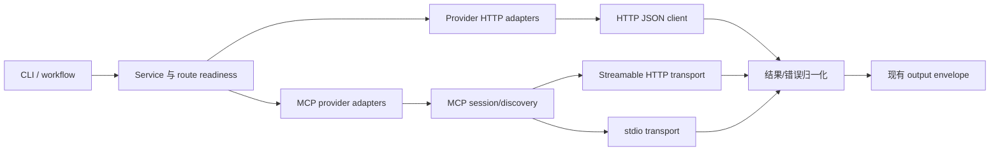

# Exa、Context7、Z.AI/智谱、Firecrawl 与 MCP 端点上游协议对齐技术方案

## 文档状态

- 状态：实施中（HTTP provider、MCP shared client、CLI 合同和文档已完成首轮对齐；真实 provider/MCP live smoke 仍未执行）。
- 基线日期：2026-08-27。
- 适用范围：`exa`、`context7`、`zhipu`、`firecrawl`，以及当前 runtime 中的全部 MCP 端点：`anysearch`、`deepwiki`、`ddg`、`freecrawl` 和可配置的 `mcp_stdio` provider。
- “全部 MCP 端点”按本仓库 runtime/provider registry 定义；未进入 `onesearch` 配置的外部 Codex/MCP 配置不在本次代码审计证据内。
- 明确排除：`openai_responses`、`openai_compatible` 及其他 OpenAI 搜索协议；本方案不改变 `answer_search` 的 OpenAI 路由和 wire contract。
- 相关但不改动：`tavily` 是普通 HTTP provider，不属于本次 MCP 对齐范围；除非共享 HTTP 错误或输出基础设施需要兼容性改动，否则不调整其上游协议。
- 证据边界：本轮完成本地源码、配置、单元测试和 mock smoke 检查，未使用真实 API key、未启动远端 MCP server、未宣称任何账号、套餐或区域 endpoint 已在线可用。

## 摘要

当前实现并非所有端点都与上游最新协议对齐。Exa 的主路径和认证仍可用，但默认 `type=neural`、已 deprecated/no-op 的 `useAutoprompt` 字段和 Contents 的部分失败语义已经漂移；Context7 的 library search 路径明确落后于当前 API Guide，且上游认证文档存在“必须 key/无 key 低频”矛盾；Z.AI/智谱同时存在全球 `api.z.ai` 与中国区 `open.bigmodel.cn` 两套区域合同，不能只替换 URL；Firecrawl 的 v2 路径基本正确，但 success envelope、错误、重试和 crawl 异步语义尚未完整建模，status/cancel 也尚未进入当前 CLI。MCP 方面，现有 stdio client 只实现固定的 2025-03-26 legacy 初始化和一次性 `tools/list`，AnySearch/DeepWiki 的 HTTP wrapper 则直接发送 `tools/call`，缺少现代 Streamable HTTP 的 per-request metadata/header、era probe、schema discovery 和分页；Freecrawl 还存在发布版 README、PyPI 和 main 源码之间的工具名冲突。

本方案推荐：

1. 保留现有 provider ID、CLI 命令、capability 和公共输出 envelope 的顶层 key/type；协议变化优先封装在 provider adapter 和共享 transport 层，避免平行的客户端数据层。无界 `raw_result`/`raw_content` 的截断与脱敏属于明确记录的安全兼容例外。
2. 把 HTTP JSON、MCP Streamable HTTP 和 MCP stdio 分为可测试的 transport/session 层，支持现代 MCP 与 2025-11-25/2025-06-18/2025-03-26 legacy server 的双时代兼容。
3. 以 `tools/list` 返回的工具名和 `inputSchema` 为最终 authority；对明确没有 discovery 的 pinned stateless endpoint，使用同一 revision 的冻结 fixture 作为例外 authority。配置中的 alias 只能在实际 discovery/fixture 确认目标工具后使用，禁止猜测或静默调用不存在的 tool。
4. 对 Z.AI/智谱和 Freecrawl 设置显式的上游版本/区域决策门：未冻结合同前不自动迁移默认 endpoint，也不把不确定的工具映射伪装成已对齐。
5. 用 provider-level wire fixture、MCP fake server、schema/route 回归和完整 Go 验证闭环；真实 provider smoke 作为单独、需要凭据和网络授权的阶段，不纳入本地默认验收。

## 背景与当前实现

### 调用链与代码边界

现有请求链保持 CLI-first 结构：

```text
CLI command / workflow
        -> internal/service
        -> provider routing and readiness
        -> internal/providers adapter
        -> HTTP JSON / MCP HTTP / MCP stdio
        -> normalized result and output renderer
```

主要入口如下：

- [`internal/cli/cli.go`](../internal/cli/cli.go)：命令解析和 service 初始化。
- [`internal/cli/command_bindings.go`](../internal/cli/command_bindings.go)：provider-direct 参数到 service/provider options 的映射。
- [`internal/commandcontract/providers.go`](../internal/commandcontract/providers.go)：CLI 命令和默认值的公开合同。
- [`internal/config/runtime.go`](../internal/config/runtime.go)：provider、capability、route、availability 和 `direct_only` 规则。
- [`internal/service/service.go`](../internal/service/service.go) 与 [`internal/service/provider_direct.go`](../internal/service/provider_direct.go)：workflow fallback、provider 构造和 direct 命令。
- [`internal/providers/`](../internal/providers/)：HTTP provider、MCP HTTP wrapper、MCP stdio wrapper 和结果归一化。
- [`internal/mcpstdio/client.go`](../internal/mcpstdio/client.go)：当前唯一的通用 MCP stdio JSON-RPC client。
- [`internal/skills/assets/`](../internal/skills/assets/)：面向 agent 的 provider 命令和错误处理说明。

### Runtime provider 与 route 基线

`defaultRuntimeRoutes()` 当前定义：

| Capability | 默认 providers | 本次处理 |
| --- | --- | --- |
| `answer_search` | `xai`、`openai_compatible`、`openai_responses` | 明确排除，不改 OpenAI 搜索协议 |
| `source_search` | `exa`、`zhipu`、`tavily`、`firecrawl` | 对齐 Exa、Z.AI、Firecrawl；Tavily 保持不变 |
| `docs_search` | `exa`、`context7` | 对齐 Exa、Context7 |
| `page_fetch` | `tavily`、`firecrawl`（runtime merge 后可能追加 `exa`、`anysearch`） | Firecrawl 对齐；`anysearch` 因非 `direct_only` 可能被 runtime merge，DDG/Freecrawl 等 direct-only MCP 仍需显式 route |
| `site_map` | `tavily`、`firecrawl` | Firecrawl 对齐 |
| `site_crawl` | `tavily`、`firecrawl` | Firecrawl 对齐；Freecrawl 默认仍不自动加入 |
| `repo_wiki` | `deepwiki` | 对齐 DeepWiki MCP |
| `vertical_search` | `anysearch` | 对齐 AnySearch MCP |

`routesWithProviderCapabilities()` 会跳过 `settings.direct_only=true` 的 provider。因此 DDG、Freecrawl 的 MCP 子进程即使配置存在，也不会因为声明 capability 而自动执行；显式写入 route 仍然是允许的兼容入口。

### 现状盘点与判定

| Provider/端点 | 当前 adapter 与实现 | 当前默认 endpoint/命令 | 对齐判定 | 优先级 |
| --- | --- | --- | --- | --- |
| Exa | `internal/providers/exa.go`，`POST /search`、`/contents`、`/findSimilar` | `https://api.exa.ai` | 部分对齐：路径和主要字段正确；search type、废弃字段、部分失败和 metadata 需修正 | P1 |
| Context7 | `internal/providers/context7.go`，GET JSON | `https://context7.com` | 不对齐：library search 使用旧 `/api/v2/search`，未发送 `libraryName` | P0 |
| Z.AI/智谱 | `internal/providers/zhipu.go`，`POST /paas/v4/web_search` | `https://open.bigmodel.cn/api`、`search_std` | 区域合同未冻结：当前中国区形态与 Z.AI 全球最新文档不同 | P0 |
| Firecrawl | `internal/providers/web.go`，v2 search/scrape/map/crawl | `https://api.firecrawl.dev/v2` | 基本对齐：v2 路径正确；success/error、Retry-After、job 状态需补齐 | P1 |
| AnySearch | `internal/providers/anysearch.go`，直接 JSON-RPC HTTP | `https://api.anysearch.com/mcp` | 部分对齐：MCP tool call 可用，但 tool 名、参数、modern metadata/era probe 和 discovery 不完整 | P0 |
| DeepWiki | `internal/providers/deepwiki.go`，直接 JSON-RPC HTTP | `https://mcp.deepwiki.com/mcp` | 部分对齐：工具名和 endpoint 正确；缺 modern probe/metadata/headers 和 legacy lifecycle 兼容 | P1 |
| DDG | `internal/providers/ddg.go` + `mcp_stdio` | `uvx duckduckgo-mcp-server --transport stdio` | 参数基本对齐；共用 MCP client 仍是 legacy-only，必须保留上游 SSRF 语义 | P2 |
| Freecrawl | `internal/providers/freecrawl.go` + `mcp_stdio` | `uvx freecrawl-mcp` | 无法直接判定：main、README、PyPI 的 tool contract 互相漂移，当前 `wait_for` 类型也不一致 | P0 |

本地基线已通过 `mise exec --command "go test -count=1 ./..."`、`mise exec --command "go vet ./..."`、`mise exec --command "go run ./cmd/onesearch smoke --mock --format json"`；命令仅有 Go telemetry upload 的权限 warning，不影响退出状态。已跟踪文件的 `git diff --check` 通过，未跟踪的本方案文档另行完成等价的空白字符、编码和路径扫描。上述结果只证明当前 checkout 的本地行为，不证明远端协议或凭据可用。

### 关键代码证据

| 结论 | 代码证据 |
| --- | --- |
| Exa Search 默认 `neural` 并发送 `useAutoprompt`；Contents 已保留 `statuses` 原字段 | [`internal/providers/exa.go`](../internal/providers/exa.go) 的 `Exa.Search`、`Exa.Fetch` |
| Context7 将 name/query 拼接后请求旧 search path；Docs 只读取 snippets | [`internal/providers/context7.go`](../internal/providers/context7.go) 的 `Context7.Library`、`Context7.Docs` |
| Zhipu 固定 `search_std`、`search_intent`、`content_size`，base 来自中国区默认值 | [`internal/providers/zhipu.go`](../internal/providers/zhipu.go)、[`internal/config/config.go`](../internal/config/config.go) 的默认常量 |
| Firecrawl Search/Map/Scrape/Crawl 解析不同 envelope，Crawl 只提交 job | [`internal/providers/web.go`](../internal/providers/web.go) 的 `Firecrawl` 方法族 |
| AnySearch/DeepWiki 各自构造 `tools/call` JSON-RPC，没有共享 modern metadata/probe 或 legacy initialize/session | [`internal/providers/anysearch.go`](../internal/providers/anysearch.go)、[`internal/providers/deepwiki.go`](../internal/providers/deepwiki.go) |
| stdio client 固定 2025-03-26、一次 `tools/list`，Tool 不含 schema/cursor | [`internal/mcpstdio/client.go`](../internal/mcpstdio/client.go) 的 `defaultProtocolVersion`、`ListTools`、`Tool` |
| DDG/Freecrawl 通过 `settings.tools` 映射并受 `direct_only` 控制 | [`internal/providers/mcp_stdio.go`](../internal/providers/mcp_stdio.go)、[`internal/config/runtime.go`](../internal/config/runtime.go) 的 route merge/availability |

这些证据是本方案的当前实现基线；实施时应以具体 diff 和新增 fixture 重新核对，不把本文件中的规划文字当作已完成行为。

## 上游协议基线

### Exa

参考：[Search API guide for coding agents](https://exa.ai/docs/reference/search-api-guide-for-coding-agents)、[Contents API guide](https://exa.ai/docs/reference/contents-api-guide-for-coding-agents)。

| 操作 | 当前目标 wire contract | 当前代码差异 |
| --- | --- | --- |
| Search | `POST https://api.exa.ai/search`；`x-api-key` 或 Bearer；JSON 包含 `query`、`numResults`（1–100）、`type`（`auto`、`fast`、`instant`、`deep-lite`、`deep`、`deep-reasoning`）和可选 `contents`、域名、日期字段 | 当前默认 `type=neural`，并无条件发送已 deprecated/no-op 的 `useAutoprompt=true`；CLI 默认 5 是产品策略，不是协议错误 |
| Contents | `POST /contents`；顶层 `urls`、`text`/`highlights`/`summary` 等；HTTP 200 仍可能在 `statuses[]` 中报告单 URL 失败 | 请求结构基本正确，但结果只按 `results` 计数，未把 `statuses[]` 的部分失败转为明确状态 |
| Find similar | `POST /findSimilar` 仍可调用，但属于 deprecated surface | 当前命令保留；需要标记兼容/弃用，不应作为新集成的默认能力 |

对齐原则：默认值可以继续是 onesearch 的产品默认，但发到 wire 的字段必须在当前允许集合内；搜索请求不自动重试可能产生重复计费的 POST，除非后续明确引入幂等键和重试策略。

### Context7

参考：[Context7 API Guide](https://context7.com/docs/api-guide)、[TypeScript get context](https://context7.com/docs/sdks/ts/commands/get-context)。

| 操作 | 当前目标 wire contract | 当前代码差异 |
| --- | --- | --- |
| Resolve library | `GET /api/v2/libs/search?libraryName=<name>&query=<query>`；`Authorization: Bearer ...` | 当前调用 `/api/v2/search?query=<name + query>`，缺少独立的 `libraryName`，会影响 docs fallback |
| Query docs | `GET /api/v2/context?libraryId=<id>&query=<query>&type=json`；library ID 可携带版本 | 路径和主要参数正确，但未显式 `type=json`，只解析 `codeSnippets`/`infoSnippets` |
| Response | API Guide 形态与 SDK 文档中的 `Documentation[]`（`title/content/source`）均可能出现 | 需要兼容两种已公开 shape，并保持 `id/title/description` 供 service 使用 |

不建议无条件先请求旧 `/api/v2/search` 再请求新路径；那会增加调用次数并掩盖配置/协议问题。若确有旧 relay 用户，兼容 fallback 必须由显式设置开启，并只在 404/405 时进行一次；DNS/TLS、超时、401/403、429 或 5xx 不触发旧路径重试。

认证语义需要单独记录：Context7 API Guide 的 Authentication 章节写明所有请求需要 API key，但同一页面的 Rate Limits 章节又描述无 key 的低频模式，属于上游公开文档之间的矛盾。当前代码在 `internal/service/service.go` 先将缺少 key 判为 `config_error`，runtime provider 也没有 `anonymous_allowed`；本方案保守采用“请求必须带 `Authorization: Bearer`，service 先 gate”的产品策略，把“未验证匿名”列为显式后续决策，而不是隐式 wire fallback。若未来开放 anonymous，必须同时调整 readiness、限流、错误语义和公开文档。`Retry-After`、`RateLimit-*` 只进入有界诊断 metadata，不进入凭据或完整响应输出。

### Z.AI / 智谱

参考：[Z.AI Web Search API](https://docs.z.ai/api-reference/tools/web-search)、[智谱 AI 网络搜索 API](https://docs.bigmodel.cn/api-reference/%E5%B7%A5%E5%85%B7-api/%E7%BD%91%E7%BB%9C%E6%90%9C%E7%B4%A2)。当前公开文档同时存在全球 Z.AI 和中国区 BigModel 两套合同：前者为 `https://api.z.ai/api/paas/v4/web_search`，后者为 `https://open.bigmodel.cn/api/paas/v4/web_search`。二者不能仅凭品牌名称视为同一 schema。

| 协议 profile | base URL | engine/字段基线 | 处理原则 |
| --- | --- | --- | --- |
| `zai_global`（推荐作为新安装的显式 profile） | `https://api.z.ai/api` | `search-prime`；`search_query`、`search_engine`、`count`（1–50）；`search_recency_filter`/`search_domain_filter` 仅在目标 engine 文档允许时发送；可选 `request_id`（6–64 字符）、`user_id`（6–128 字符，不能使用敏感信息） | 不发送当前全球文档未列出的 `search_intent`、`content_size`；Bearer 认证 |
| `bigmodel_cn`（现有兼容 profile） | `https://open.bigmodel.cn/api` | `search_std`、`search_pro`、`search_pro_sogou`、`search_pro_quark`；`search_query` 最长 70 字符；`search_intent`、`count`（1–50）、按 engine 支持的 domain/recency、`content_size`（`medium`/`high`）；可选 `request_id`/`user_id` | 保留现有账号和地区入口；按[中国区官方 schema](https://docs.bigmodel.cn/api-reference/%E5%B7%A5%E5%85%B7-api/%E7%BD%91%E7%BB%9C%E6%90%9C%E7%B4%A2) 发送字段，不把全球字段强行套用 |

当前 `zhipu` provider 无 profile 概念，固定发送 `search_intent=true`、`content_size=medium`，并把 `search_engine` 默认为 `search_std`；这与中国区 schema 的字段集合基本一致，但默认意图值与官方默认 `false` 不同，响应目前只保留 `search_intent`/`request_id`，未保留 `id`/`created` 等完整 metadata。实现前需要冻结“新安装默认全球 profile、现有配置保留中国区 profile”的产品决策；在决策确认前不直接修改默认 URL，以免改变账号体系、地区、计费或网络可达性。

### Firecrawl

参考：[v2 introduction](https://docs.firecrawl.dev/api-reference/v2-introduction)、[Search](https://docs.firecrawl.dev/api-reference/endpoint/search)、[Scrape](https://docs.firecrawl.dev/api-reference/endpoint/scrape)、[Map](https://docs.firecrawl.dev/api-reference/endpoint/map)、[Crawl POST](https://docs.firecrawl.dev/api-reference/endpoint/crawl-post)、[Crawl status](https://docs.firecrawl.dev/api-reference/endpoint/crawl-get)、[Cancel Crawl](https://docs.firecrawl.dev/api-reference/endpoint/crawl-delete)、[Errors](https://docs.firecrawl.dev/api-reference/errors)。

| 操作 | 当前目标 wire contract | 当前代码差异 |
| --- | --- | --- |
| Search | `POST /v2/search`，Bearer，`query` + `limit`（1–100）；响应含 `success`、`data.web`，可能含 `warning`、`id`、`creditsUsed` | 路径和最小 payload 正确；默认 14 是产品值；未保留完整 envelope，也未检查 HTTP 200 下的 `success=false` |
| Scrape | `POST /v2/scrape`，`url`、`formats:["markdown"]` 等；响应 `success` + `data.markdown` | payload 基本正确；缺 success/data 完整校验 |
| Map | `POST /v2/map`，`url`、`limit` 等；响应 `success` + `links` | 路径和字段正确；缺 success 检查，links 缺失时可能仍返回 `ok:true` |
| Crawl | `POST /v2/crawl` 返回异步 job（`success`、`id`、`url`）；结果通过 `GET /v2/crawl/{id}` 获取 `status/total/completed/data`，需要时使用 `DELETE /v2/crawl/{uuid}` 取消 | 当前明确把 POST 结果标为 `submitted`，但没有状态查询；必须继续区分“提交成功”和“内容完成” |

默认 base 已含 `/v2`，但自定义 base 可能是 API root 或带 `/v2` 的 URL；需要统一规范化，禁止生成 `/v2/v2/...` 或缺少版本路径。重试只针对官方建议的 408、429、500、502、503、504，并尊重 `Retry-After`；不得对已产生计费的 crawl job 无条件重复提交。

### MCP 规范与兼容年代

参考：[MCP versioning（2026-07-28）](https://modelcontextprotocol.io/specification/2026-07-28/basic/versioning)、[Streamable HTTP](https://modelcontextprotocol.io/specification/2026-07-28/basic/transports/streamable-http)、[stdio](https://modelcontextprotocol.io/specification/2026-07-28/basic/transports/stdio)、[server discovery](https://modelcontextprotocol.io/specification/2026-07-28/server/discover)、[Tools](https://modelcontextprotocol.io/specification/2026-07-28/server/tools)，以及 [2025-06-18 lifecycle](https://modelcontextprotocol.io/specification/2025-06-18/basic/lifecycle)。

2026-07-28 是 per-request metadata 的 modern revision：不存在一次性的协议协商握手，**每个请求**都必须在 `params._meta["io.modelcontextprotocol/protocolVersion"]` 声明版本；HTTP 还必须发送 `MCP-Protocol-Version`。2025-11-25 及更早版本属于 legacy，仍使用 `initialize` 会话握手。因此“支持 modern/legacy”不是在 modern 请求后再补一次 initialize，而是先用 `server/discover` 或 transport-specific probe 判定 server era，再选择对应消息形态。

| 层 | 现代目标 | 必须保留的 legacy 兼容 |
| --- | --- | --- |
| 生命周期 | 每个请求携带 `_meta` 版本、client identity/capabilities；可先调用 `server/discover` 获取支持版本 | 2025-11-25 及更早版本使用 `initialize`、`notifications/initialized` 和协商后的 legacy session |
| Streamable HTTP | 单一 MCP endpoint；每个 JSON-RPC 请求/通知独立 POST；请求的 `Accept` 同时声明 JSON/SSE；每个 modern request POST 带 `MCP-Protocol-Version`、`Mcp-Method`，tool call 还带 `Mcp-Name`（modern core 对 client notification 不定义统一 header 要求）；2026-07-28 不再使用协议级 session/GET stream | 兼容旧 Streamable HTTP 的 session/GET/DELETE 语义，以及无初始化的一次性 stateless JSON-RPC endpoint |
| stdio | server stdout 只输出换行分隔 JSON-RPC，metadata 内嵌 `_meta`；stderr 供诊断 | 通过 `server/discover` probe 识别 legacy，再走 `initialize`；保留 2025-11-25/2025-06-18/2025-03-26 |
| tools/list | 支持 `nextCursor` 分页；保留 `name`、`title`、`description`、`inputSchema`、`outputSchema`、`annotations`、`icons`、`execution` 和 `_meta` | 旧 server 可能没有 schema 或分页，客户端只在字段存在时使用 |
| tools/call | 处理 `content`、`isError`、`structuredContent`、JSON-RPC error/id | 兼容只有 text content 的旧结果，并保留未知字段为 opaque metadata |

`server/discover` 的结果至少保存 `supportedVersions`、`capabilities` 和 `_meta["io.modelcontextprotocol/serverInfo"]`；`instructions`、`ttlMs`、`cacheScope` 只用于诊断或缓存提示，不能改变 tool allowlist 或安全决策。discovery/schema cache 的 key 至少包含规范化 endpoint origin/path、transport 和 auth/profile，避免不同配置或租户的 snapshot 交叉使用；发现结果与实际调用不一致时立即失效并重新探测。

只有在双方 `capabilities.extensions` 明确声明且本地已有该 extension schema/实现时才启用扩展；否则回到 core 行为或返回 `capability_unavailable`，不得根据 `instructions` 或未知字段自行推断扩展语义。

协议版本、server era、probe 结果和 fallback 次数必须进入诊断 metadata；不能把“请求成功”误报为“现代协议已协商”，也不能把 legacy session 字段发送到 modern server。

#### Revision/header 矩阵

| Revision | Era | Body/lifecycle | HTTP transport 规则 | 本方案范围 |
| --- | --- | --- | --- | --- |
| `2026-07-28`（当前 modern 基线） | modern | 每条 request 在 `params._meta` 携带版本、client info/capabilities；无 `initialize` | 每个 request POST 带 `MCP-Protocol-Version`、`Mcp-Method`，tool call 再带 `Mcp-Name`；无 protocol-level session、GET stream 或 `Last-Event-ID` | 默认目标 |
| `2025-11-25`、`2025-06-18` | legacy | `initialize` → `notifications/initialized` → operation | initialization 后按协商版本发送 `MCP-Protocol-Version`；如 server 返回 `Mcp-Session-Id`，后续请求携带；可有旧 GET/DELETE 语义 | 兼容 fallback |
| `2025-03-26` | legacy | 同上 | 该 revision 未定义 `MCP-Protocol-Version`；请求省略该 header，按协商版本和 server 返回的 `Mcp-Session-Id`/旧 stream 语义处理 | 兼容 fallback |
| `2024-11-05` | deprecated legacy | HTTP+SSE endpoint/lifecycle | 需要独立 GET SSE、`endpoint` event、session/resume；本阶段不自动启用 | 仅未来显式 profile |

### 当前 MCP endpoint 的上游事实

| Endpoint | 上游公开事实 | 对齐注意事项 |
| --- | --- | --- |
| AnySearch | [MCP server README](https://github.com/anysearch-ai/anysearch-mcp-server) 以 `/mcp` 提供 Streamable HTTP，工具包括 `search`、`get_sub_domains`、`batch_search`、`extract`；旧 [v2.1 script](https://raw.githubusercontent.com/anysearch-ai/anysearch-skill/v2.1.0/scripts/anysearch_cli.py) 是无初始化的一次性 JSON-RPC；最新 [Skill v3.1.0](https://github.com/anysearch-ai/anysearch-skill/releases/tag/v3.1.0) 已改成 REST，非本方案目标 | 以实际 `tools/list` 为准；`get_sub_domains` 优先于旧 `list_domains`；search 支持 `sub_domain_params`、`max_results` 上限 10；extract wire 只发送 `url`，`max_length` 在本地截断 |
| DeepWiki | [DeepWiki MCP 文档](https://docs.devin.ai/work-with-devin/deepwiki-mcp) 推荐 `/mcp` Streamable HTTP；工具名为 `ask_question`、`read_wiki_structure`、`read_wiki_contents`；`/sse` 属于 legacy/deprecated | 保持 `repoName`/`question` 参数；优先 modern `server/discover`/per-request metadata，探测到 legacy 后才走 initialize/session |
| DDG | [duckduckgo-mcp-server](https://github.com/nickclyde/duckduckgo-mcp-server) 的 `search`、`fetch_content` 及参数与当前 wrapper 基本一致 | 这是社区 upstream，不是 DuckDuckGo first-party；不得绕过其 private/loopback/link-local/metadata IP、redirect 等 SSRF 防护 |
| Freecrawl | 当前 [main server.py](https://raw.githubusercontent.com/dylan-gluck/freecrawl-mcp/main/src/freecrawl/server.py) 可见 `mcp__freecrawl__scrape`、`mcp__freecrawl__search`、`mcp__freecrawl__crawl` 等 prefixed tool；[README](https://raw.githubusercontent.com/dylan-gluck/freecrawl-mcp/main/README.md) 和 [PyPI](https://pypi.org/project/freecrawl-mcp/) 的发布合同又列出不同的 unprefixed/文档工具集合 | main、发布版和 README 不是同一冻结合同；必须 pin 版本并在 fake/live `tools/list` 中核对，禁止通过 alias 调用未发现的 tool；`wait_for` 在当前 server schema 是 string，仓库目前发送 int |

## 问题定义

### 主要问题

1. provider adapter 把“当前能返回 JSON”当成“与最新协议一致”，导致旧路径、废弃字段、区域字段和异步状态差异未被发现。
2. HTTP provider 的通用 helper 只能解析 JSON 或简单 SSE 文本，没有统一的 base URL、success envelope、Retry-After、MCP per-request metadata/legacy session 和 JSON-RPC id 约束。
3. `internal/mcpstdio` 的 `Tool` 仅保存名称和描述，`tools/list` 不分页、不保留 schema；错误会把缺失 tool 归为 `config_error`，无法区分“配置错误”和“上游能力不存在”。
4. AnySearch、DeepWiki 各自复制 JSON-RPC 请求，无法共享现代 Streamable HTTP 的版本/header/probe 与 legacy session 逻辑；Freecrawl 的版本漂移会让静态 tool mapping 失效。
5. 公共 CLI、workflow、Skill 和输出 envelope 已被用户使用，直接重命名 provider 或删除旧命令会造成不必要的兼容破坏。

### 对齐判定标准

- **已对齐**：endpoint/path、认证 header、请求字段类型/范围、成功/部分成功 envelope、错误和生命周期均有上游证据与 wire test。
- **部分对齐**：主请求可工作，但存在废弃字段、缺少可选 metadata、状态语义或错误分类缺口。
- **合同未冻结**：上游存在多个并行版本、区域或发布渠道，不能通过静态代码推断唯一正确 wire；必须先 pin 和 discovery。

本方案的“对齐”以当前 onesearch 已公开的命令和 capability 为边界，不等同于一次性实现上游全部可选字段。未进入 typed allowlist 的上游可选字段不得被任意透传；若用户显式请求尚未支持的能力，应返回 `capability_unavailable`/`parameter_error`，并在 CLI/Skill 中说明，而不是静默丢弃或伪造成功。

## 目标

1. 使 Exa、Context7、选定的 Z.AI/智谱 profile 和 Firecrawl 的请求、响应、错误语义与公开最新文档一致。
2. 建立可复用的 MCP transport/session client，覆盖 Streamable HTTP 与 stdio，并兼容 modern 与 legacy server。
3. 对 AnySearch、DeepWiki、DDG、Freecrawl 使用真实 discovery 的 tool/schema 进行参数映射；不调用未声明能力。
4. 保留 provider ID、CLI 命令、capability、route 和现有输出顶层 key/type 的向后兼容性；新增诊断字段采用 additive 方式。对无界或含敏感信息的 raw 字段只保留有界、脱敏后的同类型值，并在迁移说明中标记安全语义变化。
5. 同步配置示例、CLI contract、README、内置 Skill 和 golden manifest，令公开说明与实现保持一份可验证的合同。
6. 建立无凭据的 deterministic fixture 测试，并清楚区分本地验证、mock 验证和真实远端验收。

## 非目标

- 不修改 OpenAI 搜索协议、`openai_responses` 实现、OpenAI route 或其默认配置。
- 不把 `onesearch` 改造成 MCP Server，也不把 provider 动态 schema 直接写入静态 CLI manifest。
- 不复刻 DDG、Freecrawl、DeepWiki 或 AnySearch 的上游搜索、渲染、反爬和研究实现。
- 不在没有产品确认的情况下切换 Z.AI/智谱地区、账号体系、默认 engine 或计费入口。
- 不在没有冻结 Freecrawl upstream revision 的情况下新增虚构 tool alias 或自动重试多个可能产生费用的调用。
- 不把 Firecrawl crawl 的异步提交响应伪装成已完成页面；是否提供同步轮询由独立产品决策确定。
- 本阶段不实现 MCP OAuth/protected-resource discovery；远端 MCP 默认仅使用 provider profile 中已配置的 API key，只有显式标记 `anonymous_allowed` 且有上游证据的 endpoint 才可匿名调用（Context7 仍按 key-gated 策略）。401/403 统一映射为 `auth_error`，除非响应已识别为 modern protocol/header error。OAuth/动态授权需另立 transport/auth 方案和安全评审。
- 本阶段不实现已 deprecated 的 2024-11-05 HTTP+SSE `/sse` transport；默认对 404/405 只返回可诊断的 capability/protocol error，不自动发 GET。若未来启用，必须新增独立 transport profile 及 endpoint-event、session/resume fixture。
- 不通过网络探测改变 `status`/`doctor` 的静态 readiness 语义；真实凭据、套餐、浏览器依赖和远端可达性仍需单独 smoke。
- 不做数据库迁移、持久化数据迁移或无关的 Tavily 重构。

## 总体设计

### 分层架构



建议新增一个小型 `internal/mcpclient` 协议核心，而不是继续在 `anysearch.go`、`deepwiki.go` 和 `mcpstdio/client.go` 各自复制生命周期：

```go
type Transport interface {
    RoundTrip(ctx context.Context, request RPCRequest) (RPCResponse, error)
    // Notify 仅供 legacy 或显式 transport extension 使用；modern core 不发送 client notification。
    // Streamable HTTP extension 接受时返回 202 + 空 body，不能按 RoundTrip 等待 response。
    Notify(ctx context.Context, notification RPCRequest) error
    Close(ctx context.Context) error
}

type Session interface {
    Prepare(ctx context.Context) (ProtocolInfo, error) // probe modern or select legacy
    InitializeLegacy(ctx context.Context) (InitializeResult, error)
    ListTools(ctx context.Context) (ToolSnapshot, error)
    CallTool(ctx context.Context, name string, arguments map[string]any) (ToolResult, error)
    Close(ctx context.Context) error
}
```

现有 `internal/mcpstdio` 可先保留兼容 façade，内部委托 stdio transport；这样不会一次性改变 provider wrapper 的调用边界，也不会产生第二套结果模型。默认由一次 provider-direct/workflow invocation 独占一个有界 session，不建立跨命令 daemon；同一 invocation 内允许复用已通过 probe 的 session。

`Session` 的并发模型必须在实现中固定：stdio session 复用单一子进程，由写 mutex 保证一条 JSON-RPC message 原子写入，并由唯一 request id、单一 reader dispatcher 和有界 pending map 将乱序 response 分发给并发调用；HTTP transport 可按请求并发，但 era/tool snapshot cache 必须并发安全。`Close` 必须幂等，先拒绝新调用、取消并唤醒 in-flight request，再按 deadline 回收 transport/子进程；不能在同一次可能产生副作用的业务调用中自动重启并重发。

### MCP 会话/请求生命周期

1. 根据 adapter 和 `settings.mcp.transport` 创建 `streamable_http` 或 `stdio` transport。
2. 先用 `server/discover`（stdio）或现代 HTTP probe 判定 server era。stdio probe 收到未识别的错误或超时才允许进入 `initialize` fallback；HTTP 只能在现代 POST 返回 `400`，且 body 为空或不是已知 modern JSON-RPC error 时 fallback；若要兼容更早的 HTTP+SSE，则仅对明确的 `400/404/405` 非 modern error body 进入旧 transport。`UnsupportedProtocolVersionError`、`HeaderMismatch`、`MissingRequiredClientCapabilityError` 等已知 modern error 必须留在 modern 分支并按 `supported`/修正请求重试。DNS/TLS、网络超时、401/403、429、5xx 和其他无响应不得触发 legacy fallback。默认候选至少包含 `2026-07-28`、`2025-11-25`、`2025-06-18`、`2025-03-26`，尝试次数必须有上限。
3. modern 请求的每一条 JSON-RPC message 都带 `params._meta["io.modelcontextprotocol/protocolVersion"]`、client identity/capabilities；HTTP 另外带 `MCP-Protocol-Version`、`Mcp-Method`，`tools/call` 再带 `Mcp-Name`。modern 不创建 `Mcp-Session-Id`，也不发送 `notifications/initialized`。
4. legacy server 才执行 `initialize`、`notifications/initialized`，并保存其 HTTP session/version header；AnySearch 这类已证实的 stateless endpoint 只有在 `session_mode=auto/stateless` 且 probe 有证据时才跳过生命周期。
5. 调用 `tools/list`，沿 `nextCursor` 分页，限制最大页数和总工具数；保留 `inputSchema`、`outputSchema`、`_meta`。
6. 按“精确配置名 → 发现到的显式 alias → 仅 suffix 兼容规则”的顺序解析 tool。解析成功后依据 `inputSchema` 检查必填字段，但动态 schema 不是授权边界：每个 adapter 还必须使用 typed allowlist，过滤未知/高风险字段；schema 缺失时仅发送 provider 明确要求的最小字段。
7. 调用 `tools/call`，按 JSON response 或 SSE event 解析与 request id 关联；保留 `content`、`structuredContent`、`isError` 和 JSON-RPC error/data。
8. modern HTTP 通过关闭该请求的 SSE response 取消；stdio 发送 `notifications/cancelled`。结束时关闭 legacy HTTP session 或 stdin，超时/取消时回收子进程；不把 stderr、header、token 或完整参数写入普通输出。

### Streamable HTTP 处理边界

- modern request POST 的 `Content-Type` 必须为 `application/json`，`Accept` 必须同时声明 `application/json, text/event-stream`；响应按 `Content-Type` 选择 JSON 或 SSE parser。2026-07-28 的 core 不定义 client-to-server notification；若显式启用 transport extension 发送 notification，必须把它作为无响应消息处理：服务端接受时只接受 `202 Accepted` 且空 body，拒绝时按 HTTP error（可带无 `id` 的 JSON-RPC error）分类，不能等待或解析成普通 request response。若发送 legacy notification，则按对应 revision 的 header/status 规则处理。
- modern（2026-07-28）每个 POST 都必须带 `MCP-Protocol-Version`，其值与 body `params._meta["io.modelcontextprotocol/protocolVersion"]` 一致；对规范定义的 request 带 `Mcp-Method`，`tools/call` 再带 `Mcp-Name`；若扩展发送 client notification，按该 revision/extension 的明确 header 规则处理，且不得把 request header 规则臆套到 notification。modern 不发送或依赖 `Mcp-Session-Id`。
- legacy（2025-11-25 及更早）按对应 revision 使用 `initialize`；2025-03-26 至 2025-11-25 的旧 Streamable HTTP 可使用 `Mcp-Session-Id`、GET/DELETE，2024-11-05 的 HTTP+SSE 才使用独立 GET SSE/endpoint 事件。`MCP-Protocol-Version` 从 2025-06-18 起才用于 initialization 后续 HTTP 请求；2025-03-26 请求应省略该 header，由已协商版本确定语义。legacy header 不能泄漏到 modern 请求。
- 对 SSE 逐事件读取：忽略空行和以 `:` 开头的 keep-alive comment，按 SSE 规则合并同一 event 的多行 `data:`，读取 `id/event/retry`（未知字段忽略），再解析 JSON-RPC、通知和 progress；以 JSON-RPC `id` 匹配请求，未知 id、截断 event、非 JSON data 均返回 `protocol_error`。modern SSE 的取消通过关闭 response，不发送 `notifications/cancelled`。
- 现代规范已移除 GET stream、protocol-level session 和 `Last-Event-ID` resumability；仅对旧 revision 的兼容测试实现其行为，不能把旧字段作为最新合同。
- 读取 tool `inputSchema` 中的 `x-mcp-header` 标注时，按规范把安全的 primitive 参数映射为 `Mcp-Param-*` header：标注名必须是非空 HTTP token、大小写不重复、只能沿 `properties` 静态可达，类型只能是 string/integer/boolean（integer 在 JavaScript safe range 内）；非法标注的 tool 应从可用 snapshot 排除，参数值不得进入日志。对语义上代表 `authorization`、`cookie`、`token`、`api_key`、`secret` 的参数默认拒绝 header 映射。header 值和 `Mcp-Name` 必须拒绝 CR/LF/header injection，并按可见 ASCII 或 `=?base64?...?=` sentinel 规则编码。
- stateless 兼容必须是 provider/profile 的显式能力，而不是对任意 initialize 失败都盲目降级，否则会隐藏认证和协议错误。

### Stdio 处理边界

- 延续 `exec.CommandContext` 的无 shell 参数启动；stdout 仅接受换行分隔 JSON-RPC，stderr 进入截断诊断 buffer。
- modern stdio 将版本、client capabilities 和 identity 放在每条消息的 `_meta`；先 probe `server/discover`，收到现代结果/UnsupportedProtocolVersionError 时按 supported list 选择版本。
- 对任何其他 probe error 或超时才 fallback 到 legacy `initialize`；不能只根据一个固定 JSON-RPC error code 判断时代。
- `tools/list` 支持 cursor 和 schema；进程启动、stdout 非 JSON、id 不匹配、等待超时、关闭/kill 分别分类。
- 不改变 DDG upstream 的 SSRF、redirect、private IP 和 metadata IP 防护；桥接层只传递参数，不增加绕过开关。

## Provider-specific 对齐方案

### Exa

#### 请求与响应改造

1. 在 `internal/providers/exa.go` 中使用 typed request/response DTO 和统一 endpoint join helper。
2. Search 默认 `type` 改为 `auto`；`numResults` 在 1–100 范围校验。CLI 历史默认 5 可暂时保留为产品值，wire 不发送 `neural`。
3. 删除 `useAutoprompt`；显式传入旧 `neural` 时默认在 CLI 边界转成 `auto` 并给出 deprecated warning（若产品选择 strict 模式，再改为明确的 `parameter_error`），不能继续把 `neural` 发到 wire。
4. Contents 继续使用顶层 `urls` 和 `text.maxCharacters`，但把 `statuses[]` 归一化为 `partial`、逐 URL 状态和可诊断 warning；所有 URL 失败时不得返回无提示的 `ok:true`。
5. 保留 `requestId`、实际生效的 `searchType`、`costDollars`，以及存在时的 `output`/`grounding`（均受大小限制）；`findSimilar` 命令保留兼容性并标记 deprecated，不新增依赖该 surface 的 workflow。
6. 认证继续使用官方支持的 `x-api-key`；不为同一请求同时发送两个凭据 header。

#### CLI/输出合同

- `exa web-search`、`exa web-fetch`、`exa similar` 命令名不变。
- `search_type` 的 schema 默认改为 `auto`，合法值在 help/schema 中列出；`max_results` 兼容 flag 仍按现有覆盖规则工作。
- provider result 增加 `partial`、`statuses`、`request_id`、`search_type`、`cost_dollars` 及有界的 `output`/`grounding` 时采用 additive 字段；默认 quiet output 不展开完整 raw payload。

### Context7

1. 将 library search endpoint 改为 `/api/v2/libs/search`，分别发送 `libraryName=name` 和 `query=query`，使用 `url.Values` 构造 query string。
2. Docs endpoint 保持 `/api/v2/context`，增加 `type=json`，保留版本化 `libraryId` 的原样传递和 URL encoding。
3. 解析数组、`{"results": [...]}`、`codeSnippets/infoSnippets` 和 `Documentation[]` 两种公开 response shape；service 依赖的 `id/title/description` 继续稳定输出，原始字段放到 opaque `raw_result`。
4. 保持 `X-Context7-Source: onesearch`；请求必须发送 `Authorization: Bearer <key>`，由 service 先 gate 缺 key 并返回 `config_error`。暂不改变 anonymous readiness，避免把认证策略和 path 修复混在一起；401/403 归类为 `auth_error`，不触发匿名重试。
5. 对 `202`（library 未完成）执行有界、可取消的后续重试；对 `301` 只读取 `redirectUrl` 指向的新 library ID，不把它当作任意 HTTP URL 跟随；400/401/403/404/409/422 作为参数、认证或资源错误返回，503/504 仅按统一退避策略重试。所有状态的 `error/message` 进入脱敏、限长诊断。
6. 不自动回退旧 `/api/v2/search`；如确需兼容内部 relay，新增显式 `legacy_search_endpoint=true` 且仅对 404/405 单次回退，并把 fallback 记录在 metadata。

### Z.AI / 智谱

#### Profile 决策

推荐保留 provider ID `zhipu`，增加 alias `zai`，并增加受限的 `settings.protocol_profile`：

```json
{
  "base_url": "https://api.z.ai/api",
  "settings": {
    "protocol_profile": "zai_global",
    "search_engine": "search-prime"
  }
}
```

允许值只包括已冻结的 `zai_global` 和 `bigmodel_cn`；自定义 base URL 不自动按 hostname 猜 profile，缺 profile 时按当前配置保留兼容但在 status/doctor 给出 warning。

#### Wire 规则

- `zai_global`：请求 `<base>/paas/v4/web_search`，Bearer；发送当前全球文档允许的最小字段，`count` 校验为 1–50；`search_recency_filter` 和 `search_domain_filter` 只有在所选 engine 的 schema 明确支持时才发送。初版不新增 `request_id`/`user_id` CLI flag；若后续允许通过配置提供，分别校验 6–64/6–128 字符且拒绝敏感信息，未提供 `request_id` 时由平台生成。
- `bigmodel_cn`：继续支持 `<base>/paas/v4/web_search` 和 `search_std` 等中国区 engine；`search_query` 按官方 70 字符上限截断/拒绝策略处理，`count` 校验为 1–50，`search_intent` 默认改为官方 `false`（需要意图增强时通过显式 setting/flag 开启），`content_size`、domain 和 recency 仅按中国区 engine 支持矩阵发送。
- 两个 profile 都保留 `search_result[]` 的 `title/link/content/media/publish_date/icon/refer` 归一化；同时保存官方响应的 `id/created/request_id`（字段存在时）。
- `bigmodel_cn` 按官方 70 字符上限执行截断或拒绝；`zai_global` 不继承中国区 70 字符限制，按全球文档/服务端限制处理。任何本地截断都要在输出 metadata 中可见，但不泄露原始 token。
- 对 `{code,message}` 和 HTTP 401/403/429 做统一错误分类；不在 adapter 中静默切换地区或 engine。

实施前必须冻结以下产品选择：新安装是否把默认 URL/engine 切换到全球 profile；已有 `open.bigmodel.cn` 配置是否仅保留兼容、是否需要显式迁移提示。若未确认，代码阶段只完成 profile DTO 和 fixture，不修改默认值。

### Firecrawl

1. 增加 `normalizeFirecrawlBaseURL`：接受 API root 或 `/v2` base，统一生成单一版本路径；禁止重复 `/v2`。
2. 为 Search/Scrape/Map/Crawl POST 建立 typed envelope，统一检查 HTTP status、顶层 `success`、`error`/`warning`、`data` 和 `links/web`；若启用独立 status/cancel service，则为 Crawl GET/DELETE 使用不含 `success` 的独立 envelope（GET 解析状态/分页，DELETE 解析 `{"status":"cancelled"}`）。
3. Search 的 wire `limit` 校验 1–100；保留当前 CLI 默认 14，明确这是产品默认而不是官方默认 10。
4. Scrape 要求 `data.markdown`（或明确的空内容状态）；Map 在 `success=false` 或 links 缺失时返回可诊断错误，不再空结果 `ok:true`。
5. Crawl 维持当前 provider-direct 的“提交 job”语义，输出 `job_id`、`status`、`job_url` 和 `submitted=true`；在文档和 Skill 中明确不能把它当作完成结果。当前 CLI 验收不包含自动 polling/cancel。若产品需要同步内容，再新增独立的 status/polling service：`GET /v2/crawl/{uuid}` 只接受 UUID path，解析 `scraping`、`completed`、`failed`、`cancelled` 状态和 `next`（官方在结果超过 10 MB 或未完成时返回的 continuation URL）；跟随 `next` 前必须校验其为同一 Firecrawl origin/path 范围，不能把 Authorization 转发到任意 host。取消仅对本地确认仍在运行的 job 发送 `DELETE /v2/crawl/{uuid}`，成功合同为 HTTP 200 `{"status":"cancelled"}`，404/500 映射为明确 provider error，不对 DELETE 自动重试。该 status/cancel 能力必须由显式命令或配置开启，不隐式改变现有命令。
6. 对 408、429、500、502、503、504 采用受控重试；读取 `Retry-After`，对 crawl POST 默认不自动重复提交，避免重复 job/计费。
7. 统一把字符串 `error`、`details` 和 response body 截断后放入 `ProviderError`，保留原始诊断但经过凭据脱敏。

## MCP endpoint-specific 对齐方案

### AnySearch

- 把 `Domains()` 的首选 tool 改为 `get_sub_domains`；CLI 合同要求 `domain` 或新增的 `--domains` 至少提供一项，`--domains` 采用逗号分隔或 JSON 数组并限制最多 5 个。adapter 按 discovery 到的 `inputSchema` 只发送 `domain` 或 `domains`；空参在 schema 不允许时应在本地返回 `parameter_error`，不能先发一个 `{}` 再猜测。只有 `tools/list` 实际发现 `list_domains` 且其 schema 允许时才启用旧 alias，并在 metadata 标明 legacy。
- 当请求包含 `domain` 或 `sub_domain` 时，先调用 `get_sub_domains` 并依据返回的 enum/params 校验，不得凭空构造垂直参数；解析器必须同时支持上游 Markdown 表（`sub_domain | description | params`）和 `structuredContent`/JSON schema shape，规范化为允许的 `sub_domain` 集合及其参数 schema。目录为空、Markdown/JSON 解析失败或 schema 不完整时返回 `capability_unavailable`/`parameter_error`，绝不把用户 JSON 原样透传或把未经解析的文本当作已验证 enum。无垂直过滤时可直接调用 `search`。`Search()` 发送 `query`、`domain`、`sub_domain` 和上游 schema 要求的 `sub_domain_params`；`max_results` clamp 到 1–10。CLI 默认 5 可以保留，不能越过上限。
- `Extract()` 的 MCP wire 只发送 `{url}`；现有 `max_length` 变成本地 content 截断参数，不能继续发送上游未声明的 `max_length`。
- `Batch()` 支持上游的 1–5 个 query object，并在 object 中保留 domain/sub-domain/schema 参数；保留单项失败并以 `partial`/item error 表达，不因一项失败丢弃其他结果。0 个或超过 5 个均在 CLI/service/provider 边界返回 `parameter_error`，不得发送空 `queries` 数组。
- 为保持现有 positional `queries` 兼容，同时新增一个字符串型 `--queries-json`（JSON 数组）入口承载完整 query object；两种输入互斥。数组必须为 1–5 个对象，每项至少有非空 `query`，允许字段以 discovery 到的 `inputSchema` 为准（至少覆盖 `domain`、`sub_domain`、`sub_domain_params`、`max_results`）；旧 positional 形式继续只生成 `query`/默认 `max_results`。由于当前 `ValueType` 没有 JSON 类型，先以有大小上限的 `TypeString` 接入并在 binding 层解析；不把任意 JSON 字段直接透传。
- 默认按 `session_mode=auto`：先尝试标准 Streamable HTTP/discovery；只有 endpoint/revision 已由 fixture 或人工配置明确标记为 stateless 时，才允许一次性 `tools/call`，不能把 discovery 失败、超时或认证错误当作 stateless 证据。最新 Skill v3.1 的 REST `/v1/*` 不与 MCP adapter 混用。
- 可选发送 `X-Anysearch-Client: onesearch/<version>`；不把 key 或完整 query 写入诊断。

### DeepWiki

- 保持 `/mcp`、`ask_question`、`read_wiki_structure`、`read_wiki_contents` 和 `repoName`/`question` 参数。
- 优先 modern `server/discover`、per-request metadata/header 和 `tools/list`；只有 probe 明确判定为 legacy 时才发送 `initialize`、`notifications/initialized` 和 session header；stateless one-shot 作为 endpoint 明确声明的兼容模式。
- `/sse` 不作为默认 fallback；若未来支持，必须单独声明 legacy transport，不能把连接失败自动解释为 `/sse` 可用。
- 解析 text、structuredContent 和 isError；保留 `repo`、`query`、`tool`、协商协议和 tool snapshot 的摘要。

### DDG

- 保持 logical tools `search`、`fetch_content` 和当前字段 `query`、`max_results`、`region`、`start_index`、`max_length`、`backend`。
- 通过共享 stdio session 发现 exact tool；如果上游未来把参数改名，返回 `capability_unavailable`/`parameter_error`，不静默删除安全相关字段。
- 不在 onesearch 添加 URL 放行、代理或 redirect bypass；上游的 SSRF 保护是安全合同的一部分。

### Freecrawl

Freecrawl 是本方案的合同冻结门，处理顺序必须是：

1. 选择并记录一个可复现的 upstream revision（推荐固定 PyPI/package version 或 commit，不使用裸 `latest`）。
2. 对该 revision 运行 `tools/list` fixture，保存 tool name、inputSchema、outputSchema 和 `wait_for` 类型。
3. 若目标是当前 main 的 prefixed tools，则 mapping 使用实际发现的 `mcp__freecrawl__search`、`mcp__freecrawl__scrape`、`mcp__freecrawl__crawl`、`mcp__freecrawl__deep_research`，并将 `wait_for` 改为 string（selector 或毫秒字符串）。
4. 若目标是已发布 README/PyPI 的另一组 unprefixed tools，则只暴露该版本真实提供的能力；不存在 search/crawl/deep-research 时，保留 CLI 名称但返回明确 `capability_unavailable`，不得伪造 alias。
5. 当前 wrapper 的 `search`、`crawl`、`deep_research` suffix mapping 只有在 resolver 确认 prefixed name 后才有效；不能把“suffix 能拼出来”作为能力证据。
6. `FREECRAWL_TRANSPORT=stdio`、headless、timeout 等环境变量继续从配置注入并脱敏；包版本、命令和 schema hash 可进入诊断 metadata。
7. 动态 schema 不等于可以任意透传参数。`freecrawl_scrape` 的 `headers`、`cookies` 等高风险字段默认不进入 CLI/adapter allowlist；若产品明确开启，必须使用显式配置、名称 allowlist、值脱敏和单独测试，拒绝 `Authorization`、`Cookie`、`Set-Cookie`、`Proxy-Authorization`、API key 等敏感头，不能让远端 schema 把凭据转发到目标 URL。

在合同冻结前，Freecrawl 不能标记为“已对齐”，也不能把新工具能力自动加入 workflow route。

### 任意配置的 MCP provider

所有 `adapter=mcp_stdio` 或未来的 MCP HTTP provider 都经过同一能力模型：transport、协议版本、session mode、tool mapping、schema snapshot、timeout 和 error taxonomy。provider-specific wrapper 只负责业务字段和结果归一化，不再自行构造 JSON-RPC envelope。

## 配置与兼容性

### 历史方案与公开 Skill 的迁移边界

本文件作为本次上游协议对齐的目标合同；下表所列历史文档和内置 Skill 在迁移完成前仍可能被读者直接使用，不能让其旧陈述继续充当实现 authority。实施阶段 0 开始前，应先在这些文件顶部增加 `superseded`/迁移说明，或在同一变更中同步修正；未完成同步时不得宣称文档合同已闭环。

| 现有文件 | 已知旧陈述 | 与本方案的冲突 | 处理时点 |
| --- | --- | --- | --- |
| [`docs/mcp-stdio-bridge-local-providers-plan.md`](mcp-stdio-bridge-local-providers-plan.md) | 仅支持本地 stdio、`initialize`/legacy 生命周期；远程 HTTP/SSE 属于非目标；Freecrawl 固定 prefixed tool，并示例允许 `@latest` | 本方案覆盖 modern Streamable HTTP、`server/discover`/per-request metadata、legacy fallback，并要求 Freecrawl pin + discovery，不使用裸 `latest` | 阶段 0 前标记历史；阶段 2/3 同步 transport、tool、版本边界 |
| [`docs/cli-provider-setup-technical-design.md`](cli-provider-setup-technical-design.md) | Context7 列为强制 key | 与本方案“请求必须 Bearer、缺 key 先 `config_error`”一致；若未来开放匿名，必须同步 readiness 和该文档，不能只改 provider | 当前保留为 readiness 交叉 authority；匿名决策时同步 |
| [`docs/cli-command-schema-technical-design.md`](cli-command-schema-technical-design.md)、[`docs/cli-json-output-format-technical-design.md`](cli-json-output-format-technical-design.md) | 旧的动态 schema、raw output 和错误字段边界 | 本方案增加 schema snapshot、MCP metadata、partial/job 状态，并对 raw 值增加有界脱敏约束 | 阶段 4 与 command contract/golden 一起同步 |
| [`internal/skills/assets/onesearch-anysearch/SKILL.md`](../internal/skills/assets/onesearch-anysearch/SKILL.md) | `anysearch domains` 无参数示例 | 新合同要求 `domain` 或 `--domains` 至少一项，并优先 `get_sub_domains`；无参调用应说明 `parameter_error` | 阶段 4 前同步示例、参数和错误恢复 |

在上述迁移完成前，评审和实现以本文件的目标合同、代码现状证据及上游链接为准；旧文档中的命令示例不代表新的验收标准。

### 配置字段建议

继续使用现有 `ProviderDefinition` 的 `adapter`、`base_url`、`api_key`、`api_key_env`、`settings` 和 `aliases`，只在确有协议差异时增加受限 settings：

```json
{
  "settings": {
    "mcp": {
      "transport": "streamable_http",
      "protocol_versions": ["2026-07-28", "2025-11-25", "2025-06-18", "2025-03-26"],
      "session_mode": "auto",
      "max_tool_pages": 20,
      "startup_timeout_seconds": 10
    },
    "tools": {
      "search": "search"
    }
  }
}
```

兼容规则：

- 旧 `mcp_stdio` 的 `settings.command`、`settings.args`、`settings.env`、`settings.tools`（同一 `settings` 下的直系字段）继续有效；新 `settings.mcp` 只补 transport/session 元数据，不重复定义命令参数。
- `protocol_versions`、`max_tool_pages`、超时和 body size 都有硬上限，用户配置不能关闭安全边界。
- `session_mode=auto` 由 era probe 决定：modern 使用 per-request metadata（协议级无 session），legacy 才建立 session；`stateless` 仅允许已证实的一次性 endpoint，`stateful` 只用于 legacy/业务显式句柄。
- Zhipu 的 `protocol_profile` 只允许白名单值；自定义 endpoint 不自动推断地区。
- Freecrawl 的 `upstream_ref`/package pin 必须可输出但不得包含凭据；发布配置不使用 `@latest`。
- `direct_only` 语义保持不变；新增 MCP discovery 不会改变默认 route。

### 兼容性策略

| 变化 | 兼容策略 |
| --- | --- |
| Exa `neural` | 新默认发送 `auto`；旧显式值在 CLI 边界转 deprecated alias 或明确拒绝，绝不发过时 wire 值 |
| Context7 search path | 代码切换 canonical path；旧 relay 仅由显式开关单次 fallback |
| Zhipu 默认地区 | 先保留现有配置，待产品确认后再迁移新默认；不自动改用户 `base_url` |
| AnySearch tool rename | discovery 后优先 `get_sub_domains`，旧名只作为已发现 alias |
| Freecrawl tool/version | pin + discovery；缺失能力返回 `capability_unavailable`，不隐式 alias |
| MCP 输出字段 | `mcp.protocol_version`、`mcp.session_mode`、`mcp.tool_name`、`partial`、`job_id` 等只做 additive；保留 `content`、`results`、`raw_content`、`raw_result` 的顶层 key/type，但 raw 值改为有界、脱敏内容并增加 `truncated`/`redacted` 标记。这是需要写入 release note 的安全语义变化 |
| OpenAI provider | 不改文件、默认、route 或测试合同；仅增加回归断言证明未被共享代码影响 |

### 错误与诊断合同

在不破坏现有 renderer 的前提下统一以下分类：

- `parameter_error`：CLI 或 inputSchema 必填/范围错误。
- `auth_error`、`rate_limited`、`network_error`、`timeout`：沿用现有 provider 输出。
- `protocol_error`：JSON-RPC、版本、SSE、schema、modern request metadata/header 或响应 envelope 无法解析；`HeaderMismatch` 应修正 header/schema snapshot，`UnsupportedProtocolVersionError` 只按返回的 `supported` 选择共同版本，二者均不得降级到 legacy。
- `session_error`：仅用于 legacy MCP session 建立、续用或关闭失败。
- `capability_unavailable`：tools/list 未发现配置要求的 tool/capability；不应伪装成上游业务失败。
- `provider_error`：远端明确返回业务错误或 MCP `isError=true`。
- `empty_result`、`partial`：成功响应但没有内容，或仅部分 URL/tool item 成功。

`mcp` 诊断只输出 endpoint host、transport、协商版本、session mode、resolved tool、tools count、schema presence 和参数 key 列表；不输出 key、Authorization、cookie、完整 arguments、stderr 原文或完整远端 body。`--verbose` 也必须经过最终脱敏边界。

当前 `MCPNormalizedResult.Envelope()` 会无界暴露 `raw_result`，`normalizeMCPToolResult()` 还会把 stderr 原文放入 `mcp`。实施时必须在共享层落实以下硬边界，而不能只在 README 中约定：

- 为兼容现有 JSON envelope，`raw_result` key 继续保留 object shape，但值必须限制字节数、深拷贝后按凭据/Authorization/cookie/env 规则脱敏，并增加 `raw_result_truncated`、`raw_result_redacted`；content/markdown renderer 不展开该对象。完整未脱敏 raw payload 不提供任何普通或 verbose 输出入口。
- `stderr` 只保留固定上限的截断摘要，过滤 token、URL query secret 和控制字符；默认输出只报告 `stderr_present`，不报告原文。
- `content`、`raw_content`、`structuredContent`、SSE data、HTTP error body 和 tool schema 均使用统一 body-size 上限；超过上限返回 `protocol_error`，或保留截断摘要并标记 `partial=true`/`truncated=true`，不继续拼接完整文本。
- 新增单元测试覆盖 `--format json/content/markdown`、`--verbose`、`--output` 和异常路径，断言既有 `raw_result` key 仍存在且有界，凭据原文、完整 stderr 和超限 body 均不可见，并正确设置 `truncated`/`redacted` 标记。

## CLI、Skill 与文档合同

公共命令保持不变：

```text
exa web-search|web-fetch|similar
context7 resolve-library-id|query-docs
zhipu search
firecrawl search|scrape|map|crawl
anysearch domains|search|extract|batch
deepwiki ask-question|read-wiki-structure|read-wiki-contents
ddg search|fetch-content
freecrawl search|scrape|crawl|deep-research
```

需要同步的公开变化：

- `exa --search-type` 默认 `auto`，列出当前允许值和 deprecated alias。
- `zhipu --count` 明确 1–50；`--content-size`、旧 `search_intent` 相关说明按 profile 标为 legacy/conditional。
- `anysearch domains` 增加 `--domains`（逗号分隔或 JSON 数组），并声明 `domain`/`domains` 至少一项；`anysearch search` 增加 `--sub-domain-params` JSON；`extract --max-length` 明确是本地截断；batch 保留 positional 简写并增加 `--queries-json` 以支持 1–5 个完整 query object，二者互斥。
- `freecrawl scrape --wait-for` 改为 string/selector-or-milliseconds；数字文本继续解释为毫秒以兼容旧调用，manifest/帮助改为 string；在 target release 不提供某项能力时，Skill 必须说明 `capability_unavailable`。
- Firecrawl crawl 文档明确返回 async job submission；不承诺立即页面正文。
- `README.md`、`README.zh-CN.md`、`npm/onesearch/README.md`、`npm/deqiying-onesearch/README.md`、对应 `internal/skills/assets/onesearch-*/SKILL.md`、`internal/skills/skills_test.go` 和 CLI manifest golden 必须由同一 command contract 变更同步生成。

Provider 的上游 schema 不直接复制到静态 manifest；Skill 只说明稳定的调用入口、状态门和错误恢复，完整动态 tool schema 由 `status --verbose` 或专用诊断字段按需查看。

### AnySearch 参数约束矩阵

| 命令 | 兼容输入 | 对齐后的约束 |
| --- | --- | --- |
| `anysearch domains` | 现有可选 positional `domain` | 增加字符串型 `--domains`；与 positional 互斥，至少提供一项，解析后为 1–5 个非空 domain；按发现 schema 选择 `domain` 或 `domains` |
| `anysearch search` | `query`、`--domain`、`--sub-domain`、`--max-results` | 增加有大小上限的 JSON 字符串 `--sub-domain-params`；仅在 schema 声明时发送，`max_results` 限制 1–10 |
| `anysearch batch` | positional `queries` + `--max-results` 简写 | 增加有大小上限的 `--queries-json`；与 positional 互斥，数组严格为 1–5 个 object，每项至少有 `query`，可按 schema 带 domain/sub-domain/sub_domain_params/max_results；0 项和超过 5 项均为 `parameter_error` |

这些约束应同时落在 `commandcontract`、CLI binding、service/provider 参数校验、manifest golden 和 Skill 示例中；不得仅在 provider 收到请求后才发现输入错误。

## 文件改动规划

| 文件/目录 | 规划内容 | 变更性质 |
| --- | --- | --- |
| `internal/providers/exa.go`、`internal/providers/exa_test.go` | typed request/response、`auto`、去除 `useAutoprompt`、statuses/metadata、错误和范围校验 | 必改 |
| `internal/providers/context7.go`、新增 `context7_test.go` | `/libs/search`、`libraryName`、`type=json`、两种 response shape | 必改 |
| `internal/providers/zhipu.go`、新增 `zhipu_test.go` | global/China profile DTO、count 校验、错误和 response metadata | 依决策门 |
| `internal/config/config.go`、`internal/config/runtime.go`、`config.example.json` | profile/default/settings schema、Freecrawl pin 示例、保留 route/direct-only | 依决策门 |
| `internal/providers/web.go`、`internal/providers/types.go`、`internal/providers/web_test.go` | Firecrawl base/envelope/retry/error；共享 HTTP error 解析 | 必改 |
| 新增 `internal/mcpclient/` | RPC types、era/version probe、per-request metadata、legacy session、tool schema、HTTP/stdio transport、SSE/JSON parser | 必改 |
| `internal/mcpstdio/client.go`、`internal/mcpstdio/client_test.go` | 兼容 façade 或迁移到共享 client；分页、schema、错误和关闭语义 | 必改 |
| `internal/providers/mcp_stdio.go` | 使用共享 discovery/transport、alias、capability error；raw result/stderr 使用 bounded sanitized diagnostics | 必改 |
| `internal/providers/anysearch.go`、`internal/providers/deepwiki.go` | 删除重复 JSON-RPC，改用共享 MCP client；provider 参数映射 | 必改 |
| `internal/providers/ddg.go`、`freecrawl.go` | schema 驱动字段、Freecrawl pin/类型、SSRF 参数保持 | 必改/依合同门 |
| `internal/service/service.go`、`provider_direct.go` | 构造新的 profile/session、readiness reason、crawl submission 语义 | 必改 |
| `internal/commandcontract/providers.go`、`internal/cli/command_bindings.go` | 默认值、范围、AnySearch/Freecrawl 参数和 warning | 必改 |
| `internal/cli/testdata/cli-command-manifest-v2.golden.json` | 由 contract 生成器同步 | 必改 |
| `README.md`、`README.zh-CN.md`、`npm/onesearch/README.md`、`npm/deqiying-onesearch/README.md`、`internal/skills/assets/` | 上游限制、错误恢复、异步 crawl、协议边界 | 必改 |
| `docs/mcp-stdio-bridge-local-providers-plan.md`、`docs/cli-command-schema-technical-design.md`、`docs/cli-provider-setup-technical-design.md`、`docs/cli-json-output-format-technical-design.md`、`internal/skills/assets/onesearch-anysearch/SKILL.md` | 标记旧 transport/Freecrawl `@latest`/动态 schema/readiness/raw output/AnySearch 无参示例为历史或同步新合同；保留 Context7 强制 key 交叉说明 | 阶段 0 标记，阶段 4 同步 |

不应修改的核心范围：`internal/providers/openai.go`、`internal/providers/openai_alpha_search.go`、OpenAI provider 默认配置和 OpenAI 搜索测试；若共享 helper 必须触及这些调用点，只允许保持行为的兼容性改动并增加回归测试。

## 实施步骤

### 阶段 0：合同冻结与 fixture 建立

1. 冻结 Z.AI/智谱目标 profile（推荐新默认 `zai_global`，保留 `bigmodel_cn` 兼容）并记录账号/地区决策。
2. 选择 Freecrawl 的 release/commit，运行 `tools/list` 并把名称、schema、`wait_for` 类型作为版本 fixture。
3. 为 Exa、Context7、Firecrawl、AnySearch、DeepWiki 建立脱敏 HTTP response fixture；为 DDG/Freecrawl 建立 fake stdio server。
4. 记录当前 CLI manifest、route、output envelope 和 OpenAI provider 快照，作为回归基线。

阶段出口：所有 P0 的上游合同有来源 URL、版本/日期和本地 fixture；若 Zhipu 或 Freecrawl 仍未冻结，停止其默认值迁移，只继续完成不依赖该决策的共享测试。

### 阶段 1：HTTP provider wire 对齐

按 Context7 → Exa → Z.AI → Firecrawl 顺序实现 typed DTO、URL/header/body、response/error parser 和 provider-level `httptest`。共享 helper 只补通用能力，不把某 provider 的字段泄漏到其他 adapter。

阶段出口：每个 provider 的 request path、关键 header、字段类型、成功/错误/partial fixture 均有精确断言；无真实网络调用也能稳定通过。

### 阶段 2：MCP transport/session 核心

1. 抽取 RPC envelope、protocol version、Tool schema、content block 和 error 类型。
2. 实现 Streamable HTTP JSON/SSE、modern per-request metadata/header、legacy session、stateless mode 和 era fallback。
3. 升级 stdio framing、分页、schema、超时、stderr 和 process close；保留 façade，避免一次性破坏 provider。
4. 加入 alias resolver、inputSchema 最小校验、capability error 和诊断 metadata。

阶段出口：fake HTTP/stdio server 覆盖 modern/legacy、JSON/SSE、pagination、structuredContent、id mismatch、超时和关闭。

### 阶段 3：MCP provider adapter

按 AnySearch → DeepWiki → DDG → Freecrawl 接入共享 client。每个 adapter 只保留业务参数与输出归一化；工具名称必须来自 discovery 或冻结的版本 fixture。Freecrawl 仅在阶段 0 通过后启用对应命令/route。

阶段出口：四个 MCP endpoint 的 direct 命令在 fake server 上请求字段和 tool name 精确匹配；缺失 tool 返回 `capability_unavailable`，不发第二个猜测请求。

### 阶段 4：配置、CLI、Skill 和迁移

同步 runtime schema、config example、默认值、范围、deprecated warning、manifest golden、README 和内置 Skill。保留旧 provider ID/alias，提供 status/doctor 的 profile、transport 和协议摘要；不自动改写用户 config。

阶段出口：隔离配置目录中的 `config list/status/doctor`、CLI help/schema、provider direct 和 mock workflow 结果一致，敏感信息不泄露。

### 阶段 5：发布前验证与可选 live smoke

完成定向测试、全量 Go 测试、vet、mock smoke、文档路径审计和 `git diff --check`。若用户另行授权并提供测试凭据，再按 provider 分组执行低频 live smoke；live 结果单独记录，不写入默认 fixture 或 Git 跟踪文件。

## 测试方案

### Provider HTTP wire tests

| Provider | 必测请求 | 必测响应/错误 |
| --- | --- | --- |
| Exa | Search `type=auto`、不含 `useAutoprompt`、1–100；Contents `urls/text`；Similar deprecated path | `results`、`statuses` 部分失败、`searchType`/`output`/`grounding`/requestId/cost、400/401/429 |
| Context7 | 缺 key 由 service 先返回 `config_error`；`/api/v2/libs/search` 的 `libraryName/query`；context `type=json`；Bearer/source header；版本化 library ID encoding | 数组、`results`、snippets、Documentation[]；401/403、404、301/202、429/Retry-After、503/504 的分类和不重试边界 |
| Z.AI | global 与 China profile 的 base/path、engine、字段白名单、count clamp；CN query 70 字符、`search_intent` 默认值和 engine 能力矩阵 | `id/created/request_id/search_intent/search_result`、`{code,message}` 或 `{error:{code,message}}`、区域错误、401/403/429 |
| Firecrawl | root 与 `/v2` base normalization；search/scrape/map/crawl POST payload；（若启用独立 status/cancel service）crawl status `GET /v2/crawl/{uuid}`、cancel `DELETE /v2/crawl/{uuid}` | POST 的 success false、warning/credits、markdown、links、job submitted；可选 status 的独立 envelope（`scraping/completed/failed/cancelled`、`next` 10 MB continuation）；可选 cancel 的 200 `{"status":"cancelled"}`、404/500、Retry-After |

每个 fixture 应断言 method、path、query、header 名和值（凭据只断言存在，不断言原文）、JSON 字段类型和“不发送的字段”，而不是只断言最终 `ok`。

### MCP fake server tests

- modern `server/discover`/per-request metadata、legacy 2025-11-25/2025-06-18/2025-03-26 fallback、unsupported version 上限。
- `server/discover` 的 `supportedVersions`、capabilities、serverInfo、cache TTL/scope 和与实际 tools snapshot 不一致时的失效行为。
- Streamable HTTP JSON response、SSE response、`MCP-Protocol-Version`/`Mcp-Method`/`Mcp-Name` header、modern no-session、legacy session、stateless one-shot、非法 content type；notification extension 的 `202 Accepted` 空 body与拒绝时 HTTP error；400 body 判定、已知 modern error 不 fallback、网络超时/认证/5xx 不 fallback，以及默认不启用 2024 HTTP+SSE GET。
- stdio newline framing、modern `_meta`、server notification、stderr、SSE comment/多行 data、非 JSON stdout、stdout close、进程 timeout/kill。
- `tools/list` `nextCursor` 多页、`inputSchema/outputSchema`、`_meta`、空 schema；exact mapping、prefixed suffix alias、`x-mcp-header` 合法/非法标注和未发现 tool。
- `tools/call` text/content block、`structuredContent`、`isError`、JSON-RPC error/data、id mismatch、重复/未知 response。
- 并发 `CallTool` 的乱序 response/id 分发、stdio 写入不交错、`context` cancel 与 `Close` 竞态、进程退出后的下一次显式重启；不得在同一副作用调用中自动重发。
- AnySearch `get_sub_domains` 的 `domain`/`domains` 必填约束、空输入 `parameter_error`、legacy alias、`sub_domain_params`、max 10、extract 仅 url、batch 0/1–5/6 项边界及 `--queries-json` 对象字段。
- DeepWiki modern probe/per-request metadata；仅在探测为 legacy 后测试 initialize/session；另有显式 stateless fixture。DDG 参数和安全字段保持；Freecrawl 每个 pinned schema 的 tool/type fixture。

### 回归与静态验证

- `internal/config`：provider profile、`direct_only`、route 显式加入、缺 tool/readiness reason。
- `internal/commandcontract` 与 CLI golden：默认值、参数类型、deprecated warning、命令路径不漂移。
- `internal/service`：workflow fallback、Firecrawl submitted job、AnySearch/DeepWiki output 和错误分类。
- OpenAI 回归：共享 client 改动不改变 `answer_search`；至少保留原有 OpenAI tests 和 payload snapshot。
- 输出安全：JSON/content/markdown、quiet/verbose、`--output` 均不出现 API key、Authorization、MCP env value 或完整远端 body。
- 本地命令：

  ```text
  mise exec --command "go test -count=1 ./..."
  mise exec --command "go vet ./..."
  mise exec --command "go run ./cmd/onesearch smoke --mock --format json"
  git diff --check
  ```

## 验收标准

| 编号 | 标准 | 证据 |
| --- | --- | --- |
| A1 | Context7 library search 使用 `/api/v2/libs/search`、`libraryName`、`query`，两种公开 context response 均可归一化 | wire test + parser test |
| A2 | Exa 不再发送 `useAutoprompt`/默认 `neural`，Contents 部分失败可见，Similar 标记 deprecated | request snapshot + statuses fixture |
| A3 | Z.AI/智谱有明确 profile；global 与 China 的 URL、engine、字段和 count 范围不混用 | 决策记录 + 双 profile fixture |
| A4 | Firecrawl v2 path/base、POST success/error、Retry-After 和 crawl job submission 语义明确；不把 submitted 当 completed；若另行启用 status/cancel service，再验收其独立 envelope | httptest + service test（status/cancel 为条件项） |
| A5 | 所有 MCP endpoint 共享 discovery/transport/error core，支持 modern per-request metadata、legacy lifecycle、HTTP JSON/SSE、stdio、pagination、schema、structuredContent | fake MCP matrix |
| A6 | AnySearch/DeepWiki/DDG/Freecrawl 只调用实际发现或 pinned fixture 中存在的 tool；AnySearch domains 遵守 `domain`/`domains` 至少一项；缺失能力返回 `capability_unavailable` | tool resolver and parameter-contract tests |
| A7 | provider ID、CLI 命令、route/direct-only 和公共 output 顶层 key/type 保持兼容；raw 字段仅做已记录的有界脱敏安全变化；README、Skill、manifest 同步 | contract/golden/doc review |
| A8 | OpenAI 搜索协议和默认行为无变化 | OpenAI regression snapshot |
| A9 | 本地验证与远端 live 验证边界清楚，未把静态 status 当成网络健康 | test report + status docs |

## 风险与取舍

| 风险 | 影响 | 缓解 |
| --- | --- | --- |
| Z.AI 全球/中国区 schema、账号和网络入口不同 | 默认切换可能导致认证失败或计费变化 | 显式 profile、保留现有 config、实施前决策门和双 fixture |
| Freecrawl main/README/PyPI 漂移 | tool mapping 失效、错误能力声明 | pin revision、启动 discovery、schema hash、缺失即 capability error |
| MCP 规范继续演进 | 单一版本实现很快失效 | version negotiation、legacy fallback、transport 与 provider 分层 |
| Exa/Firecrawl POST 重试产生重复计费 | 成本和重复 job | status 白名单、Retry-After、默认不重试有副作用的提交 |
| Context7 response shape 漂移 | docs fallback 结果为空 | canonical path + 双 shape parser + fixture |
| MCP raw content/structuredContent 过大或含敏感信息 | 输出膨胀、泄密 | size limit、默认摘要、统一 redaction、verbose 仍受限 |
| DDG SSRF 保护被错误覆盖 | 安全风险 | 参数透传、不增加 bypass、保留 upstream 失败语义 |
| 新增配置字段破坏旧 schema | 用户升级阻塞 | additive merge、白名单、旧字段兼容、不自动改写配置 |
| 仅做 mock 验证却宣称 provider 可用 | 错误发布结论 | 报告中分离 local/mock/live，live 需单独授权 |

## 回滚方案

1. 代码回滚按 provider/transport 小提交恢复；不执行 destructive reset，不覆盖用户配置和无关工作树修改。
2. 若某 provider 上游变更失败，先停用该 provider 或移除其 route，保留其他已对齐 provider；不把失败请求自动回退到 OpenAI 搜索。
3. Z.AI 默认迁移若出现区域问题，恢复旧 `open.bigmodel.cn`/`search_std` defaults，保留显式 profile 字段供后续重试。
4. Freecrawl 若 pinned package 不可启动，保持 `enabled=false`、`direct_only=true`，不要退回未 pinned 的 `latest`。
5. MCP shared client 若出现回归，临时保留 façade 下的旧 stdio path，同时关闭受影响的 HTTP adapter；恢复前后都运行 OpenAI、route、output 和安全回归。
6. 文档、README、Skill 和 manifest 与代码一起回滚，避免公开合同领先或落后实现。

## 当前实施记录

当前已完成首轮实施：

- 代码入口、provider config、route/capability、CLI contract、MCP stdio/HTTP wrapper 的只读盘点。
- Exa、Context7、Z.AI、Firecrawl、MCP specification 及各 endpoint upstream 公开资料的对照。
- 本地 Go test、vet、mock smoke、已跟踪文件 `git diff --check` 以及本方案文档的独立空白/编码/路径扫描基线验证。
- Context7 canonical library search/context query wire、Exa `auto` search type 与 statuses、Z.AI 双 profile DTO、Firecrawl v2 envelope/retry/job submission。
- `internal/mcpclient` modern JSON/SSE request core、legacy lifecycle fallback、stdio schema/pagination façade、AnySearch/DeepWiki adapter 复用及 bounded diagnostics。
- AnySearch domains/search/batch CLI 参数约束、Freecrawl `wait_for` 字符串合同、Freecrawl `pypi:freecrawl-mcp==0.1.2` 示例 pin，以及 README/Skill/manifest 同步。

尚未完成：配置迁移、真实 provider 请求、真实远端 MCP handshake、Freecrawl `tools/list` 运行时 fixture 校验、MCP 完整并发/取消矩阵，以及 Z.AI 新安装默认是否切换全球 profile 的产品决策。

## 参考资料

### 官方 provider 文档

- [Exa Search API guide](https://exa.ai/docs/reference/search-api-guide-for-coding-agents)
- [Exa Contents API guide](https://exa.ai/docs/reference/contents-api-guide-for-coding-agents)
- [Context7 API Guide](https://context7.com/docs/api-guide)
- [Context7 TypeScript get context](https://context7.com/docs/sdks/ts/commands/get-context)
- [Z.AI Web Search](https://docs.z.ai/api-reference/tools/web-search)
- [智谱 AI 网络搜索](https://docs.bigmodel.cn/api-reference/%E5%B7%A5%E5%85%B7-api/%E7%BD%91%E7%BB%9C%E6%90%9C%E7%B4%A2)
- [Firecrawl v2 introduction](https://docs.firecrawl.dev/api-reference/v2-introduction)
- [Firecrawl Search](https://docs.firecrawl.dev/api-reference/endpoint/search)
- [Firecrawl Scrape](https://docs.firecrawl.dev/api-reference/endpoint/scrape)
- [Firecrawl Map](https://docs.firecrawl.dev/api-reference/endpoint/map)
- [Firecrawl Crawl POST](https://docs.firecrawl.dev/api-reference/endpoint/crawl-post)
- [Firecrawl Crawl status](https://docs.firecrawl.dev/api-reference/endpoint/crawl-get)
- [Firecrawl Cancel Crawl](https://docs.firecrawl.dev/api-reference/endpoint/crawl-delete)
- [Firecrawl Errors](https://docs.firecrawl.dev/api-reference/errors)

### MCP specification

- [MCP versioning 2026-07-28](https://modelcontextprotocol.io/specification/2026-07-28/basic/versioning)
- [MCP Streamable HTTP 2026-07-28](https://modelcontextprotocol.io/specification/2026-07-28/basic/transports/streamable-http)
- [MCP stdio 2026-07-28](https://modelcontextprotocol.io/specification/2026-07-28/basic/transports/stdio)
- [MCP server discovery 2026-07-28](https://modelcontextprotocol.io/specification/2026-07-28/server/discover)
- [MCP tools 2026-07-28](https://modelcontextprotocol.io/specification/2026-07-28/server/tools)
- [MCP lifecycle 2025-11-25](https://modelcontextprotocol.io/specification/2025-11-25/basic/lifecycle)
- [MCP transports 2025-11-25](https://modelcontextprotocol.io/specification/2025-11-25/basic/transports)
- [MCP lifecycle 2025-06-18](https://modelcontextprotocol.io/specification/2025-06-18/basic/lifecycle)
- [MCP transports 2025-06-18](https://modelcontextprotocol.io/specification/2025-06-18/basic/transports)
- [MCP transports 2025-03-26](https://modelcontextprotocol.io/specification/2025-03-26/basic/transports)
- [MCP transports 2024-11-05](https://modelcontextprotocol.io/specification/2024-11-05/basic/transports)

### Endpoint upstream

- [AnySearch MCP server](https://github.com/anysearch-ai/anysearch-mcp-server)
- [AnySearch v2.1 stateless client](https://raw.githubusercontent.com/anysearch-ai/anysearch-skill/v2.1.0/scripts/anysearch_cli.py)
- [AnySearch Skill v3.1.0](https://github.com/anysearch-ai/anysearch-skill/releases/tag/v3.1.0)
- [DeepWiki MCP](https://docs.devin.ai/work-with-devin/deepwiki-mcp)
- [DuckDuckGo MCP server](https://github.com/nickclyde/duckduckgo-mcp-server)
- [Freecrawl current server source](https://raw.githubusercontent.com/dylan-gluck/freecrawl-mcp/main/src/freecrawl/server.py)
- [Freecrawl README](https://raw.githubusercontent.com/dylan-gluck/freecrawl-mcp/main/README.md)
- [Freecrawl PyPI releases](https://pypi.org/project/freecrawl-mcp/)
